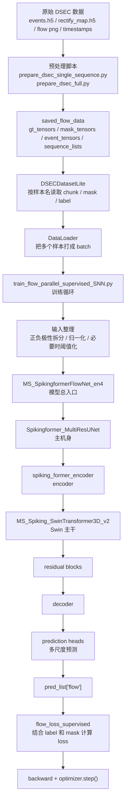
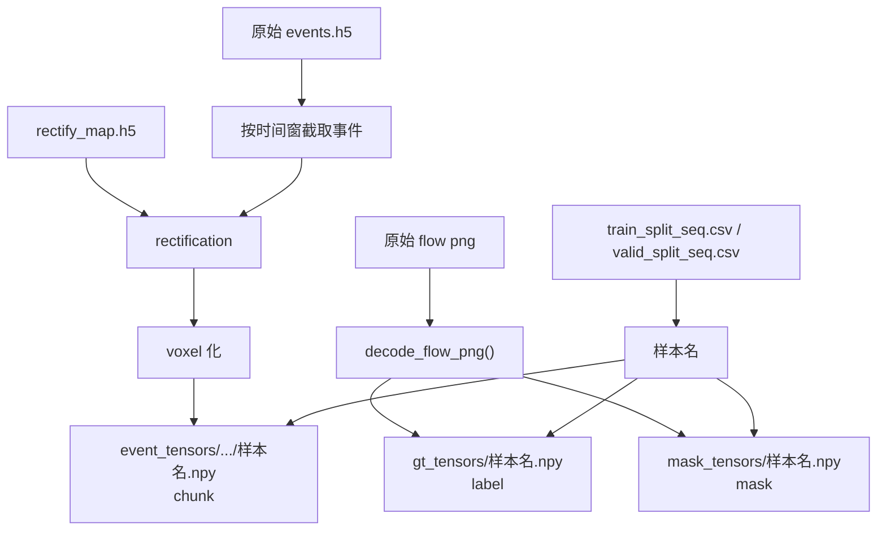
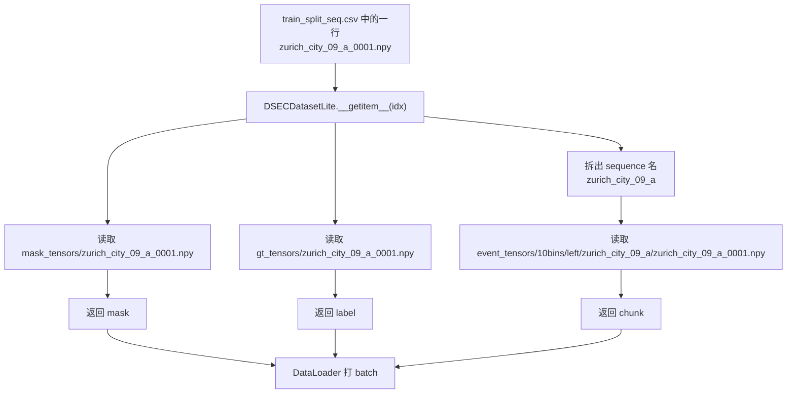
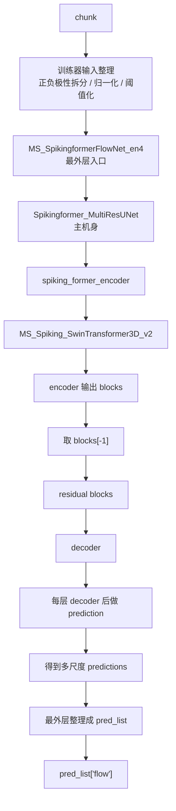
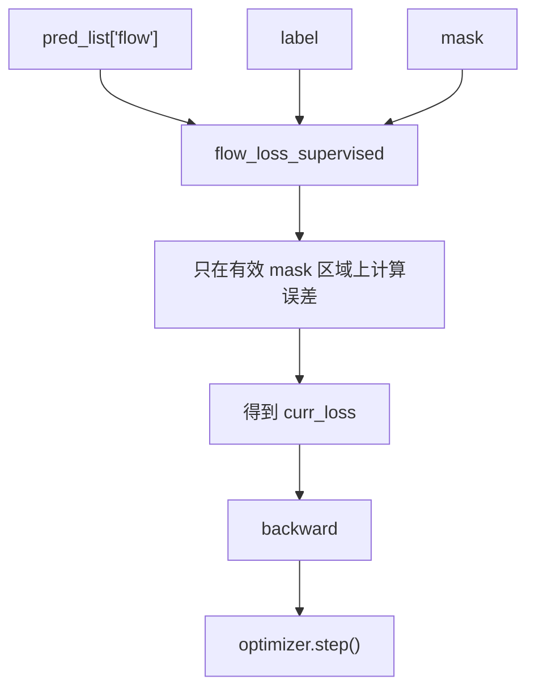

# Baseline 流程框图

这份文档只做一件事：

**把 baseline 从原始数据到 loss 的整条数据流，画成能反复对照的流程框图。**

---

## 1. 最简总图



---

## 2. 只看“数据”怎么流



---

## 3. 只看“训练时一个样本怎么走”

这里始终盯一个样本：

```text
zurich_city_09_a_0001.npy
```



---

## 4. 只看“chunk 进入模型后怎么走”



---

## 5. 只看“loss 怎么算”



---

## 6. 一句话总结

```text
原始数据先被预处理成 saved_flow_data；
训练时 DSECDatasetLite 从 saved_flow_data 读出 chunk、mask、label；
训练器继续整理 chunk 后送入模型；
模型经过外层入口、主机身、encoder、Swin 主干、residual、decoder、prediction 得到 pred_list['flow']；
最后 loss 用 label 和 mask 对预测进行监督。
```
