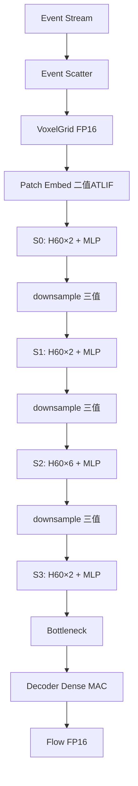

# 端到端数据流规格（NTS-11bc 统一 H60）

> **主线推理图 + 硬件方案**：`docs/16_统一H60注意力硬件方案.md`（必读）  
> 本文：周期量级、DMA、控制机 **补充细节**。  
> ~~11aa Legacy+H60 混用~~ 已废弃。

---

## 总览



**关键**：S0/S1 注意力也是 **H60**，不是 QKFormer。

---

## Stage 0：事件 → 体素

- 输入：`(x,y,t,p)` ~1M events/frame  
- 输出：`[10,2,H,W]` FP16  
- 硬件：`event_scatter_unit`，~10⁵ cycles  

---

## Patch Embedding

- Fold → `[T=10,C=2,H,W]`  
- Head Conv + **二值 ATLIF** → `[T,48,H,W]` 1-bit  
- Res×2 → `[T,96,240,320]` 进入 S0  

---

## Encoder S0–S3（统一模板）

每个 block：

```text
LN → H60 Attention → residual
LN → MLP (二值 SN) → residual
```

### H60 注意力（全 stage 相同语义）

```text
Q/K 三值 → TX+SC → Shiftmax → K×gate → proj
```

### Per-stage 几何

| Stage | dim | heads | H×W | windows | blocks |
|-------|-----|-------|-----|---------|--------|
| S0 | 96 | 3 | 240×320 | 800 | 2 |
| S1 | 192 | 6 | 120×160 | 200 | 2 |
| S2 | 384 | 12 | 60×80 | 50 | 6 |
| S3 | 768 | 24 | 30×40 | 13 | 2 |

### downsample（S0/S1/S2）

- `downsample.sn`：**三值 ATLIF** → Sparse MAC（不经 H60）

### S2 单 window 周期（dim=384, heads=12）

| 步 | 操作 | 周期约 |
|----|------|--------|
| 1 | Load Q/K | 50 |
| 2 | TX | 98 |
| 3 | SC | 98 |
| 4 | Fuse+center | 10 |
| 5 | Shiftmax | 20 |
| 6 | K-gate | 98 |
| 7 | Proj | 200 |

单 window ~574 cycles。

---

## Bottleneck + Decoder

- Res×2 @ 768；Decoder 上采样 + skip  
- 硬件：**Dense MAC**  
- 输出：`[2,H,W]` FP16  

---

## 控制状态机（11bc+）

```text
FOR stage = 0..3:
  engine_attn = H60   // 统一，无 Legacy 分支
  FOR block:
    RUN_H60_ATTN
    RUN_MLP (SPARSE_MAC)
  IF merge: DOWNSAMPLE + ternary encode
→ BOTTLENECK → DECODE → OUTPUT
```

---

## DMA 事务

| txn_type | 说明 |
|----------|------|
| `WGT_LOAD` | 权重 |
| `FEAT_IN/OUT` | window tile |
| `META_MASK` | TTB skip / token_mask |
| `EVT_IN` | 事件流 |

---

## Profile 对齐

`spike_profile.json` 导出 per-layer firing；统一 H60 后 **无** `engine_schedule` 中 Legacy 项。