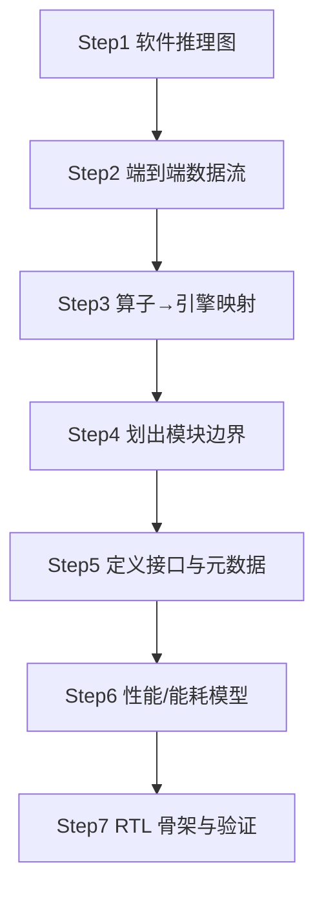

# 硬件小白入门路线图：先数据流，后接口

**读者**：熟悉 PyTorch/NTS-07 软件，不熟悉 RTL/ASIC  
**目标**：知道第一步干什么、每一步产出什么、和现有文档怎么对应

---

## 0. 一句话答案

> **第一步：先把端到端数据流摸清楚（带形状、精度、谁算哪一步）。**  
> **第二步：把数据流切成模块（引擎边界）。**  
> **第三步：再定义模块之间的接口（信号名、握手、元数据）。**  
> **第四步：最后才写 RTL / 跑综合。**

**不能反过来**：没弄清「Q/K 三值 tile 从哪来到哪去」，就没法正确定义 `h60_attention_engine` 的输入端口。

---

## 1. 三个概念先分清

### 1.1 数据流（Dataflow）

**是什么**：一帧输入到一帧输出，数据 **经过哪些阶段、变成什么形状、用什么精度**。

例子（NTS-07b）：

```text
事件 (x,y,t,p)
  → 体素 [10,2,H,W] FP16
  → Patch [T=10,C=96,H,W] 1-bit spike
  → S2 某 window 的 Q/K [98,32] 2-bit ternary
  → H60 输出 attn [98,32] FP16
  → 光流 [2,H,W] FP16
```

**你要能回答**：每一步的 **输入/输出张量** 和 **在软件里对应哪一层**。

📄 **Step1 完整教程（统一 H60）**：`docs/16_统一H60注意力硬件方案.md`（事件→光流逐步详解，§0–§16 必读）  
📄 ~~`docs/15`~~ 已废弃（11aa 混用注意力，仅历史）  
📄 补充：`docs/02_end_to_end_dataflow.md`（周期/DMA）

---

### 1.2 模块（Module / Engine）

**是什么**：把数据流切成 **可独立设计的一块硬件**，每块负责一类算子。

11bc/11bd **三引擎 + Scatter**（Legacy 已删除）：

| 引擎 | 干什么 | 类比 |
|------|--------|------|
| Event Scatter | 事件变体素 | 专用「前处理核」 |
| Sparse MAC | 1-bit 卷积/MLP | 主力算力，像 GPU 里的 Tensor Core |
| H60 Binary | **S0–S3 全线**注意力 TX+SC+Shiftmax | **唯一**注意力专用核 |
| Dense MAC | Decoder、少量非稀疏 | 普通矩阵乘 |

📄 主文档：`docs/03_operator_hardware_mapping.md`（算子→引擎表）

---

### 1.3 接口（Interface）

**是什么**：两个模块 **之间连什么线、怎么握手、附带什么控制信息**。

例子：

- `valid/ready`：下游准备好了，上游才能送下一拍数据（像流水线握手）
- `user_stage=2`：这批数据属于 Swin Stage 2，控制器应路由到 H60
- `neuron_mode=1`：这层 SN 用三值 ATLIF（`ternary_en`）

📄 主文档：`docs/05_module_interface_spec.md`  
**注意**：这份文档是 **第三步** 才细读的，不是第一步。

---

## 2. 推荐学习顺序（7 步）



---

### Step 1：对着软件把「推理图」画出来（1–2 天）

**做什么**：

1. 读 **`docs/16_统一H60注意力硬件方案.md`**（全线 12 block H60）
2. 打开 `nts11bc` / `nts11bd_u12_*` yml，确认 `target_blocks` 共 **12 个**
3. 理解：**无 Legacy 注意力**，sn2_q 不参与 H60 推理
3. 忽略训练-only 项（threshold 更新、target_rate）

**产出**：一张「层名 → 神经元模式 → 注意力类型」表  
**参考**：`docs/01_nts07b_architecture_profile.md` §5

**自检**：

- [ ] 能说出「为什么只有 S2 走 H60」
- [ ] 能说出「Q/K 和 FFN 输出位数差在哪」

---

### Step 2：写清端到端数据流（2–3 天）⭐ **这是你的第一步**

**做什么**：

沿 `docs/02` 走一遍，**每一步手写**：

| 字段 | 你要填的 |
|------|----------|
| 输入形状 | 如 `[10,2,288,384]` |
| 输出形状 | 如 `[10,96,240,320]` |
| 精度 | FP16 / 1-bit / 2-bit |
| 负责引擎 | Scatter / Sparse MAC / H60 / Dense |
| 软件对应 | `layers.0.blocks.0...` |

**重点精读两节**：

1. **Stage 0**：事件→体素→Patch（大多数人在这里建立直觉）
2. **S2 H60 单 window 表**（`docs/02` 里 7 步周期表）——这是 DATE 微观图核心

**产出**：你可以用自己的话讲：**「一帧事件进芯片后依次发生什么」**

**自检**：

- [ ] 能画出总览 mermaid（`docs/02` 第一张图）
- [ ] 能解释 Sparse MAC 为什么吃 1-bit、H60 为什么吃 2-bit

---

### Step 3：算子挂到引擎（1 天）

**做什么**：读 `docs/03` 的 O1–O15 表，把每个算子归到四引擎之一。

**关键理解**：

- **同一张特征图**，不同层可能走不同引擎（S2 attn→H60，S0 attn→Legacy）
- **统一 ATLIF 算子**不改变引擎划分，只改变「编码器实例是否共用」（`docs/11`）

**产出**：「引擎分工表」——论文 Architecture 小节素材

---

### Step 4：划模块边界（1 天）

**做什么**：读 `docs/05` §1 顶层层次图，理解 **controller / SRAM / 各 engine** 谁管谁。

**划分原则**：

1. **数据类型变化大的地方** 往往是边界（FP16→1bit→2bit）
2. **调度规则变化大的地方** 往往是边界（S2 用 H60，其它用 Legacy）
3. **不宜切太碎**：编码器可并入 DMA 出口，不必每层一个 RTL 顶层

**产出**：模块框图（可手绘拍照进论文）

---

### Step 5：定义接口（2–3 天）——数据流清楚后再做

**做什么**：读 `docs/05` §2–§5：

- Stream 接口：`valid/ready/data/user_stage/user_engine`
- 128-bit descriptor：`window_enable`、`neuron_mode`、`head_mask`…
- H60 局部端口：Q/K ternary、`mu_q8`、K_orig

**原则**：

- 接口 = **数据流里已经存在的量**，不是凭空造信号
- 每加一个端口，问：**Step2 里哪一步需要这个信息？**

**产出**：接口表（可先从 descriptor 字段开始，比 SystemVerilog 容易）

**自检**：

- [ ] 能解释 `timestep_enable=0` 时控制器跳过什么
- [ ] 能解释 `neuron_mode` 如何变成 `ternary_en`

---

### Step 6：性能与能耗模型（1–2 天）

**做什么**：

- 读 `docs/08` + 跑 `python3 scripts/nts07_perf_model.py --json`
- 读 `docs/12` 文献启发 autoresearch 结果

**目的**：不是要你推公式，而是建立 **「改一个硬件参数 → 能耗/FPS 怎么变」** 的直觉。

---

### Step 7：RTL 与验证（持续）

**做什么**：

- 先看 `rtl/h60_attention_engine.v`、`atlif_unified_encode_unit.v` 骨架
- 用软件 golden 对比位精确（待 `export_hw_golden.py`）

**原则**：RTL 是数据流+接口的 **代码化**，不是学习的起点。

---

## 3. 和你当前软件实验的对应关系

| 软件你在试的 | 硬件对应 | 先弄清的数据流位置 |
|--------------|----------|-------------------|
| 只留三值+二值 ATLIF | `atlif_unified_encode_unit` + `neuron_mode` | SN 出口：哪层 2bit / 1bit |
| S2 仅 H60 | `h60_attention_engine` 仅 stage_id=2 | `docs/02` S2 单 window 表 |
| 去掉第三种神经元 | 不再需要独立 PSN 编码路径 | Patch 时间混合是否仍用 Dense MAC |

---

## 4. 本周可执行清单（复制即用）

### Day 1–2：数据流（第一步）

- [ ] 通读 **`docs/16_统一H60注意力硬件方案.md`**
- [ ] 完成 §16 短测 checklist（短测后更新数字）
- [ ] 可选：精读 §8 H60 单 window 七步

### Day 3：引擎映射

- [ ] 通读 `docs/03_operator_hardware_mapping.md`
- [ ] 通读 `docs/11_统一ATLIF算子与数据流.md`

### Day 4–5：接口

- [ ] 通读 `docs/05_module_interface_spec.md` §1–§5
- [ ] 列出你还缺的 3 个 descriptor 字段问题（不懂就问）

### Day 6：文献

- [ ] 读 `docs/13_扩展文献库与可借鉴清单.md` 线 B + 线 D
- [ ] 精读 FireFly-T + Bishop 摘要（arXiv 2505.12771 / 2505.12281）

### Day 7：串讲

- [ ] 不看文档，用 10 分钟讲一遍：事件→光流，指出 S2 特殊在哪

---

## 5. 常见误区

| 误区 | 正确做法 |
|------|----------|
| 先背 AXI/APB 协议 | 先知道 **什么数据** 要过总线 |
| 先写 Verilog | 先画数据流和 descriptor |
| 把软件和硬件一一同名模块 | 硬件按 **引擎** 分，不是按 PyTorch `nn.Module` 分 |
| 文献只读 5 篇 | 按 `docs/13` 四条线选读 15–20 篇摘要 |

---

## 6. 文档索引（按阅读顺序）

| 顺序 | 文档 | 作用 |
|------|------|------|
| 1 | `docs/02_end_to_end_dataflow.md` | **第一步主教材** |
| 2 | `docs/01_nts07b_architecture_profile.md` | 软件锚点与层几何 |
| 3 | `docs/03_operator_hardware_mapping.md` | 算子→引擎 |
| 4 | `docs/11_统一ATLIF算子与数据流.md` | 双模神经元硬件故事 |
| 5 | `docs/05_module_interface_spec.md` | 接口与寄存器 |
| 6 | `docs/13_扩展文献库与可借鉴清单.md` | 文献 idea 池 |
| 7 | `docs/06_literature_review.md` | DATE 引用精简版 |
| 8 | `docs/07_date2027_innovations.md` | 创新点表述 |
| 9 | `docs/08` + `docs/12` | 模型与 autoresearch |

---

## 7. 你问的两个选项——最终对照

| 选项 | 何时做 | 依赖什么 |
|------|--------|----------|
| **先数据流** ✅ | 第 1 周 | 软件推理图、NTS-07b yml |
| **先接口定义** | 第 2 周 | 数据流 + 模块边界已清楚 |

**记忆口诀**：**「流 → 块 → 线 → 码」**（数据流 → 模块 → 接口连线 → RTL 代码）