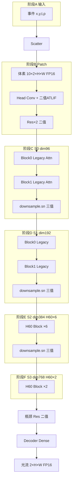

# ~~Step 1 详细教程：NTS-11aa~~（已废弃 — 注意力混用方案）

> **⚠️ 硬件主线已切换**：软件发现 S0/S1 Legacy + S2/S3 H60 **注意力混用**，芯片需两套引擎，DATE 难讲。  
> **请改读**：[`docs/16_统一H60注意力硬件方案.md`](16_统一H60注意力硬件方案.md)（**11bc/11bd 全线 H60**）。  
> 下文仅保留作历史参考（11aa ep19 神经元范围仍部分适用于 11bc）。

---

# [历史] Step 1 详细教程：NTS-11aa 推理图与端到端数据流

**适用读者**：熟悉 PyTorch / 你们软件实验，**不熟悉硬件**  
**软件锚点**：`nts11aa_hw_h60_s23_scope_downsample_ternary` full30 **ep19**（**非当前硬件锚点**）  
**配置路径**：`neuron_experiments/H9_bipolar_self_attention/configs/nts11aa_hw_h60_s23_scope_downsample_ternary_scope_full30_20260612_065413.yml`

---

## 0. 本文是什么、怎么读

| 章节 | 内容 | 建议 |
|------|------|------|
| §1 | 先建立直觉：推理图、数据流、引擎 | **必读** |
| §2 | 11aa 相对 07b 改了什么 | **必读** |
| §3 | 整张网络长什么样（树状结构） | **必读** |
| §4 | 两种神经元怎么部署 | **必读** |
| §5 | **逐步数据流**（事件→光流，最细） | **核心，慢读** |
| §6 | 单个 Swin block 内部拆开讲 | 加深理解 |
| §7 | Legacy 注意力 vs H60 注意力 | 加深理解 |
| §8 | H60 单 window 七步（硬件微观） | 可选先跳过 |
| §9 | 四层编码器对照总表 | 复习用 |
| §10 | 硬件引擎分工 | Step2 前奏 |
| §11 | 常见困惑 FAQ | 遇到问题查 |
| §12 | 自检 + 下一步 | 读完做 |

---

## 1. 三个词先搞懂（后面全文都靠它们）

### 1.1 推理图（Inference Graph）

**是什么**：推理时，数据**按什么顺序**经过哪些算子，**不训练、不反传**。

你可以把它想成：把 `model.forward()` 画成一张流程图，但只保留推理路径。

### 1.2 数据流（Dataflow）

**是什么**：推理图上**每一步**的：

- **输入/输出长什么样**（形状，例如 `[10, 96, 240, 320]`）
- **什么精度**（FP16 浮点、1-bit 脉冲、2-bit 三值脉冲）
- **谁来算**（Scatter / Sparse MAC / H60 / Dense MAC）

**Step 1 的目标就是把数据流讲清楚。** 接口、RTL 是后面的事。

### 1.3 硬件引擎（Engine）

芯片里切成 **4 类执行单元**（先记名字，不必懂电路）：

| 引擎 | 干什么 | 11aa 里主要出现在哪 |
|------|--------|---------------------|
| **Event Scatter** | 事件变体素 | 最开头 |
| **Sparse MAC** | 1-bit 卷积 / MLP（稀疏乘加） | 全网大部分算力 |
| **H60 Binary** | S2/S3 的特殊注意力 | 仅 8 个 block |
| **Dense MAC** | 普通矩阵乘（Decoder 等） | 网络末尾 |

---

## 2. 11aa 是什么：三条你必须记住的变化

相对旧硬件锚点 NTS-07b，**11aa 只改三件事**（拓扑仍是 SDformerFlow 那套 UNet+Swin）：

| # | NTS-07b | **NTS-11aa** | 你该怎么理解 |
|---|---------|--------------|--------------|
| 1 | H60 注意力只在 **S2**（6 个 block） | H60 在 **S2+S3**（**8 个 block**，叫 scope **s23**） | S3 的两个 block 也走 H60，不再用 Legacy |
| 2 | 三值神经元主要在 Q/K | 三值在 **Q/K + 3 个 downsample.sn** | downsample 出口也是 2-bit，但不进 H60 |
| 3 | 还混着 PSN 叙事 | **只剩两种 ATLIF**：三值 / 二值 | 统一一个编码算子 + `ternary_en` 开关 |

**不变的东西**：事件→体素→Swin 编码→瓶颈→Decoder→光流；H60 内部仍是 TX+SC+Shiftmax；没有 softmax、没有 carrier。

### 2.1 11aa ep19 关键数字（valid825）

| 指标 | 数值 | 备注 |
|------|------|------|
| AEE | **1.543** | 比 10d 高约 0.06，11aah 在回调精度 |
| firing | **6.22%** | 比 07b 更低 → 硬件更省电 |
| total_spikes | **28.83G** | |
| energy | **22.9k µJ** | 软件能耗剖面 |

---

## 3. 整张网络长什么样

### 3.1 顶层（和软件类名一一对应）

```text
MS_SpikingformerFlowNet_en4
└── MS_Spikingformer_MultiResUNet
    ├── encoders: Swin Transformer × 4 stages (S0~S3)
    ├── resblocks: 2 × 瓶颈 ResBlock
    ├── decoders: 4 级上采样 + skip 连接
    └── preds: 4 个 flow head → 时间维求和 → 插值 → 最终光流
```

**输入**：DSEC 事件（或体素）  
**输出**：2 通道光流 `[2, H, W]`（H、W 与 crop 有关，训练常用 288×384）

### 3.2 四阶段编码器几何（crop 288×384 时）

| Stage | block 数 | 通道 dim | 注意力头 heads | 特征图 H×W | window 大小 |
|-------|----------|----------|----------------|------------|-------------|
| **S0** | 2 | 96 | 3 | 240×320 | 时间2 × 空间9×9 |
| **S1** | 2 | 192 | 6 | 120×160 | 同上 |
| **S2** | 6 | 384 | 12 | 60×80 | 同上 |
| **S3** | 2 | 768 | 24 | 30×40 | 同上 |

**window 是什么**：Swin 不一次看整张图，而是把特征图切成许多小窗口。  
每个窗口里有 `2×7×7 = 98` 个 token（时间 2 × 空间 7×7，由 window_size 决定）。

### 3.3 时间维 T=10

- 事件被分成 **10 个时间 bin**（`num_bins=10`）
- 全网按 **10 个时间步**并行处理（`num_steps=10`）
- 硬件上：often 外层循环 `timestep = 0..9`

---

## 4. 两种神经元：11aa 部署法则（推理图的核心）

11aa **只有两种**脉冲出口，都由软件类 `ATLIFTernaryPSN` 实现，靠 `output_mode` 切换：

### 4.1 三值 ATLIF（`ternary_en = 1`）

- **输出**：`{-阈值, 0, +阈值}`，硬件打包成 **2 bit**（静默 / 正 / 负）
- **挂在哪**：
  1. **全线 Q/K**（所有 stage 所有 block 的 `sn_q`、`sn_k`）
  2. **3 个 downsample.sn**（`layers.0/1/2.downsample.sn`）

### 4.2 二值 ATLIF（`ternary_en = 0`）

- **输出**：`{0, +阈值}`，硬件 **1 bit**
- **挂在哪**：
  1. **`sn2_q`**：仅 S0/S1 的 Legacy 注意力需要（carrier 门控）
  2. **`all_non_qk`**：其余所有 SN——Patch、MLP、proj、decoder、bottleneck 等

### 4.3 一张图记住「谁三值、谁二值」

```text
                    ┌─ sn_q  ─┐
                    │  三值   │
每个 Swin Block ────┼─ sn_k  ─┤──→ 注意力引擎（Legacy 或 H60）
                    │  三值   │
                    └─ sn2_q ─┘  二值（仅 S0/S1 Legacy 需要）

每个 Stage 末尾 ──── downsample.sn ──→ 三值（仅 S0/S1/S2 有，S3 无 merge）

Patch / MLP / Decoder / … ─────────→ 二值（all_non_qk）
```

### 4.4 重要：Q/K 三值 ≠ 一定走 H60

| Stage | Q/K 编码 | 注意力**引擎** | 为什么 |
|-------|----------|----------------|--------|
| S0, S1 | **三值** | **Legacy QKFormer** | `target_blocks` 没包含这些 block |
| S2, S3 | **三值** | **H60** | 配置里明确列出了这 8 个 block |

**这是新手最容易混的一点**：三值只描述 **脉冲长什么样**；H60 描述 **注意力怎么算**。

---

## 5. 端到端数据流：从事件到光流（逐步详解）

下面按**真实执行顺序**走一遍。每一步都写：**输入 → 做什么 → 输出 → 谁硬件算 → 11aa 特殊点**。

---

### 阶段 A：事件 → 体素（Event Scatter）

#### 输入

- 事件流：每个事件 `(x, y, t, polarity)`
- 一帧大约 **~100 万**事件（量级，随场景变）

#### 做什么

1. 把时间轴切成 **10 个 bin**（一帧约 50ms）
2. 每个事件按极性扔进 `grid[bin][pol][y][x]`（scatter-add）
3. 对非零格子做 min-max 归一化

#### 输出

| 张量 | 形状 | 精度 |
|------|------|------|
| VoxelGrid | `[10, 2, H, W]` | **FP16** |

训练 crop 时 H=288, W=384（与 loader 一致）。

#### 硬件

- **引擎**：`event_scatter_unit`
- **周期量级**：~10⁵ cycles/帧

#### 11aa 特殊点

无。与 07b 相同。

---

### 阶段 B：Patch Embedding（进 Swin 之前）

#### B.1 时间 Fold（几乎零成本）

```text
[10, 2, H, W]  ──DMA 重排──►  [T=10, C=2, H, W]
```

只是内存地址映射，没有乘加。

#### B.2 Head 卷积 + 脉冲神经元

```text
Conv2d(2 → 48, 3×3) → BatchNorm → SN → 二值脉冲
```

| 项目 | 说明 |
|------|------|
| SN 类型 | **二值 ATLIF**（`all_non_qk`） |
| 输出形状 | `[T=10, C=48, H, W]`，**1-bit** |
| 发放率 | 约 8–15%（随层变） |

#### B.3 下采样 + 2 个 ResBlock

```text
stride-2 卷积 → dim 升到 96
ResBlock ×2：  SN → Conv → BN → SN → Conv → BN → 残差加
```

每个 ResBlock 里的 SN 都是 **二值 ATLIF**。

#### 输出（进入 S0 之前）

| 张量 | 形状 | 精度 |
|------|------|------|
| 特征 | `[T=10, C=96, 240, 320]` | **1-bit** |

空间从 H/2、W/2 下来（相对 288×384 输入）。

#### 硬件

- **引擎**：**Sparse MAC**（1-bit × INT8 权重，零跳过）
- Patch 里若有时间混合权重，可走小块 **Dense MAC**（11aa 主线叙事是二值 ATLIF，不再强调独立 PSN 第三条路）

---

### 阶段 C：编码器 Stage 0（S0）

S0 有 **2 个 Swin block**，通道 **96**，**3 个头**。

#### C.1 每个 block 干什么（重复 2 次）

```text
输入 x
  │
  ├─► LayerNorm
  ├─► 注意力（Legacy QKFormer）  ← 见 §7.1
  ├─► 残差加：x + attn_out
  │
  ├─► LayerNorm
  ├─► MLP（4× 扩通道）          ← 见 §6.3
  └─► 残差加：x + mlp_out
```

#### C.2 S0 注意力用到的 SN（11aa）

| 子模块 | 神经元 | 作用 |
|--------|--------|------|
| `sn_q` | **三值** | 产生 Q 脉冲 |
| `sn_k` | **三值** | 产生 K 脉冲 |
| `sn2_q` | **二值** | Legacy 的 carrier：`attn = K * sn2(sum(Q))` |
| `proj_sn` 等 | **二值** | 输出投影 |

**引擎**：**Legacy Binary Engine**（不是 H60！）

#### C.3 S0 末尾：PatchMerge（downsample）

```text
特征 [T, 96, 240, 320]
  → downsample 模块
  → downsample.sn：三值 ATLIF   ← 11aa 特有
  → 空间 ÷2
  → [T, 192, 120, 160] 进入 S1
```

| 项目 | ep19 实测 |
|------|-----------|
| `layers.0.downsample.sn` firing | **~51%**（偏高，但只有一个节点） |
| 硬件路径 | 2-bit 编码 → **Sparse MAC**，**不经过 H60** |

---

### 阶段 D：编码器 Stage 1（S1）

结构与 S0 类似，规模变大：

| 项目 | S1 |
|------|-----|
| block 数 | 2 |
| dim | 192 |
| heads | 6 |
| 分辨率 | 120×160 |
| 注意力 | **Legacy**（Q/K 仍三值，sn2_q 二值） |
| 末尾 downsample | `layers.1.downsample.sn` **三值**，firing ~**32%** |
| 输出分辨率 | 60×80，dim 384 → 进 S2 |

---

### 阶段 E：编码器 Stage 2（S2）—— H60 主战场

S2 有 **6 个 block**，dim **384**，**12 heads**。  
**11aa 的全部 6 个 block 注意力都换成 H60。**

#### E.1 每个 S2 block 结构（与 S0 外壳相同，注意力换芯）

```text
x → LN → H60 注意力 → 残差
x → LN → MLP（二值 SN）→ 残差
```

#### E.2 H60 注意力内部（逻辑，见 §7.2）

对每个 **head**、每个 **window**、每个 **query token**：

```text
1.  Linear 得到 Q_orig, K_orig（浮点/定点激活）
2.  sn_q / sn_k：三值 ATLIF → Q_event, K_event ∈ {-1,0,+1}
3.  TX 分数：三值 popcount 相似度
4.  SC 分数：有符号共识 Q_event·K_event
5.  scores = TX + μ·SC（μ≈0.05），可选减行均值
6.  gate = Shiftmax(scores)     # 不用 softmax
7.  attn = K_orig ⊙ gate
8.  Linear 投影输出
```

**没有** `sn2_q` carrier（S2 不走 Legacy 公式）。

#### E.3 S2 末尾 downsample

- `layers.2.downsample.sn`：**三值**，firing ~**53%**
- 输出：dim **768**，分辨率 **30×40** → 进 S3

#### E.4 硬件

- 注意力：**H60 Engine** × 6 blocks
- MLP：**Sparse MAC**
- downsample.sn 后：**Sparse MAC**（2-bit 三值 tile）

---

### 阶段 F：编码器 Stage 3（S3）—— 11aa 新增 H60

| 项目 | S3 |
|------|-----|
| block 数 | 2 |
| dim | 768 |
| heads | **24**（比 S2 多一倍） |
| 分辨率 | 30×40（小，但通道肥） |
| window 个数 | **13**（比 S2 的 50 少很多） |
| 注意力 | **H60**（`target_blocks`: `3:0`, `3:1`） |
| 末尾 downsample | **无**（最后一级 encoder） |

**相对 07b 的硬件增量**：主要就是 **S3 这 2 个 block 也要实例化 H60 数据通路**（`ENGINE_MAP[3]=H60`）。

---

### 阶段 G：瓶颈 ResBlock ×2

```text
dim=768, 分辨率 30×40
ResBlock ×2，内部 SN 全是二值 ATLIF
```

**引擎**：Sparse MAC

---

### 阶段 H：Decoder ×4 + 多尺度预测

```text
每一级：
  上采样（×2 空间）
  与 encoder skip 特征拼接
  卷积 + SN（二值）
  接一个 flow prediction head

最后：
  多个 head 的光流在时间上求和
  双线性插值到目标分辨率
```

| 输出 | 形状 | 精度 |
|------|------|------|
| 光流 | `[2, H_out, W_out]` | **FP16** |

**引擎**：**Dense MAC**（Decoder 难做 1-bit 稀疏，保持常规定点/浮点）

---

### 阶段 I：全流程一张总图



---

## 6. 单个 Swin Block 拆开讲（通用模板）

任何一个 Swin block（不论 S0–S3）**外壳都一样**：

```text
┌──────────────────────────────────────┐
│  输入特征 x [T, C, H, W]  1-bit      │
├──────────────────────────────────────┤
│  ① LayerNorm（在浮点域做，再回脉冲）   │
│  ② 注意力子模块                       │
│  ③ x ← x + 注意力输出   （残差）      │
│  ④ LayerNorm                          │
│  ⑤ MLP：SN1→Linear→SN2→Linear        │
│  ⑥ x ← x + MLP 输出     （残差）      │
└──────────────────────────────────────┘
```

### 6.1 注意力子模块里有哪些 SN（11aa）

| 路径名（软件） | 11aa 模式 | 只有 Legacy 才用 |
|----------------|-----------|------------------|
| `attn.sn_q` | 三值 | |
| `attn.sn_k` | 三值 | |
| `attn.sn2_q` | 二值 | **是**，carrier |
| `attn.proj_sn` | 二值 | |

### 6.2 MLP 子模块

```text
sn1（二值）→ Linear: C → 4C → sn2（二值）→ Linear: 4C → C
```

全是 **二值 ATLIF**，走 **Sparse MAC**。

### 6.3 为什么 MLP 占大头算力

MLP 中间通道 ×4，且每个时间步、每个空间点都要跑。  
11aa 全局 firing **6.22%**，意味着约 **94%** 的 MAC 因稀疏被跳过——这是硬件省电的主要来源。

---

## 7. 两种注意力：Legacy vs H60（配公式）

### 7.1 Legacy QKFormer（S0、S1）

**软件在算什么**（简化）：

```text
Q, K, V = Linear(x)  之后过 SN
carrier = sn2( sum_t Q )          # sn2_q 二值
attn_out = K * carrier            # 按元素乘，再投影
```

**直觉**：用 Q 的和产生一个门控，去调制 K。  
**硬件**：小引擎，几次 popcount + MUX，**不是** H60 那套 TX/SC/Shiftmax。

**11aa**：Q/K 虽然三值编码，但**注意力公式仍是 Legacy**，直到 stage 换成 S2。

### 7.2 H60（S2、S3）

**软件在算什么**（NTS-11aa 推理冻结）：

```text
Q_orig, K_orig = Linear(x) + BN 之后的三值 SN 前激活
Q_event = sign_ternary(Q_orig)    # -1, 0, +1
K_event = sign_ternary(K_orig)

TX = popcount_similarity(Q_event, K_event)   # α-XNOR 风格
SC = signed_consensus(Q_event, K_event) / head_dim
scores = TX + 0.05 * SC
scores -= mean(scores)              # center_scores=true
gate = Shiftmax(scores)             # 2^x / 2^ceil(log2 sum)，无 exp
output = K_orig * gate
```

**直觉**：

1. 先把 Q/K 压成三值事件（-1/0/1）
2. 用两种「数数」算相似度（TX 和 SC）
3. 加起来，用 Shiftmax 当 softmax 替身
4. 用 gate 去乘 **原始的** K（不是三值 K）

**硬件**：`h60_attention_engine`（TX 单元 + SC 单元 + Shiftmax + K-gate）

**11aa 关闭的东西**（推理不用）：carrier、K magnitude、β/γ 惩罚项、训练期 threshold 更新。

---

## 8. H60 微观：一个 S2 window 里发生什么

这一节给「想看到芯片级」的读者；第一遍可跳过。

**设定**：S2 某 block、某 head、某 window

| 参数 | 值 |
|------|-----|
| token 数 N | 98 |
| head_dim D | 32 |
| Q/K 精度 | 2-bit 三值 |

| 步骤 | 操作 | 输入 | 输出 | 周期约 |
|------|------|------|------|--------|
| 1 | 从 SRAM 读 Q/K tile | DRAM/SRAM | 98×32×2b | 50 |
| 2 | TX popcount | Q,K 三值 | score_tx[98] | 98 |
| 3 | SC popcount | Q,K 三值 | score_sc[98] | 98 |
| 4 | 融合 + 去均值 | 两路分数 | score[98] | 10 |
| 5 | Shiftmax | score | gate[98] | 20 |
| 6 | K × gate | K_orig, gate | attn[98×32] | 98 |
| 7 | 输出 Linear | attn | proj_out | 200 |

**单 window 单 head 合计 ~574 cycles**（量级）。

### 8.1 S3 与 S2 微观差异

| | S2 | S3 |
|---|----|----|
| heads | 12 | **24** |
| windows / stage | 50 | **13** |
| dim | 384 | 768 |

S3 每个 block 内 **head 更多**，但 **window 总数更少**，整段 H60 总时间通常仍小于 S2。

---

## 9. 四层编码器对照总表（复习）

| Stage | 分辨率 | dim | blocks | 注意力引擎 | Q/K | downsample.sn | 输出给谁 |
|-------|--------|-----|--------|------------|-----|---------------|----------|
| S0 | 240×320 | 96 | 2 | Legacy | 三值 | 三值 | → S1 |
| S1 | 120×160 | 192 | 2 | Legacy | 三值 | 三值 | → S2 |
| S2 | 60×80 | 384 | 6 | **H60** | 三值 | 三值 | → S3 |
| S3 | 30×40 | 768 | 2 | **H60** | 三值 | 无 | → 瓶颈 |

**H60 target_blocks 列表**（与 yml 一致）：

```text
2:0, 2:1, 2:2, 2:3, 2:4, 2:5, 3:0, 3:1
```

---

## 10. 硬件引擎：每一步谁干活

| 阶段 | 主要引擎 | 11aa 备注 |
|------|----------|-----------|
| 事件→体素 | Event Scatter | |
| Patch + Res | Sparse MAC | 二值 ATLIF |
| S0/S1 注意力 | **Legacy** | Q/K 三值编码在前端 |
| S0/S1/S2 downsample.sn | Sparse MAC | 出口三值 |
| S2/S3 注意力 | **H60** | 8 blocks |
| 全线 MLP | Sparse MAC | 二值 |
| 瓶颈 + Decoder | Sparse / **Dense** | Decoder 偏 Dense |

### 10.1 控制器 ENGINE_MAP（11aa 定值）

```text
stage 0 → LEGACY_QK
stage 1 → LEGACY_QK
stage 2 → H60
stage 3 → H60
```

（07b 是 stage3→Legacy，这是硬件迁移必改项。）

### 10.2 统一 ATLIF 编码器

所有 SN 层共用 `atlif_unified_encode_unit`：

- `ternary_en=1` → 2-bit 出口（Q/K、downsample）
- `ternary_en=0` → 1-bit 出口（其余）

**数据流不变**：只是不再做三套独立编码器。

---

## 11. 常见困惑 FAQ

**Q1：为什么 S0 的 Q/K 是三值，却不走 H60？**  
A：`target_blocks` 只列出了 S2/S3 的 block。三值是神经元配置；H60 是注意力**替换范围**。两件事独立。

**Q2：downsample 三值和 Q/K 三值有什么区别？**  
A：编码方式一样（都是 `ternary_en=1`）。但 downsample 不算注意力，不算 TX/SC，下游直接 **Sparse MAC** 做空间合并后的卷积。

**Q3：11aa 还有 PSN 吗？**  
A：yml 里 `neuron_type: psn` 是默认壳。推理路径上 **97 层 SN 都已落在 ATLIF 二值/三值**，没有第三条「纯 PSN 出口」。

**Q4：sn2_q 为什么只有 S0/S1？**  
A：Legacy 公式需要 carrier。S2/S3 用 H60，公式里**没有** `sn2(sum(Q))` 这一项。

**Q5：11aa 比 07b 硬件难在哪？**  
A：主要是 **S3 多 2 个 H60 block**（24 heads）+ **3 个三值 downsample** 的带宽；不是重做整套架构。

**Q6：精度 1.543 能用吗？**  
A：硬件数据流以 **11aa ep19** 为准；论文 AEE 等 **11aah** finetune 完成后再换 best checkpoint，**引擎图不变**。

---

## 12. SN 层统计（ep19 profile，按类型）

| 类型 | 层数 | 典型 firing | 硬件出口 |
|------|------|-------------|----------|
| Q/K 三值 | 24 | 1%–17% | 2-bit |
| downsample.sn 三值 | 3 | **32%–53%** | 2-bit → Sparse MAC |
| sn2_q 二值 | 4 | ~7% | 1-bit |
| 其余二值 | 66 | 各异 | 1-bit → Sparse MAC |

---

## 13. 推理控制顺序（一帧生命周期）

```text
IDLE
 → SCATTER（事件→体素）
 → PATCH_EMBED（阶段 B）
 → FOR stage = 0 TO 3:
      设置 engine = (stage∈{2,3}) ? H60 : LEGACY
      FOR each block in stage:
          RUN_ATTENTION(engine)
          RUN_MLP(SPARSE_MAC)
      IF stage < 3:
          RUN_DOWNSAMPLE（若该 stage 有 merge）
          若 downsample.sn：TERNARY_ENCODE → SPARSE_MAC
 → BOTTLENECK
 → DECODE
 → OUTPUT_FLOW
 → IDLE
```

---

## 14. 相对 07b：硬件包迁移清单

| 项目 | 07b | 11aa | 是否要改文档/RTL |
|------|-----|------|------------------|
| 软件锚点 | ep29 | **ep19** | ✅ 已改 |
| H60 范围 | S2 | **S2+S3** | ✅ 已改；RTL `ENGINE_MAP` 待改 |
| 三值节点 | Q/K | **Q/K+downsample×3** | ✅ |
| 神经元 | 三种混叙 | **双模 ATLIF** | ✅ |
| firing 模型 | 7.94% | **6.22%** | ✅ perf model |
| 四引擎划分 | 有 | **保留** | 不改 |
| H60 微架构 | 有 | **保留** | 不改 |

---

## 15. Step1 自检（请逐项能口头答出）

- [ ] 一帧事件经过哪些**大阶段**（A→I）？
- [ ] S0 和 S2 的注意力**公式**有何不同？
- [ ] 为什么 S0 Q/K 三值却用 Legacy？
- [ ] downsample.sn 走不走 H60？走什么引擎？
- [ ] 11aa 一共几个 block 用 H60？列出门牌号 `stage:block`
- [ ] 二值 ATLIF 挂在哪两类路径上？
- [ ] 最终光流从哪出来、什么精度？

**全部打勾 = Step1 完成**，可以进入 Step2（读 `docs/03` 算子→引擎表）和 Step3（`docs/05` 接口）。

---

## 16. 下一步（不要跳步）

| Step | 文档 | 做什么 |
|------|------|--------|
| 2 | `docs/03_operator_hardware_mapping.md` | 每个算子 O1–O15 归到四引擎 |
| 3 | `docs/05_module_interface_spec.md` | descriptor、`valid/ready`、APB |
| 并行 | 等 11aah valid825 | 只换 AEE/checkpoint，不改本文数据流 |

---

## 附录 A：软件配置关键字段速查

```yaml
# 注意力替换范围（H60）
bsa_attention.target_blocks: ['2:0'..'2:5', '3:0', '3:1']

# 三值：全线 Q/K
atlif_ternary_psn.target: qk
atlif_ternary_psn.output_mode: ternary

# 三值：downsample
atlif_ternary_psn.target_groups.downsample_ternary.paths:
  - layers.0.downsample.sn
  - layers.1.downsample.sn
  - layers.2.downsample.sn

# 二值：sn2_q + 其余
atlif_ternary_psn.target_groups.sn2q_binary
atlif_ternary_psn.target_groups.all_non_qk_binary_atlif.path_selection: all_non_qk
```

## 附录 B：推荐阅读顺序（只有本文不够时）

本文已自洽。若需接口/能耗细节，再查：

- 周期/能耗模型：`docs/08_perf_area_energy_model.md`
- 模块端口：`docs/05_module_interface_spec.md`
- 文献对标：`docs/13_扩展文献库与可借鉴清单.md`