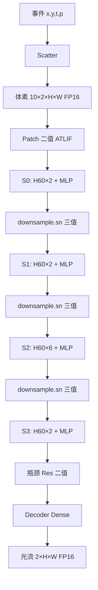

# Step 1 详细教程：统一 H60 注意力 — 推理图与端到端数据流

**状态**：硬件主线（v2）。废弃 11aa / 07b 的 Legacy+H60 混用 → 历史见 `docs/15`。  
**适用读者**：熟悉 PyTorch / H9 实验，**不熟悉硬件**  
**软件锚点（进行中）**：`nts11bd_u12_ds_w720_fastlr` full30 + valid825（rank2：downsample 三值 + fastlr，**全线 H60**）  
**短测参考**：11bd sweep `results/nts11bd_unified_short_20260613_163804/`（valid10 仅早筛）

---

## 0. 本文是什么、怎么读

| 章节 | 内容 | 建议 |
|------|------|------|
| §1 | 三个词：推理图、数据流、引擎 | **必读** |
| §2 | 相对 07b / 11aa 改了什么 | **必读** |
| §3 | 整张网络树状结构 | **必读** |
| §4 | 两种神经元怎么部署 | **必读** |
| §5 | **逐步数据流**（事件→光流） | **核心，慢读** |
| §6 | 单个 Swin block 拆开 | 加深理解 |
| §7 | **全线 H60** 注意力公式 | 加深理解 |
| §8 | H60 单 window 微观周期 | 可选先跳过 |
| §9 | 四层编码器对照总表 | 复习用 |
| §10 | 三引擎分工 + 控制器 | Step2 前奏 |
| §11 | FAQ | 遇到问题查 |
| §12 | SN 层统计（短测） | 数字参考 |
| §13 | 一帧推理控制顺序 | 与 RTL 对齐 |
| §14 | 相对旧方案的迁移清单 | 维护文档用 |
| §15 | Step1 自检 | 读完做 |
| §16 | 下一步读什么 | 不要跳步 |
| §17–§20 | RTL、性能模型、创新点、checklist | 工程师附录 |

**Step 1 的目标**：能口头讲清「一帧事件怎么变成光流、每一步什么形状/精度、谁算什么」，**还不碰** `valid/ready` 和 APB。

---

## 1. 三个词先搞懂

### 1.1 推理图（Inference Graph）

**是什么**：推理时数据**按什么顺序**经过哪些算子（无训练、无反传）。  
把 `model.forward()` 画成只含推理路径的流程图，就是推理图。

### 1.2 数据流（Dataflow）

**是什么**：推理图上**每一步**的：

- **输入/输出形状**（如 `[10, 96, 240, 320]`）
- **精度**（FP16、1-bit 二值脉冲、2-bit 三值脉冲）
- **执行引擎**（Scatter / Sparse MAC / H60 / Dense MAC）

**Step 1 只讲数据流。** 接口与 RTL 是 Step 3。

### 1.3 硬件引擎（Engine）—— 统一 H60 版只有 **三引擎 + Scatter**

| 引擎 | 干什么 | 本方案出现在哪 |
|------|--------|----------------|
| **Event Scatter** | 事件 → 体素栅格 | 最开头 |
| **Sparse MAC** | 1-bit（或三值零扩展后）卷积 / MLP | 全网大部分算力 |
| **H60 Binary** | TX+μSC+Shiftmax 注意力 | **全部 12 个** encoder block |
| ~~Legacy QKFormer~~ | ~~S0/S1 carrier 注意力~~ | **已删除** |
| **Dense MAC** | Decoder、上采样等常规定点乘 | 网络末尾 |

```text
Event → [Scatter] → [Sparse MAC] → [H60 全线注意力] → [Sparse MAC MLP] → [Dense MAC Decoder] → Flow
```

**DATE 一句话**：

> 整条 encoder 映射到**单一推理冻结的 H60 加速器**；stage 差异只是几何参数（dim、heads、window 数），不是第二套注意力 ISA。

---

## 2. 统一 H60 是什么：四条必须记住的变化

相对 **NTS-07b**（H60 仅 S2）和 **NTS-11aa**（S0/S1 Legacy + S2/S3 H60），**11bc/11bd** 的硬件故事是：

| # | 07b | 11aa（废弃） | **11bc/11bd（主线）** |
|---|-----|--------------|----------------------|
| 1 | H60 只在 **S2**（6 block） | H60 在 S2+S3（8 block） | H60 在 **S0–S3 全部 12 block** |
| 2 | 两套注意力 ISA | Legacy + H60 **混用** | **只有 H60 一种注意力核** |
| 3 | 三值主要在 Q/K | Q/K + downsample 三值 | 同左；scope 可扫 FFN 三值（11bd） |
| 4 | sn2_q carrier（Legacy） | S0/S1 需要 sn2_q | **推理不用 carrier；硬件不布线** |

**不变**：事件→体素→Swin UNet 编码→瓶颈→Decoder→光流；H60 内部仍是 TX+μSC+Shiftmax；无 softmax。

### 2.1 软件锚点与关键数字（短测 valid10，**非** valid825）

| 线 | 配置 | valid10 AEE | firing | 备注 |
|----|------|-------------|--------|------|
| 11bc 单点 | `nts11bc_hw_h60_all12_ds_w720_fastlr` | 2.633 | 4.52% | 与 rank2 同 scope |
| **11bd rank2（全量中）** | `nts11bd_u12_ds_w720_fastlr` | **2.633** | **4.52%** | downsample 三值 + fastlr |
| 11bd rank1 | `nts11bd_u12_dsffn2_w720_fastlr` | 2.528 | 6.0% | 多 S2 FFN 三值 |

**评价原则**：以 **AEE / AAE（valid825）** 为最终精度；firing、三值健康度为辅；**SOPs 仅参考，不作唯一排序依据**。

full30 + valid825 完成后，用赢家 checkpoint 刷新 `scripts/configs/nts11bc_anchor.json` 与能耗表。

### 2.2 `target_blocks`（12 个，全线 H60）

```text
0:0, 0:1,          # S0 ×2
1:0, 1:1,          # S1 ×2
2:0, 2:1, 2:2, 2:3, 2:4, 2:5,   # S2 ×6
3:0, 3:1           # S3 ×2
```

生成脚本：`entrypoints/make_nts11bc_unified_attn_config.py`、`make_nts11bd_unified_attn_sweep_configs.py`。

---

## 3. 整张网络长什么样

### 3.1 顶层（与软件类名一一对应）

```text
MS_SpikingformerFlowNet_en4
└── MS_Spikingformer_MultiResUNet
    ├── encoders: Swin Transformer × 4 stages (S0~S3)
    ├── resblocks: 2 × 瓶颈 ResBlock
    ├── decoders: 4 级上采样 + skip 连接
    └── preds: 4 个 flow head → 时间维求和 → 插值 → 最终光流
```

**输入**：DSEC 事件（或预计算体素）  
**输出**：2 通道光流 `[2, H, W]`（训练 crop 常用 288×384）

### 3.2 四阶段编码器几何（crop 288×384）

| Stage | block 数 | dim | heads | 特征图 H×W | windows/stage | 注意力 |
|-------|----------|-----|-------|------------|---------------|--------|
| **S0** | 2 | 96 | 3 | 240×320 | **800** | **H60** |
| **S1** | 2 | 192 | 6 | 120×160 | 200 | **H60** |
| **S2** | 6 | 384 | 12 | 60×80 | 50 | **H60** |
| **S3** | 2 | 768 | 24 | 30×40 | 13 | **H60** |

**window**：Swin 把特征图切成小窗口；每窗 `2×7×7 = 98` 个 token（`window_size` 决定）。

### 3.3 时间维 T=10

- `num_bins=10`：事件分 10 个时间 bin  
- `num_steps=10`：全网按 10 个时间步处理  
- 硬件：外层常循环 `timestep = 0..9`

### 3.4 推理总览图（统一 H60）



与 11aa 图的**唯一结构区别**：S0/S1 注意力方块也是 **H60**，不是 Legacy。

---

## 4. 两种神经元：部署法则（推理图核心）

全线只有 **`ATLIFTernaryPSN`** 两种出口，靠 `output_mode` / `ternary_en` 切换（见 `docs/11`）。

### 4.1 三值 ATLIF（`ternary_en = 1`）

- **输出**：`{-阈值, 0, +阈值}` → 硬件 **2 bit**（静默 / 正 / 负）
- **挂载**：
  1. **全线 Q/K**（12 block × `sn_q`、`sn_k`）
  2. **3 个 downsample.sn**（`layers.0/1/2.downsample.sn`）
  3. （可选，11bd sweep）部分 **FFN sn**（如 `dsffn2` 仅 S2 FFN 三值）

### 4.2 二值 ATLIF（`ternary_en = 0`）

- **输出**：`{0, +阈值}` → 硬件 **1 bit**
- **挂载**：Patch、MLP、proj、decoder、bottleneck 等 **`all_non_qk`**

### 4.3 sn2_q 怎么处理？

| 层面 | 处理 |
|------|------|
| 配置 / 模块安装 | 可能仍列出 `sn2_q` 路径（历史兼容） |
| **H60 前向** | **不参与**注意力计算 |
| **硬件** | **不布线**；descriptor 无 carrier 相位 |
| 论文 | 写「统一 H60，无 carrier」 |

### 4.4 一张图记住「谁三值、谁二值」（rank2 scope）

```text
每个 Swin Block ────┬─ sn_q  三值 ─┐
                    ├─ sn_k  三值 ─┤──→ H60 注意力（全线相同 ISA）
                    └─ proj 等 二值 ┘

Stage 末尾 ───────── downsample.sn ──→ 三值 → Sparse MAC（不进 H60）

Patch / MLP / Decoder ─────────────→ 二值 ATLIF → Sparse MAC
```

### 4.5 新手最易混的一点（统一 H60 后已简化）

| 概念 | 含义 |
|------|------|
| **三值 / 二值** | 脉冲**长什么样**（2-bit vs 1-bit） |
| **H60** | 注意力**怎么算**（TX+SC+Shiftmax） |

在 11bc/11bd 里：**所有 encoder 注意力都是 H60**；三值只描述 Q/K（及可选 FFN）的编码方式，**不再**出现「三值 Q/K 却走 Legacy」的分叉。

---

## 5. 端到端数据流：从事件到光流（逐步详解）

每一步格式：**输入 → 做什么 → 输出 → 硬件引擎 → 本方案特殊点**。

---

### 阶段 A：事件 → 体素（Event Scatter）

#### 输入

- 事件流：`(x, y, t, polarity)`，一帧约 **~10⁶** 量级事件

#### 做什么

1. 时间轴切 **10 bin**（一帧 ~50ms）
2. scatter-add 到 `grid[bin][pol][y][x]`
3. 非零格子 min-max 归一化

#### 输出

| 张量 | 形状 | 精度 |
|------|------|------|
| VoxelGrid | `[10, 2, H, W]` | **FP16** |

训练 crop：H=288, W=384。

#### 硬件

- **引擎**：`event_scatter_unit`
- **周期量级**：~10⁵ cycles/帧

---

### 阶段 B：Patch Embedding（进 Swin 之前）

#### B.1 时间 Fold

```text
[10, 2, H, W]  ──DMA 重排──►  [T=10, C=2, H, W]
```

无乘加，仅地址映射。

#### B.2 Head 卷积 + 脉冲神经元

```text
Conv2d(2 → 48, 3×3) → BatchNorm → SN → 二值脉冲
```

| 项目 | 说明 |
|------|------|
| SN | **二值 ATLIF**（`all_non_qk`） |
| 输出 | `[T=10, C=48, H, W]`，**1-bit** |

#### B.3 下采样 + 2× ResBlock

```text
stride-2 卷积 → dim 升到 96
ResBlock ×2：SN → Conv → BN → SN → Conv → BN → 残差
```

全部 SN 为 **二值 ATLIF**。

#### 输出（进入 S0）

| 张量 | 形状 | 精度 |
|------|------|------|
| 特征 | `[T=10, C=96, 240, 320]` | **1-bit** |

#### 硬件

- **引擎**：**Sparse MAC**（1-bit × INT8 权重，零跳过）

---

### 阶段 C：编码器 Stage 0（S0）

- **2 个 Swin block**，dim **96**，**3 heads**，**800 windows/stage**

#### C.1 每个 block（与 S2 相同外壳，见 §6）

```text
x → LN → H60 注意力 → 残差
x → LN → MLP（二值 SN）→ 残差
```

#### C.2 S0 注意力用到的 SN

| 子模块 | 神经元 | 作用 |
|--------|--------|------|
| `sn_q` | **三值** | Q 事件，喂 H60 TX/SC |
| `sn_k` | **三值** | K 事件 |
| `proj_sn` 等 | **二值** | 输出投影 |

**引擎**：**H60**（与 S2 相同微架构，参数表不同）

#### C.3 S0 为何芯片上往往最耗时？

S0 **window 数最多**（800），虽 heads 仅 3。统一 H60 后，控制器必须用 **TTB 空窗跳过 + token_mask**（Bishop 思路）压有效周期。

#### C.4 S0 末尾 PatchMerge

```text
[T, 96, 240, 320] → downsample → downsample.sn（三值）→ 空间 ÷2
→ [T, 192, 120, 160] 进 S1
```

| 项目 | 说明 |
|------|------|
| `layers.0.downsample.sn` | **三值**，走 **Sparse MAC**，**不经 H60** |
| 短测 firing | downsample 层偏高属正常，看全局 firing 与 AEE |

---

### 阶段 D：编码器 Stage 1（S1）

| 项目 | S1 |
|------|-----|
| block 数 | 2 |
| dim / heads | 192 / 6 |
| 分辨率 | 120×160 |
| windows | 200 |
| 注意力 | **H60**（`1:0`, `1:1`） |
| 末尾 | `layers.1.downsample.sn` **三值** → dim 384，60×80 → S2 |

**与 S0 差别**：仅几何参数；**公式与引擎不变**。

---

### 阶段 E：编码器 Stage 2（S2）

- **6 block**，dim **384**，**12 heads**，**50 windows/stage**

#### E.1 每个 block

```text
x → LN → H60 → 残差
x → LN → MLP → 残差
```

#### E.2 H60 内部逻辑（每 head、每 window、每 query）

见 §7。要点：**无 sn2_q carrier**。

#### E.3 末尾 downsample

- `layers.2.downsample.sn`：**三值** → dim **768**，30×40 → S3

---

### 阶段 F：编码器 Stage 3（S3）

| 项目 | S3 |
|------|-----|
| block 数 | 2（`3:0`, `3:1`） |
| dim / heads | 768 / **24** |
| 分辨率 | 30×40 |
| windows | **13**（少，但 head 多） |
| 注意力 | **H60** |
| downsample | **无**（最后一级 encoder） |

---

### 阶段 G：瓶颈 ResBlock ×2

```text
dim=768, 30×40，ResBlock ×2，SN 全二值 ATLIF
```

**引擎**：Sparse MAC

---

### 阶段 H：Decoder ×4 + 多尺度预测

```text
每级：上采样 ×2 → 与 encoder skip 拼接 → Conv+SN（二值）→ flow head
最后：多 head 光流时间求和 → 双线性插值
```

| 输出 | 形状 | 精度 |
|------|------|------|
| 光流 | `[2, H_out, W_out]` | **FP16** |

**引擎**：**Dense MAC**

---

### 阶段 I：全流程对照（阶段字母表）

| 阶段 | 名称 | 主要引擎 | 输出精度趋势 |
|------|------|----------|--------------|
| A | Scatter | Event Scatter | FP16 体素 |
| B | Patch | Sparse MAC | 1-bit |
| C–F | S0–S3 | **H60** + Sparse MAC | 1-bit 特征 |
| G | 瓶颈 | Sparse MAC | 1-bit |
| H | Decoder | Dense MAC | FP16 光流 |

---

## 6. 单个 Swin Block 拆开讲（全 stage 通用）

```text
┌──────────────────────────────────────┐
│  输入 x [T, C, H, W]  1-bit          │
├──────────────────────────────────────┤
│  ① LayerNorm（浮点域，再回脉冲路径）   │
│  ② 注意力：H60（§7）                  │
│  ③ x ← x + attn_out                   │
│  ④ LayerNorm                          │
│  ⑤ MLP：sn1→Linear→sn2→Linear（二值） │
│  ⑥ x ← x + mlp_out                    │
└──────────────────────────────────────┘
```

### 6.1 注意力子模块 SN（统一 H60）

| 路径 | 模式 | 硬件出口 |
|------|------|----------|
| `attn.sn_q` | 三值 | 2-bit → H60 |
| `attn.sn_k` | 三值 | 2-bit → H60 |
| `attn.proj_sn` | 二值 | 1-bit → Sparse MAC |

**无** `sn2_q` 参与 H60 前向。

### 6.2 MLP

```text
sn1（二值）→ Linear: C → 4C → sn2（二值）→ Linear: 4C → C
```

### 6.3 为什么 MLP 仍占 Sparse MAC 大头

MLP 中间 ×4 通道，且逐时间步、逐空间点执行。全局 firing ~4–6%（短测）意味着绝大多数 MAC 被稀疏跳过——硬件省电主因。

---

## 7. 全线 H60 注意力（唯一公式）

**推理冻结**（与软件 `H60BipolarSelfAttention` 一致）：

```text
Q_orig, K_orig = Linear(x) 经 BN 后的激活
Q_event = sign_ternary(sn_q)    # ∈ {-1, 0, +1}
K_event = sign_ternary(sn_k)

TX = popcount_similarity(Q_event, K_event)      # α-XNOR 风格
SC = signed_consensus(Q_event, K_event) / head_dim
scores = TX + μ·SC                              # μ≈0.05，checkpoint 冻结
scores -= mean(scores)                          # center_scores=true 时
gate = Shiftmax(scores)                         # 无 exp、无 softmax
output = K_orig ⊙ gate
→ Linear 投影
```

**关闭项（推理不用）**：carrier、`sn2(sum(Q))`、K magnitude、β/γ 惩罚、threshold 在线更新。

**硬件模块**：`h60_attention_engine` = TX + SC + Shiftmax + K-gate（`rtl/tx_sc_score_unit.v` 等）。

### 7.1 各 stage 仅参数不同

| Stage | head_dim | n_heads | windows | 单 block 内循环 |
|-------|----------|---------|---------|-----------------|
| S0 | 32 | 3 | 800 | 800×3 次 H60 window-head |
| S1 | 32 | 6 | 200 | 200×6 |
| S2 | 32 | 12 | 50 | 50×12 |
| S3 | 32 | 24 | 13 | 13×24 |

**head_dim 恒 32**（dim / heads）。

---

## 8. H60 微观：一个 window 里发生什么

**设定**：任意 stage 某 block、某 head、某 window

| 参数 | 典型值 |
|------|--------|
| token 数 N | 98 |
| head_dim D | 32 |
| Q/K | 2-bit 三值 packed |

| 步骤 | 操作 | 周期约 |
|------|------|--------|
| 1 | SRAM 读 Q/K tile | 50 |
| 2 | TX popcount | 98 |
| 3 | SC popcount | 98 |
| 4 | 融合 + 去均值 | 10 |
| 5 | Shiftmax | 20 |
| 6 | K_orig ⊙ gate | 98 |
| 7 | 输出 Linear | 200 |

**单 window 单 head ~574 cycles**（量级）。

### 8.1 全线 H60 工作量加权（相对 07b 仅 S2）

| Stage | 加权 windows×blocks×heads | |
|-------|---------------------------|---|
| S0 | 800×2×3 = **4800** | 最重 |
| S1 | 200×2×6 = 2400 | |
| S2 | 50×6×12 = 3600 | |
| S3 | 13×2×24 = 624 | |
| **合计** | **11424** | 07b 仅 S2=3600 → **约 3.17×** |

**trade-off**：去掉 Legacy 面积与双 ISA 控制器；H60 总周期上升，仍可达 30 FPS（`nts07_perf_model.py` + `nts11bc_anchor.json`）。

---

## 9. 四层编码器对照总表（复习）

| Stage | 分辨率 | dim | blocks | 注意力 | Q/K | downsample.sn | 下游 |
|-------|--------|-----|--------|--------|-----|---------------|------|
| S0 | 240×320 | 96 | 2 | **H60** | 三值 | 三值 | → S1 |
| S1 | 120×160 | 192 | 2 | **H60** | 三值 | 三值 | → S2 |
| S2 | 60×80 | 384 | 6 | **H60** | 三值 | 三值 | → S3 |
| S3 | 30×40 | 768 | 2 | **H60** | 三值 | 无 | → 瓶颈 |

**target_blocks（12 个）**：

```text
0:0, 0:1, 1:0, 1:1,
2:0, 2:1, 2:2, 2:3, 2:4, 2:5,
3:0, 3:1
```

---

## 10. 硬件引擎：每一步谁干活

| 阶段 | 主要引擎 | 备注 |
|------|----------|------|
| 事件→体素 | Event Scatter | |
| Patch + Res | Sparse MAC | 二值 ATLIF |
| **S0–S3 注意力** | **H60** | **12 block，单 ISA** |
| downsample.sn ×3 | Sparse MAC | 三值编码后合并 |
| 全线 MLP | Sparse MAC | 二值 |
| 瓶颈 | Sparse MAC | |
| Decoder | **Dense MAC** | |

### 10.1 控制器（11bc+，简化）

**废弃（11aa）**：

```text
stage 0,1 → LEGACY_QK
stage 2,3 → H60
```

**现行**：

```text
FOR stage = 0..3:
  FOR block in stage:
    RUN_ATTENTION → 恒 ENG_H60（载入该 stage 的 heads/dim/windows）
    RUN_MLP       → SPARSE_MAC
  IF stage < 3:
    RUN_DOWNSAMPLE
    IF downsample.sn: TERNARY_ENCODE → SPARSE_MAC
```

`engine_id` 在注意力相位**恒为 H60**；`stage_id` 只换几何 LUT。

### 10.2 Work descriptor 要点

| 字段 | 统一 H60 |
|------|----------|
| `engine_id` @ attn | **H60** |
| `stage_id` | 0–3，换 heads/windows |
| `head_dim`, `n_heads` | 必填 |
| carrier / sn2_q 相位 | **删除** |
| `neuron_mode` | 0=二值，1=三值（见 `docs/11`） |

### 10.3 统一 ATLIF 编码器

`atlif_unified_encode_unit`：`ternary_en=1` → 2-bit；`ternary_en=0` → 1-bit。全线 SN 共用比较器树。

---

## 11. 常见困惑 FAQ

**Q1：S0 也用 H60，会不会太慢？**  
A：window 数多，确实耗时最大。靠 TTB 跳空窗 + token 稀疏；perf model 仍满足 30 FPS 目标。精度以 valid825 AEE 为准。

**Q2：downsample 三值和 Q/K 三值有什么区别？**  
A：编码方式相同（`ternary_en=1`）。downsample **不算注意力**，不做 TX/SC，下游直接 Sparse MAC。

**Q3：配置里还有 sn2_q，硬件要留吗？**  
A：**不留**。H60 前向无 carrier；RTL 中 `legacy_attn_engine` 标 deprecated、不综合。

**Q4：11bd 扫 scope（sn2q / ds / dsffn2）对硬件注意力有影响吗？**  
A：**无**。注意力始终 all12 H60；scope 只改哪些 **非注意力** SN 用三值（带宽 / firing 略变）。

**Q5：还用 PSN 吗？**  
A：yml 壳可能是 `neuron_type: psn`；推理路径上 SN 已落在 **ATLIF 二值/三值** 双模。

**Q6：短测 AEE ~2.6 能写进论文吗？**  
A：不能。valid10 仅早筛；等 full30 **valid825** 再更新 DATE 表格。

**Q7：和 11aa ep19（AEE 1.54）比怎么样？**  
A：11aa 是混用注意力，**硬件已废弃**；统一 H60 是新的 co-design 故事，数字等 rank2 full30 完成再对比。

---

## 12. SN 层统计（11bd 短测 rank2，valid10）

| 类型 | 层数（约） | 短测 firing 趋势 | 硬件出口 |
|------|------------|------------------|----------|
| Q/K 三值 | 24 | 低（1–17% 量级） | 2-bit → H60 |
| downsample.sn 三值 | 3 | 偏高 | 2-bit → Sparse MAC |
| all_non_qk 二值 | ~78 | 随层变化 | 1-bit → Sparse MAC |
| sn2_q | 0（硬件） | 配置可有，**H60 不用** | 不布线 |

全局 firing（rank2）：**~4.5%**（短测）；三值 `zero_neg=0`，正负比健康。

---

## 13. 推理控制顺序（一帧生命周期）

```text
IDLE
 → SCATTER
 → PATCH_EMBED（阶段 B）
 → FOR stage = 0 TO 3:
      LOAD_STAGE_GEOM(stage)    // heads, windows, dim
      FOR each block:
          RUN_ATTENTION(H60)
          RUN_MLP(SPARSE_MAC)
      IF stage < 3:
          RUN_DOWNSAMPLE
          IF downsample.sn: TERNARY_ENCODE → SPARSE_MAC
 → BOTTLENECK
 → DECODE(DENSE_MAC)
 → OUTPUT_FLOW
 → IDLE
```

---

## 14. 相对 07b / 11aa：硬件包迁移清单

| 项目 | 07b | 11aa | **11bc/11bd** |
|------|-----|------|---------------|
| H60 范围 | S2 | S2+S3 | **S0–S3 全 12 block** |
| 注意力 ISA 数 | 2（Legacy+H60） | 2 | **1** |
| Legacy 引擎 | 要 | 要 | **0（deprecated）** |
| sn2_q / carrier | S0/S1 | S0/S1 | **推理删除** |
| 三值节点 | Q/K | Q/K+DS×3 | 同左 + 可选 FFN |
| 控制器 | ENGINE_MAP 分叉 | 分叉 | **恒 H60 @ attn** |
| 软件锚点 | ep29 | ep19 | **11bd rank2 full30 进行中** |

---

## 15. Step1 自检（请逐项能口头答出）

- [ ] 一帧事件经过哪些**大阶段**（A→H）？
- [ ] **全部 12 个** encoder block 用哪种注意力？列出门牌号。
- [ ] S0 为何在芯片上可能最耗时？靠什么优化？
- [ ] downsample.sn 走不走 H60？走什么引擎？
- [ ] 三值 Q/K 与二值 MLP 各走什么引擎？
- [ ] sn2_q 在统一 H60 方案里还要不要？
- [ ] 最终光流从哪出来、什么精度？
- [ ] 评价实验时以什么指标为准（不是 SOPs 单独排序）？

**全部打勾 = Step1 完成** → Step2：`docs/03_operator_hardware_mapping.md`；Step3：`docs/05_module_interface_spec.md`。

---

## 16. 下一步（不要跳步）

| Step | 文档 | 做什么 |
|------|------|--------|
| 2 | `docs/03_operator_hardware_mapping.md` | 算子 O1–O15 → 三引擎映射 |
| 3 | `docs/05_module_interface_spec.md` | descriptor、握手、APB |
| 并行 | 等 rank2 valid825 | 只换 AEE/checkpoint/能耗，**不改本文引擎图** |

---

## 17. RTL / 模块清单（工程师附录）

| 模块 | 统一 H60 角色 |
|------|---------------|
| `h60_attention_engine.v` | **S0–S3 全程** |
| `legacy_attn_engine` | **deprecated，不综合** |
| `nts07_controller.v` | 注意力相位恒 `ENG_H60` |
| `atlif_unified_encode_unit.v` | 二值/三值统一编码 |
| `sparse_mac_pe.v` | MLP / downsample / Patch |
| `nts07_top.v` | 注释：**NTS-11bc unified H60** |

---

## 18. 性能 / 能耗模型（待 valid825 校准）

`hw_anchor=nts11bc` 解析假设：`legacy_attn_mc=0`，`h60_attn_mc≈4.45` Mcycles。

```bash
python scripts/nts07_perf_model.py --config scripts/configs/nts11bc_anchor.json
```

full30 完成后：从 `standard_valid825/.../spike_profile.json` 刷新 `firing`，更新 `docs/08` 与 DATE 表。

---

## 19. 创新点表述（DATE）

**废弃**：Stage-aware static binding — S0/S1 Legacy，S2/S3 H60。

**现行**：

> **Unified H60 Attention Mapping**：12 个 encoder block 绑定同一 H60-ISA；硬件用参数化 H60 引擎（per-stage heads/windows）实现，**消除 Legacy 第二通路**，与双模 ATLIF 编码正交。

---

## 20. valid825 完成后的硬件 checklist

- [ ] 赢家 config 更新 `hw_anchor` checkpoint 路径  
- [ ] 从 `spike_profile.json` 刷新 `firing`  
- [ ] 重跑 `nts07_perf_model.py`  
- [ ] 更新 DATE 论文 AEE / 能耗表  
- [ ] 全文检索删除「Legacy 引擎」「ENGINE_MAP 分两路」  

---

## 附录 A：软件配置关键字段（rank2 / 11bc）

```yaml
# 注意力：全线 H60
bsa_attention.target_blocks:
  - '0:0', '0:1', '1:0', '1:1'
  - '2:0', '2:1', '2:2', '2:3', '2:4', '2:5'
  - '3:0', '3:1'

# 三值：全线 Q/K
atlif_ternary_psn.target: qk
atlif_ternary_psn.output_mode: ternary

# 三值：downsample（rank2 scope）
atlif_ternary_psn.target_groups.downsample_ternary.paths:
  - layers.0.downsample.sn
  - layers.1.downsample.sn
  - layers.2.downsample.sn

# 二值：其余
atlif_ternary_psn.target_groups.all_non_qk_binary_atlif.path_selection: all_non_qk
```

## 附录 B：11bd sweep 与硬件关系

| 配置前缀 | scope（神经元） | 注意力 |
|----------|-----------------|--------|
| `nts11bd_u12_ds_*` | + downsample 三值 | **all12 H60** |
| `nts11bd_u12_dsffn2_*` | + S2 FFN 三值 | 同左 |
| `nts11bd_u12_sn2q_*` | 仅 Q/K 三值 | 同左 |
| `nts11bc_*` | downsample + fastlr | 同左 |

**硬件引擎图不随 scope 变**；仅三值层数 / 2-bit 带宽 / firing 略变。

## 附录 C：文档索引

| 文档 | 角色 |
|------|------|
| **本文** | **Step1 完整教程 + 硬件主线** |
| `docs/15` | 废弃（11aa 混用，仅历史） |
| `docs/14` | 入门总路线 |
| `docs/02` | 周期/DMA 补充 |
| `docs/11` | 统一 ATLIF 算子 |
| `docs/05` | 接口（Step3） |