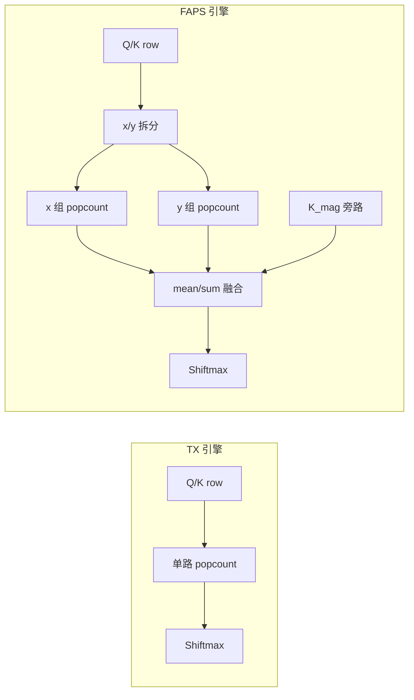
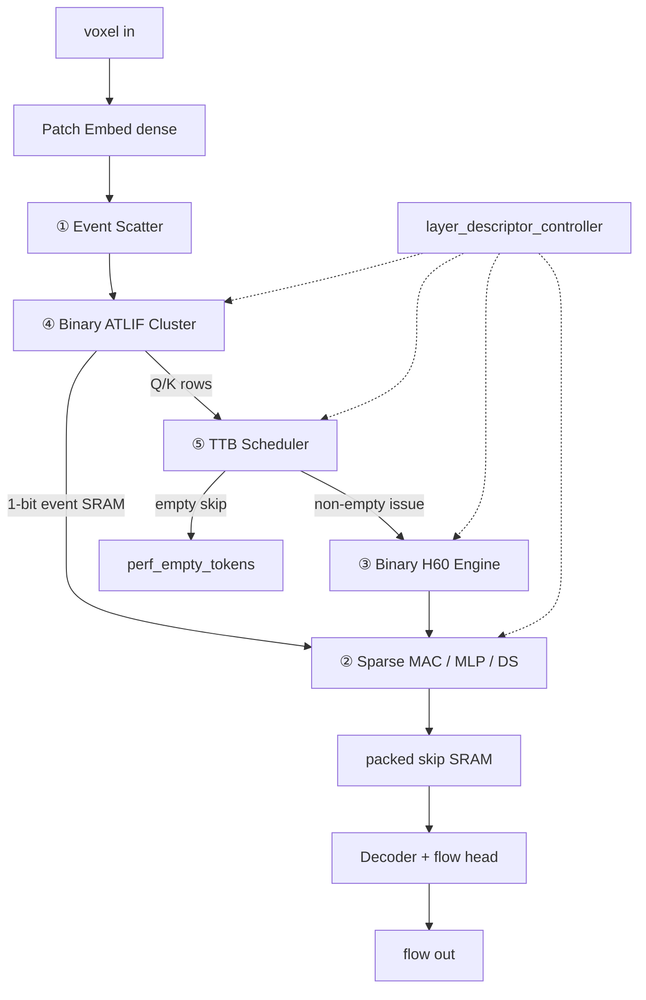
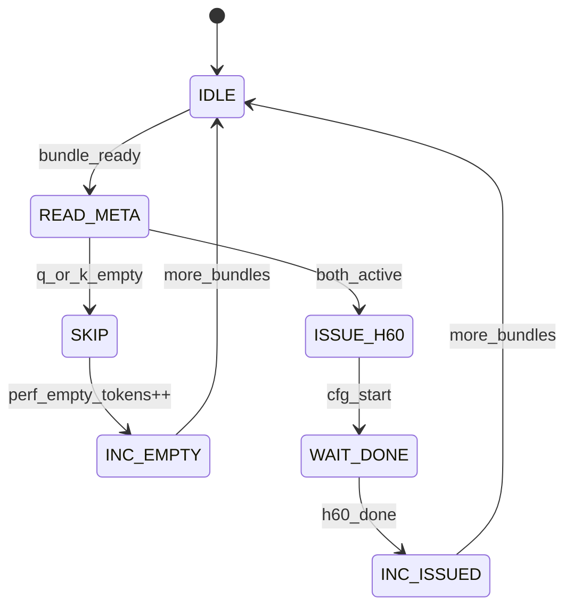
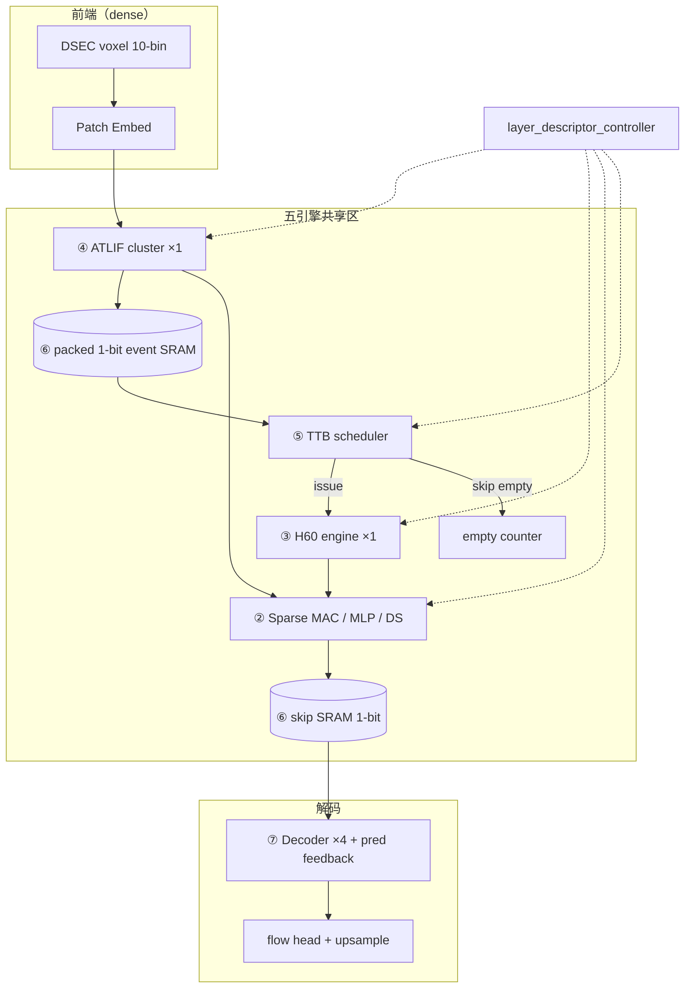

# All-Binary 硬件小白完整入门教程（含 TX / FAPS 选型）

**版本**：2026-06-22  
**读者**：会 PyTorch、没做过 RTL/ASIC，要在 DATE 论文里讲清「软硬件协同」  
**定位**：在 `14_硬件小白入门路线图.md`（7 步总纲）和 `18_NTS11硬件小白入门路线图.md`（7 天实操）之上，补一份**可独立阅读**的完整教材，并专门回答当前分叉：**all-binary + TX** vs **all-binary + FAPS**，硬件上该怎么选。

---

## 0. 先读这 3 句话

1. **软件里的一个 `nn.Module`，不等于硬件里的一块独立芯片**——硬件要靠「数据流 + 复用 + 描述符」把 105 个 ATLIF、12 个 H60 block 收成少数几个引擎。
2. **当前已验证的硬件主线是 all-binary + NTS/H60（`mode=h60`）**，不是纯 TX，也不是 FAPS——但你在 TX 与 FAPS 之间做选择时，结论很明确：**第一版硅优先 TX；FAPS 留给论文消融或第二代**。
3. **学硬件的正确顺序永远是**：端到端数据流 → 张量/bit 格式 → 引擎边界 → 接口/握手 → RTL → 验证闭环。**不要从 Verilog 第一行开始啃。**

---

## 1. 你在解决什么问题？

### 1.1 软件侧（DATE11 实验矩阵）

你们在 DSEC valid825 上比较「全网 binary ATLIF + 不同注意力打分方式」：

| 代号 | `bsa_attention.mode` | 一句话 |
|------|----------------------|--------|
| **TX** | `ternary_alpha_xnor_shiftmax` | 二值 Q/K 上做 popcount 匹配 + Shiftmax 门控 |
| **NTS / H60** | `h60` | **TX + SC 融合**（consensus 修正），再 Shiftmax |
| **FAPS** | `faps` | 在 TX 风格 popcount 上，把 head 拆成 **x/y 光流方向组**，可选 **K_mag** 稀疏修正 |

配置命名规律：

```text
date11full_all_binary_atlif_tx_*.yml    → all-binary + TX
date11full_all_binary_atlif_nts_*.yml    → all-binary + NTS/H60
date11full_all_binary_atlif_faps_*.yml  → all-binary + FAPS
```

### 1.2 硬件侧（DATE 论文要交付什么）

| 交付物 | 含义 |
|--------|------|
| **架构图** | 事件进、光流出；哪些引擎共享、哪些 buffer 复用 |
| **数据格式表** | 1-bit event、INT16 score、INT8 gate 各占多少 bit |
| **RTL 原型** | 至少一个可综合、可仿真的 H60 token-row core |
| **量化证据** | INT8 部署后 AEE/spikes 与 float 接近 |
| **能耗故事** | popcount 代替 float MAC；TTB skip；1-bit SRAM |

硬件小白的第一目标：**能对着软件 forward 画出一张「硬件重排后的数据流图」**，并指出 TX / FAPS 分别多出来哪些电路。

---

## 2. 三条注意力线：软件公式与硬件电路对照

### 2.1 共同前提（all-binary 主线）

无论 TX、H60 还是 FAPS，all-binary 主线里：

- ATLIF wrapper：`output_mode=binary`（105 个 site 全是 1-bit event）
- Q/K 进入注意力前被压成 **事件符号**（0 / +1 / -1 的 ste 版本）
- 不再有 ternary 2-bit tile SRAM 主线

**硬件收益**：全网事件存储统一为 **packed 1-bit**，Scatter + Sparse MAC + 单一格式 SRAM。

---

### 2.2 TX（`ternary_alpha_xnor_shiftmax`）

**软件在干什么（简化）**：

```text
Q_ev, K_ev = sign_ste(Q), sign_ste(K)     # 二值事件
same_nonzero = popcount(Q_ev & K_ev)     # 同号同位激活
same_zero    = popcount(~Q_ev & ~K_ev)   # 同为零
score_token  = same_nonzero + α₀ * same_zero
gate         = Shiftmax(score_token)     # 沿 token 维归一化门控
output       = K * gate                  # threshold-valued K
```

**硬件对应（一块 score engine 就够）**：

```text
           Q_row[head_dim]  ──┐
                              ├── AND ── popcount ── + α₀·popcount_zero ── score
           K_row[head_dim]  ──┘
                                              │
                                              ▼
                                    Shiftmax ── gate ── × K ── out
```

| 硬件模块 | 作用 |
|----------|------|
| `binary_popcount_consensus` | 统计 overlap / zero-overlap |
| `shiftmax_int8_unit` | token 维门控 |
| `gated_k_unit` | gate × K event |

**优点**：电路最直观，和 `rtl_allbinary/binary_popcount_consensus.v` 几乎一一对应。  
**缺点（相对 H60）**：没有 SC 修正项，valid825 精度通常差一截（见 §8 表）。

---

### 2.3 NTS/H60（`h60`）——当前硬件 RTL 对齐对象

**在 TX 基础上多一项 SC（signed consensus）**：

```text
TX_part = popcount(Q&K) + α₀·popcount(~Q&~K)
SC_part = popcount(Q&K) / head_dim    # 再经 μ 调度融合
score   = TX_part + μ · SC_part
```

**硬件**：在 TX 的 popcount 树上**多加一路归一化累加**（μ 可用 `1/16` 定点，已做 INT8 部署验证）。

📄 已有 RTL：`hw_autoresearch_nts07/rtl_dc/unibin_h60_core_dc.sv`  
📄 量化结果：`docs/22_AllBinary_NTS_H60_P0与量化验证结果.md`（AEE 1.4891 → INT8 1.4916）

**结论**：如果论文要写「我们做了芯片」，**H60 不是 TX 和 FAPS 的折中，而是当前唯一有 RTL + 量化 + P0 profiling 闭环的选项。**

---

### 2.4 FAPS（`faps`）——光流方向专用打分

**软件在干什么（`bsa_attention.py` → `_faps_flow_aligned_token_scores`）**：

```text
head_dim 拆两半：
  前半 = x 方向通道组
  后半 = y 方向通道组

score_x = dyadic_popcount_score(Q_x, K_x)   # 带 mismatch / single_active 权重
score_y = dyadic_popcount_score(Q_y, K_y)
score   = mean(score_x, score_y)            # 或 sum / 带 flow_disagreement 惩罚

可选：若 k_magnitude_alpha > 0 且 active >= τ
  score += sparse_quantized_K_mag(...)      # 2-bit 量化 margin 修正
```

**硬件比 TX 多什么**：



| 额外硬件 | 原因 |
|----------|------|
| **head 维 demux** | x/y 两半分别计数 |
| **双路 dyadic score** | 每路有 opposite / single_active 加权 |
| **融合 ALU** | mean 或 \|Sx-Sy\| 惩罚 |
| **K_mag 通路（可选）** | 保留 threshold margin、量化、active-count gate |

短测配置里 FAPS 最优常是 **S2 仅 6 block**（`target_blocks: 2:0..2:5`），不是 all12——**控制器还要支持 per-block 不同 mode**，进一步加重 RTL 负担。

**优点**：论文叙事贴合光流（x/y 一致性）。  
**缺点**：**无 RTL、无 INT8 部署报告、无 valid825 完整全量**；同精度下硬件显著重于 TX。

---

## 3. TX vs FAPS：硬件选型决策表

若你**只能在 TX 与 FAPS 二选一**做第一版注意力引擎（暂时不做 H60）：

| 维度 | **all-binary + TX** | **all-binary + FAPS** |
|------|---------------------|-------------------------|
| Score 引擎数量 | **1 路** popcount | **2 路** + 融合 (+ 可选 K_mag) |
| 覆盖 block | all12（DATE11 默认） | 短测最优常 **S2-only 6** |
| RTL 可复用 | `binary_popcount_consensus.v` | **需新写** |
| 量化验证 | 无独立报告 | 无 |
| valid825（参考） | ep19 AEE **1.583**；FT5 ep2 **1.508** | 短测 valid40 **~1.595**（S2 noKmag） |
| DATE 故事 | 「通用二值匹配注意力」 | 「光流 x/y 方向一致性」 |
| **第一版硅推荐** | **✅ 选 TX** | ❌ 作 ablation / 第二代 |

**但若允许选第三条路（强烈建议）**：

> **all-binary + NTS/H60**：精度 **1.489**（ft ep2）、INT8 **1.492**、RTL **已 DC-ready** → **硬件论文主线应锁这条。**

```text
硬件优先级：
  H60（量产叙事）  >  TX（极简消融 / 面积下限参考）  >  FAPS（方向叙事 / 后续扩展）
```

---

## 4. 端到端数据流（硬件小白第一课）

### 4.1 从事件到光流（软件真实路径）

严格按 `docs/26_AllBinary主线真实数据流与硬件重排设计.md`：

```text
DSEC voxel [B,10,2,H,W]
  → Patch Embed（dense conv，仍是 FP16/FP32）
  → Encoder S0–S3（12 Swin blocks）
       每 block：Norm → H60 Attn → ADD → Norm → MLP → ADD
       S0/S1/S2 末：Downsample（patch merge）
  → 深层 2× ResBlock
  → Decoder 4 级（concat encoder skip + prediction feedback）
  → 多尺度 flow → 时间求和 → 上采样
```

**硬件必须画出的「非 H60」部分**（新手常漏）：

- Patch embed 前端（dense）
- 两处 block residual（ADD0/ADD1）
- 三级 downsample
- Decoder skip concat（1-bit packed buffer 生命周期）
- Prediction feedback

### 4.2 一张图记住 H60 在 block 里的位置

```text
        x_in [B,C,T,H,W]
              │
         ┌────┴────┐
         │  Norm   │
         └────┬────┘
              ▼
    ┌─────────────────────┐
    │  H60 Attention      │  ← TX/FAPS/H60 只替换这一块里的 score 算法
    │  Q/K: binary event  │
    │  out: gated K path  │
    └─────────┬───────────┘
              ▼
         x + attn  (residual ADD)
              ▼
            MLP ...
```

📄 必读：`docs/26` §4–§7  
📄 代码入口：`third_party/SDformerFlow/models/STSwinNet_SNN/Spiking_swin_transformer3D.py`

---

## 5. 数据格式与存储（第二课）

### 5.1 All-binary 主线格式表

| 信号 | 位宽 | 谁产生 | 谁消费 | 存活多久 |
|------|------|--------|--------|----------|
| 输入 voxel | FP16 | 前端 | Patch embed | 1 次 |
| Binary event tile | **1-bit packed** | ATLIF cluster | H60 / Sparse MAC | 1 block～1 stage |
| Q/K row | 1-bit × head_dim | ATLIF | Score engine | 1 window |
| Score | INT16 累加 | popcount | Shiftmax | 1 row |
| Gate | INT8 | Shiftmax | gated-K | 1 row |
| Skip tensor | 1-bit packed | Encoder | Decoder concat | 跨 stage |

### 5.2 为什么 FAPS 让格式变复杂

- TX/H60：一行 Q、一行 K 进 **同一个** popcount 单元即可。
- FAPS：同一行要先 **按 channel 拆 x/y**，中间多两个 score 寄存器，再融合——**SRAM 带宽和控制器状态都变多**。
- 若开 K_mag：还要旁路读 **原始 threshold 域** 的 Q/K（不是纯 1-bit），破坏「全网 1-bit」的简洁性。

---

## 6. 引擎划分（第三课）

All-binary DATE 图推荐 **五类引擎**（见 `docs/22_AllBinary主线硬件规划.md` §2）：

| 引擎 | 包含算子 | 与 TX/FAPS 关系 |
|------|----------|-----------------|
| Event Scatter | voxel → 事件地址 | 无关 |
| Sparse MAC | 1-bit 卷积 / MLP | 无关 |
| **Binary H60 Engine** | popcount + Shiftmax + gated-K | **TX/FAPS/H60 争的是这里面的 score 子电路** |
| Binary ATLIF Cluster | 105 site 复用 | 无关 |
| TTB Scheduler | empty bundle skip | 无关 |

**关键思想**：12 个 attention block **共享 1 个** `binary_h60_engine`，靠 `layer_descriptor` 切换 μ、window、head 数——不是 12 份 RTL。

---

## 7. H60 token-row 微架构（第四课）

以 `rtl_dc/unibin_h60_core_dc.sv` 为准，一行 token 的计算顺序：

```text
1. 载入 Q_row, K_row（ready-valid）
2. popcount_same      = count(Q & K)
3. popcount_zero_pair = count(~Q & ~K)
4. tx_score           = popcount_same + α₀ * popcount_zero_pair
5. sc_score           = popcount_same * norm_factor   # head_dim 或 active 归一化
6. fused_score        = tx_score + μ * sc_score       # μ 定点，如 1/16
7. gate               = Shiftmax(fused_score, row_buffer)
8. k_out              = K * gate
9. 写回 packed SRAM / 下游 MAC
```

**对照学习**：

- 把步骤 4 留下、去掉 5–6 → 你得到 **TX 硬件**
- 把步骤 4 拆成 x/y 两路再合并 → 你得到 **FAPS 硬件**

📄 实操：读 `tb_dc/tb_unibin_h60_core_dc.sv`，对照波形理解 `cfg_mu_shift`、`cfg_alpha0`。

---

## 8. 精度与功耗证据（帮你说服自己别选错）

### 8.1 valid825 参考（all-binary 家族）

| 方案 | 最佳 ep | AEE↓ | spikes | 硬件状态 |
|------|---------|------|--------|----------|
| NB0 baseline | 59 | 1.487 | 44.0G | 非 binary 主线 |
| binary + **NTS/H60** ft | 2 | **1.489** | 23.8G | **RTL + INT8 ✅** |
| binary + TX | 19 | 1.583 | 22.5G | 无专用 RTL |
| binary + TX ft5 | 2 | 1.508 | 22.7G | 无专用 RTL |
| FAPS 短测 | — | ~1.595@valid40 | — | 无 RTL |

来源：`EXPERIMENT_REDESIGN_PLAN.md` DATE11 矩阵、`docs/22_AllBinary_NTS_H60_P0与量化验证结果.md`

### 8.2 P0 profiling（为什么 H60 能讲功耗）

- H60 调用 **480 次**/valid40 规模
- TTB2 empty skip **27–74%**（block 越浅越高）
- 1-bit skip buffer **~1.45 MB/sample** 量级

📄 `docs/23_AllBinary_P0_profiling实测结果.md`

---

## 9. Part II：14 天完整教材（图、表、答案已全部给出）

> **用法**：Part I（§0–§8）是概念速览；本节每天 **2–4 小时**，按 **读讲解 → 对照图/表 → 翻代码验证** 即可。  
> **不要求你画图或填表**——下面每张图、每张表、每道题的答案都已写好，可直接用于加速器设计。  
> **14 天读完你手里应有**：system diagram（§9 Day14）、descriptor v0.1（§9 Day14）、SRAM 预算表（§9 Day5/14）、H60 端口表（§9 Day7）。

### 9.0 总览

| 阶段 | 天 | 主题 | 本节已给出的交付物 |
|------|----|------|-------------------|
| **A** | 1 | 软件 forward | 端到端数据流图 + block 内 H60 位置图 |
| | 2 | TX/H60/FAPS | 三路线对比表 + yml 关键行 |
| | 3 | 五引擎划分 | 顶层框图 + descriptor 字段 + 12 block 调用序 |
| **B** | 4 | 1-bit ATLIF | cluster 微架构图 + site 复用表 |
| | 5 | Skip 生命周期 | 时间线图 + SRAM 表 + 1.45MB 解读 |
| | 6 | TTB empty skip | 状态机图 + profiling 数字 |
| **C** | 7 | H60 端口 | 完整端口表 + 握手时序 + cfg 默认值 |
| | 8 | 仿真 | 验证流程 + 波形说明 + 问答 |
| | 9 | 综合 | Yosys 报告摘录 + checklist 答案 |
| | 10 | INT8 量化 | 定点表 + 数值手算例题 |
| **D** | 11–14 | 论文与定稿 | contribution 正文 + TX/FAPS 段落 + **系统图定稿** |

---

### Phase A：建立地图（Day 1–3）

#### Day 1：软件 forward 路径

**你要记住的一句话**：H60 只是 encoder 每个 Swin block 里的 attention 子块；patch embed、downsample、decoder skip、prediction feedback 都占 SRAM，不能漏。

**图 1：端到端数据流（主路径）**

```text
DSEC voxel [B,10,2,288,384]
        │
        ▼
┌───────────────────┐
│ Patch Embed       │  dense conv，输出 [B,96,T=10,H=72,W=96]
└─────────┬─────────┘
          ▼
┌───────────────────┐     ┌─────────┐
│ S0: H60 block ×2  │────►│ DS0     │──┐
└───────────────────┘     └─────────┘  │ skip S0 写入
          │                              │
          ▼                              │
┌───────────────────┐     ┌─────────┐  │
│ S1: H60 block ×2  │────►│ DS1     │──┤ skip S1
└───────────────────┘     └─────────┘  │
          ▼                              │
┌───────────────────┐     ┌─────────┐  │
│ S2: H60 block ×6  │────►│ DS2     │──┤ skip S2
└───────────────────┘     └─────────┘  │
          ▼                              │
┌───────────────────┐                    │
│ S3: H60 block ×2  │── skip S3 ─────────┤
└─────────┬─────────┘                    │
          ▼                              │
┌───────────────────┐                    │
│ Bottleneck ×2     │                    │
└─────────┬─────────┘                    │
          ▼                              │
┌───────────────────────────────────────┴──┐
│ Decoder0 ← S3 skip                       │
│ Decoder1 ← S2 skip + pred0 feedback      │
│ Decoder2 ← S1 skip + pred1 feedback      │
│ Decoder3 ← S0 skip + pred2 feedback      │
└─────────┬────────────────────────────────┘
          ▼
   Σ_t flow predictions → upsample → optical flow
```

**图 2：单个 Swin block 内部（H60 在哪）**

```text
  x_in ───────────── shortcut0 ─────────────┐
    │                                        │
    ▼                                        │
  Norm                                       │
    │                                        │
    ▼                                        │
┌─────────────┐                              │
│ H60 Attn    │  Q/K: 1-bit event          │
│ (score+gate)│  out: gated K path         │
└──────┬──────┘                              │
       ▼                                      │
    ADD0 ◄───────────────────────────────────┘
       │
       ▼
  Norm → MLP
       │
       ▼
    ADD1 ◄── shortcut1（ADD0 输出）
       │
       ▼
    x_out
```

**表：各 stage 尺寸（crop 288×384）**

| stage | H60 blocks | C | H×W | heads | head_dim | window tokens |
|-------|------------|---|-----|-------|----------|---------------|
| S0 | 2 | 96 | 72×96 | 3 | 32 | 162 |
| S1 | 2 | 192 | 36×48 | 6 | 32 | 162 |
| S2 | 6 | 384 | 18×24 | 12 | 32 | 162 |
| S3 | 2 | 768 | 9×12 | 24 | 32 | 162 |

**H60 在 block 里的五句话（直接记）**

1. 输入：Norm 后的 activation tile，经 ATLIF 产生 Q/K 1-bit event。  
2. 计算：对 window 内每个 query row，与所有 key row 做 popcount score → Shiftmax gate → gated-K。  
3. 输出：gated attention 结果，与 block 入口 shortcut 做 ADD0。  
4. 后续：MLP 再与 ADD0 输出做 ADD1，得到 block 输出。  
5. H60 不处理 skip；skip 在 stage 级由 BasicLayer 在 downsample 前写出。

**对照阅读**：`docs/26` §1–§4；`Spiking_swin_transformer3D.py` 里 `Spiking_SwinTransformerBlock3D.forward`、`Spiking_Swin_BasicLayer.forward`。

**自测（题 + 答案）**

| # | 问题 | 答案 |
|---|------|------|
| 1 | 12 个 H60 block 怎么分布？ | S0×2、S1×2、S2×6、S3×2 |
| 2 | downsample 在哪？ | S0/S1/S2 末；S3 无 |
| 3 | block 内除 H60 外还有哪两次 ADD？ | ADD0=attn+shortcut；ADD1=MLP+ADD0 |
| 4 | decoder 除 encoder skip 还有什么？ | 上一级 prediction feedback concat |
| 5 | patch embed 输出分辨率？ | 72×96，C=96，T=10 |

---

#### Day 2：TX vs H60 vs FAPS

**图 3：三条 score 数据通路**

```text
                    ┌── 共用：Q_row[32], K_row[32] 均为 1-bit event ──┐
                    │                                                │
     TX 路径         │   AND → popcount(Q&K)                          │
                    │        + α₀·popcount(~Q&~K)                      │
                    │                └──────────────► Shiftmax → gate  │
                    │                                                │
     H60 路径        │   同上 TX 部分                                   │
                    │        + μ·(overlap/head_dim)   ← 多这一条      │
                    │                └──────────────► Shiftmax → gate  │
                    │                                                │
     FAPS 路径       │   head 拆半：                                    │
                    │   Q_x,K_x → dyadic score_x ─┐                    │
                    │   Q_y,K_y → dyadic score_y ─┼→ mean/fuse        │
                    │   可选 K_mag 旁路 ──────────┘                    │
                    │                └──────────────► Shiftmax → gate  │
                    └────────────────────────────────────────────────┘
```

**表：三路线硬件对比（已填好）**

| 维度 | TX | H60 | FAPS |
|------|----|-----|------|
| 输入 Q/K | 1-bit ×32 | 同左 | 同左，但先 x/y demux |
| score 中间量 | UINT8 popcount | INT16 fused score | 两路 score + 融合寄存器 |
| 输出 | INT8 gate × threshold-K | 同左 | 同左 |
| 多出来的算子 | 无 | μ 乘加 + `/head_dim` | demux、双 popcount、融合 ALU；可选 K_mag |
| RTL | `binary_popcount_consensus.v` | `unibin_h60_core_dc.sv` ✅ | 无 |
| 相对 TX 面积倍数（粗估） | 1.0× | ~1.15× | ~2.2×（+K_mag 更高） |
| valid825 AEE | TX ft5 ep2 **1.508** | H60 ft ep2 **1.489** | 短测 valid40 ~**1.595** |

**表：两份 yml 决定 mode 的关键行（已抄好）**

| 字段 | H60 主线 `...nts_stdlr_ft_ep29_ft5.yml` | TX `...tx_w720_fastlr_full30.yml` |
|------|----------------------------------------|-----------------------------------|
| `bsa_attention.mode` | `h60` | `ternary_alpha_xnor_shiftmax` |
| `bipolar_mu` | `0.05` | `0.05`（TX 分支不用 SC，字段存在但不进 score） |
| `target_blocks` | `0:0`…`3:1` 共 12 个 | 同样 all12 |

**软件函数对照**（`bsa_attention.py`）

| 模式 | 函数 |
|------|------|
| TX | `_ternary_alpha_xnor_token_scores` |
| H60 | `_tx_sc_fusion_score_pair` |
| FAPS | `_faps_flow_aligned_token_scores` |

**为何 FAPS 开 K_mag 破坏「全网 1-bit」**：K_mag 要读 threshold 域的连续 margin 并做量化与 active-count 门控，数据通路不再是纯 popcount 可完成的 1-bit match，需旁路宽位 SRAM，控制状态也翻倍。

**第一版硅选型（直接结论）**：锁 **H60**；TX 作面积下界消融；FAPS 只写论文 ablation，不做 v1 RTL。

**自测（题 + 答案）**

| # | 问题 | 答案 |
|---|------|------|
| 1 | H60 比 TX 多什么？ | SC 项：μ·(popcount(Q&K)/head_dim) |
| 2 | FAPS x/y 拆分含义？ | head 前半→水平光流证据，后半→垂直 |
| 3 | `binary_popcount_consensus.v` 对应哪步？ | TX 的 overlap + same_zero；H60 在其后加 μ·SC |
| 4 | FAPS 为何常 S2-only 6 block？ | 光流语义集中在 S2；控制器要 per-block mode |
| 5 | 第一版 score 锁谁？ | H60：RTL+INT8+AEE 最优 |

---

#### Day 3：五引擎划分

**图 4：顶层五引擎（mermaid）**



**表：descriptor 字段 → 下发引擎（草案，可直接用）**

| 字段 | 下发给 | 含义 |
|------|--------|------|
| `layer_id` | controller 内部 | 全局递增任务 ID |
| `stage`, `block` | 全部引擎 | 当前 Swin stage/block |
| `module_type` | ATLIF / H60 / MAC | ATLIF \| H60 \| MLP \| DS |
| `in_base_addr`, `out_base_addr` | ATLIF, MAC, SRAM ctrl | packed event 地址 |
| `C`, `T`, `H`, `W` | 全部 | tile shape |
| `num_heads`, `head_dim` | H60 | 默认 3–24 heads，head_dim=32 |
| `window[3]` | H60 | 默认 `[2,9,9]` → 162 tokens |
| `mu_q8`, `alpha0_q8` | H60 | μ≈13(0.05)，α₀≈5(0.02) |
| `preserve_mean` | H60 | 对齐 `center_scores` |
| `score_mode` | H60 | `H60`（v1）；预留 `TX` |

**表：12 个 H60 block 调用次序（forward 顺序）**

| 序 | stage:block | heads | H×W |
|---|-------------|-------|-----|
| 1 | 0:0 | 3 | 72×96 |
| 2 | 0:1 | 3 | 72×96 |
| 3 | 1:0 | 6 | 36×48 |
| 4 | 1:1 | 6 | 36×48 |
| 5 | 2:0 | 12 | 18×24 |
| 6 | 2:1 | 12 | 18×24 |
| 7 | 2:2 | 12 | 18×24 |
| 8 | 2:3 | 12 | 18×24 |
| 9 | 2:4 | 12 | 18×24 |
| 10 | 2:5 | 12 | 18×24 |
| 11 | 3:0 | 24 | 9×12 |
| 12 | 3:1 | 24 | 9×12 |

**自测（题 + 答案）**

| # | 问题 | 答案 |
|---|------|------|
| 1 | 为何不是 12 份 H60 RTL？ | 分时复用；换 descriptor 即换 layer |
| 2 | TX/FAPS/H60 分歧在哪类引擎？ | ③ score 子电路 |
| 3 | packed_event_sram 谁写谁读？ | ATLIF 写；H60/MAC/decoder 读；encoder 写 skip、decoder 读 skip |
| 4 | Patch Embed 算五引擎吗？ | 不算；dense 前端，独立面积预算 |
| 5 | descriptor vs state_dict？ | descriptor=运行时调度；state_dict=离线权重 |

---

### Phase B：比特与存储（Day 4–6）

#### Day 4：1-bit ATLIF

**图 5：ATLIF cluster 微架构**

```text
layer_descriptor ──► module_id, in_addr, out_addr, threshold, center
                              │
                              ▼
                    ┌─────────────────┐
   activation SRAM ─► subtract center │
                    │ compare ≥ thr   │  ×N lane（如 32 lane/cycle）
                    │ 1-bit packer    │
                    └────────┬────────┘
                             ▼
                    packed event SRAM ──► H60 / Sparse MAC
```

**表：105 logical site → 1 cluster 的复用模式（节选 + 规律）**

| 调度序 | stage | block | 角色 | 说明 |
|--------|-------|-------|------|------|
| 1 | 0 | 0 | Q/K/V for H60 | 每个 block 先 ATLIF-Q/K，再 H60 |
| 2 | 0 | 0 | MLP in | MLP 前 ATLIF |
| 3 | 0 | 1 | Q/K/V + MLP | 同模式 |
| … | … | … | … | S0 2 block × 每 block ~7–8 site |
| 9 | 1 | 0 | Q/K/V + MLP | S1 通道加倍 |
| … | 2 | 0–5 | Q/K/V + MLP | S2 占 6 block，site 最多 |
| 21 | 3 | 0–1 | Q/K/V + MLP | S3 head=24 |

**规律**：安装识别 **105** 个 wrapper，forward hook 记录 **93** 个；未记录的是部分未走 ATLIF 路径的 site。硬件按 **105 调度槽** 编程即可，物理只需 **1 cluster**。

**value_mode=threshold 与 1-bit 并存**：SRAM 里存 1-bit active；`in_k_value` 在 H60 gated-K 阶段从 threshold 常量或旁路恢复幅度。

**S2 写流量量级**（`docs/23`）：`swin_block` 类 1-bit packed 约 **157 MB / 40 samples ≈ 3.9 MB/sample**（含所有 block 内 event tile，不单层）。

**自测（题 + 答案）**

| # | 问题 | 答案 |
|---|------|------|
| 1 | ATLIF 输入？ | activation（conv/膜电位），不是已有 event |
| 2 | 为何不是 105 套 comparator？ | descriptor 分时复用，物理 1 cluster |
| 3 | binary 输出几位？ | 1-bit |
| 4 | threshold 放哪？ | ROM/常量寄存器（official ATLIF 起步 1.0） |
| 5 | 给 H60 vs MLP 格式同吗？ | 存的都是 1-bit event；MLP 内部 MAC 可 widen |

---

#### Day 5：Skip / residual 生命周期

**图 6：Skip 时间线（横轴 = 推理阶段）**

```text
时间 ─────────────────────────────────────────────────────────────►

Patch    S0 blk   DS0   S1 blk   DS1   S2 blk×6   DS2   S3   Bottleneck   Dec3 Dec2 Dec1 Dec0
  │        │       │      │       │       │        │     │        │         │    │    │    │
  │        ├─S0 skip 写入───────────────────────────────────────────────┐   │    │    │    │
  │        │       ├─S1 skip 写入──────────────────────────────────┐   │   │    │    │    │
  │        │       │      │       ├─S2 skip 写入──────────────┐    │   │   │    │    │    │
  │        │       │      │       │       │        │     ├S3 skip┤   │   │    │    │    │
  │        │       │      │       │       │        │     │      │   │   │    │    │    │
  │        │       │      │       │       │        │     │      │   └───┴────┴────┴─ 读 S0
  │        │       │      │       │       │        │     │      │        读 S1/S2/S3
  shortcut0/1：仅在单个 block 内部存活（ADD0/ADD1），不进长 SRAM
  pred feedback：Dec(i) 输出 ──► Dec(i+1) 输入，存活 1 个 decoder 级
```

**表：SRAM 生命周期（已填，可直接进 architecture spec）**

| 数据 | 位宽 | 产生 | 消费 | 生命周期 | 存储 |
|------|------|------|------|----------|------|
| Q row | 1-bit×32 | ATLIF-Q | H60 score | 1 window row | event SRAM / stream |
| K row | 1-bit×32 | ATLIF-K | H60 score+gate | 1 window row | 同上 |
| score | INT16 | popcount | Shiftmax | 整行 162 tokens | score_mem（片上） |
| gate | INT8 | Shiftmax | gated-K | 逐 token emit | 可流式，不强制 SRAM |
| shortcut0 | 定点/event | block in | ADD0 | 同 block | local reg |
| shortcut1 | 定点/event | ADD0 out | ADD1 | 同 block | local reg |
| S0 skip | 1-bit pack | S0 DS 前 | Dec3 | 最长 | off-chip 或 DDR |
| pred feedback | 定点 flow | Dec i-1 | Dec i | 1 级 | prediction buffer |

**表：skip 容量（`docs/23`，每 sample）**

| skip 类型 | 1-bit packed |
|-----------|-------------|
| S0/S1/S2 pre-DS 合计 | **1,451,520 B ≈ 1.45 MB** |
| S3 final | **103,680 B ≈ 0.10 MB** |

**设计结论**：1.45 MB/sample 放不进典型片上 SRAM → **DDR/LPDDR 存 skip + 片上 cache 当前 stage 工作集**；all-binary 比 2-bit ternary 再减半，比 FP16 小 16×。

**自测（题 + 答案）**

| # | 问题 | 答案 |
|---|------|------|
| 1 | S0 skip 为何 DS 前？ | 对齐软件 `out_x before downsample`，decoder 要高分辨率 |
| 2 | S0 vs S2 skip 谁活得久？ | S0（分辨率最高，跨 bottleneck+全程 decoder） |
| 3 | score 为何不能 1-bit？ | popcount 累加需 INT16，否则 Shiftmax 失真 |
| 4 | gate 能否不存整行？ | 可以流式 emit；但 score 行必须先算完 |
| 5 | 1.45MB 意味什么？ | 主 skip 放片外；片上只 cache 热点 tile |

---

#### Day 6：TTB / empty skip

**图 7：TTB issue-gating 状态机**



**表：TTB2 empty ratio（valid40 profiling，已抄）**

| stage | TTB1 empty | TTB2 empty | 解读 |
|-------|------------|------------|------|
| S0 | 58.9% | **27.9%** | 浅层 Q/K 稍活，TTB1 更激进 |
| S1 | 85.4% | **73.8%** | 极稀疏，skip 潜力最大 |
| S2 | 73.8% | **63.0%** | 光流主语义层，仍过半可 skip |
| S3 | 72.1% | **64.5%** | 与 S2 类似 |

**表：`unibin_h60_core_dc` perf 计数器**

| 信号 | 含义 |
|------|------|
| `perf_tokens_loaded` | 进入 core 的 token 总数（含 empty） |
| `perf_empty_tokens` | Q/K 全零被跳过的 token 数 |
| `perf_issued_tokens` | 实际参与 score 的非空 token 数 |

关系：`perf_issued_tokens ≤ perf_tokens_loaded`；empty 计入 loaded 但不计入 issued。

**论文一句话（直接用）**：We gate H60 work issue on empty token-time bundles, skipping up to 74% of attention token evaluations in shallow stages.

**自测（题 + 答案）**

| # | 问题 | 答案 |
|---|------|------|
| 1 | TTB 是算法还是调度？ | 调度层 work unit |
| 2 | empty 省什么？ | SRAM 读、popcount+Shiftmax、gated-K 写 |
| 3 | binary 为何易 detect？ | 1-bit OR-reduction 即可，无需 ternary 解码 |
| 4 | loaded vs issued？ | loaded 含 empty；issued 只计非空 |
| 5 | S1 为何 empty 最高？ | Q 活性 0.03%，K 也极低（见 docs/23） |

---

### Phase C：RTL 与验证（Day 7–10）

#### Day 7：H60 core 端口（冻结版）

**表：完整端口表（`unibin_h60_core_dc.sv`）**

| 信号 | 方向 | 位宽 | 功能 |
|------|------|------|------|
| `clk_core` | in | 1 | 核心时钟 |
| `rst_n_core` | in | 1 | 异步复位，低有效 |
| `cfg_start` | in | 1 | 启动一行 attention row（脉冲） |
| `cfg_n_tokens` | in | 8 | 本 row token 数，≤162 |
| `cfg_mu_q8` | in | 8 | μ 的 Q8 定点 |
| `cfg_preserve_mean` | in | 1 | 是否 score centering |
| `in_valid` | in | 1 | 输入 token 有效 |
| `in_ready` | out | 1 | core 可接收 |
| `in_last` | in | 1 | 本 row 最后一个 token |
| `in_q_bits` | in | 32 | Q event，HEAD_DIM=32 |
| `in_k_bits` | in | 32 | K event |
| `in_k_value` | in | 8 signed | K threshold 幅度 |
| `out_valid` | out | 1 | 输出 token 有效 |
| `out_ready` | in | 1 | 下游可接收 |
| `out_last` | out | 1 | 本 row 最后输出 |
| `out_token_idx` | out | 8 | 当前 token 索引 |
| `out_gate` | out | 8 | Shiftmax gate |
| `out_gated_k` | out | 16 signed | gate × K |
| `busy` | out | 1 | 计算进行中 |
| `done` | out | 1 | 本 row 完成脉冲 |
| `perf_tokens_loaded` | out | 8 | 加载 token 计数 |
| `perf_empty_tokens` | out | 8 | empty token 计数 |
| `perf_issued_tokens` | out | 8 | 非空 token 计数 |

**图 8：握手时序（LOAD 3 token 示例）**

```text
clk          /‾\_/‾\_/‾\_/‾\_/‾\_/‾\_/‾\_/‾\_/‾\_/‾\_/‾\_/‾\_/‾\_/‾\_/‾\_/‾\_
cfg_start    ‾‾‾\___________________________
in_valid     _____/‾‾\___/‾‾\___/‾‾\___________   (3 tokens)
in_last      ___________________/‾‾\___________
in_ready     ‾‾‾‾‾‾‾‾‾‾‾‾‾‾‾‾‾‾‾‾‾‾‾‾‾‾‾‾‾‾‾‾‾‾   (tb 常恒 1)
             |←── ST_LOAD ──→|
busy         _______/‾‾‾‾‾‾‾‾‾‾‾‾‾‾‾‾‾‾‾‾‾‾‾‾\___
             |LOAD|FIND_MAX|SUM_EXP|← EMIT →|DONE|
out_valid    _______________________/‾‾\___/‾‾\___...
out_gate     _______________________/VAL\___/VAL\___
done         ___________________________________/‾\_
```

**表：cfg 默认值（S2 block0，训练 vs 部署）**

| 字段 | 训练（yml） | 部署（RTL） |
|------|-------------|-------------|
| `cfg_n_tokens` | 162 | 162 |
| `cfg_mu_q8` | 0.05×256≈**13** | **16**（μ=1/16=0.0625） |
| `cfg_preserve_mean` | 1 | 1 |
| `ALPHA0_Q8` | 0.02×256≈5 | 5（RTL 参数） |

**状态机**：`IDLE → LOAD → FIND_MAX → SUM_EXP → EMIT → DONE`

**自测（题 + 答案）**

| # | 问题 | 答案 |
|---|------|------|
| 1 | `in_q_bits` 位宽？ | 32（HEAD_DIM） |
| 2 | `cfg_mu_q8` 控制？ | μ·SC 融合权重 |
| 3 | 为何有 `in_k_value`？ | 1-bit match；threshold 幅度给 gated-K |
| 4 | busy/done？ | cfg_start 后 busy=1；row 完成 done 脉冲 |
| 5 | `cfg_start` vs `in_valid`？ | cfg_start 启动整 row；in_valid 逐 token 灌数据 |

---

#### Day 8：Testbench 仿真

**图 9：验证闭环**

```text
PyTorch H60 forward (h60 mode, ep2 ckpt)
        │ 导出 CSV golden
        ▼
tb_unibin_h60_core_dc.sv  ──► 驱动 in_* / 比对 out_gate, out_gated_k
        │
        ▼
   PASS / FAIL log
```

```bash
cd hw_autoresearch_nts07/sim_dc && bash run_iverilog_dc.sh
```

**波形 EMIT 第一拍（文字版标注）**

| 信号 | EMIT 第 1 拍 |
|------|-------------|
| `out_valid` | 0→1 |
| `out_token_idx` | 0 |
| `out_gate` | 该行 token0 的 INT8 gate |
| `out_gated_k` | gate × in_k_value（token0） |
| `token_empty_w`（内部） | 若 Q/K 全零则为 1，gate≈0 |

**自测（题 + 答案）**

| # | 问题 | 答案 |
|---|------|------|
| 1 | 失败先看哪？ | checker 打印的 token_idx 与 expected/actual |
| 2 | gate 差 1 LSB？ | INT8 部署通常允许 ±1 ULP |
| 3 | iverilog vs verilator？ | 前者功能仿真；后者 lint |
| 4 | 谁驱动 out_ready？ | tb，常 tie 1 |
| 5 | empty token 表现？ | perf_empty_tokens++，gate≈0 |

---

#### Day 9：综合

**Yosys 报告摘录（已有）**

```text
Number of cells:    24313
Number of memories: 0        ← score_mem 被展成 FF，尚未绑 SRAM macro
Found and reported 0 problems
```

**DC-ready 五条（答案）**

1. 状态机 `enum` 可综合，无意外 latch。  
2. 无仿真-only `initial` 进综合路径。  
3. `score_mem[162]` 综合为寄存器堆或后续手动替 SRAM macro。  
4. `HEAD_DIM=32` 常量 → popcount 展开、除法变移位。  
5. top=`unibin_h60_core_dc` 可单独过 Yosys。

**尚未等于 signoff**：缺 SDC、memory compiler、PyTorch bit-accurate golden、SAIF 功耗。

**自测（题 + 答案）**

| # | 问题 | 答案 |
|---|------|------|
| 1 | 综合 vs 仿真？ | 仿真=功能正确；综合=能映射标准单元+面积可行 |
| 2 | score_mem 162 深度？ | ~2.6Kb 寄存器或 1 个小 SRAM |
| 3 | HEAD_DIM=32 重要性？ | 循环完全展开，时序可估 |
| 4 | Shiftmax 为何不能 formal signoff？ | exp2 近似，未逐 bit 等价证明 |
| 5 | 加 FAPS 双路？ | v1 不建议；若做则同一 top 内第二路 score，面积 ~2× |

---

#### Day 10：INT8 量化部署

**表：定点格式（已定稿）**

| 量 | 格式 | 典型值 |
|----|------|--------|
| overlap, same_zero | UINT8 | 0–32 |
| fused score | Q7.8 / INT16 | SCORE_FRAC=7 |
| μ | Q0.8 | train 13；deploy **16** |
| α₀ | Q0.8 | 5 |
| gate | INT8 | Shiftmax out |
| gated_k | INT16 | 8+8 |

**数值例题（overlap=8, head_dim=32, μ=1/16, α₀=0.02）**

```text
same_zero 粗估 ≈ 32 - q_active - k_active + overlap（设 ≈8）
TX_part ∝ overlap + α₀·same_zero ≈ 8 + 0.02×8 ≈ 8.16
SC_part = overlap/32 = 8/32 = 0.25
fused ≈ TX_part/32 + μ·SC_part ≈ 0.255 + 0.0625×0.25 ≈ 0.271
（RTL 用 Q7.8 整数运算，上式仅示数量级）
```

**AEE 1.489 → 1.492 解释（200 字，直接用）**

训练用 μ=0.05，部署量化为 μ=1/16=0.0625，误差 0.0125。但 SC 项经 head_dim 归一后量级远小于 TX 主项，μ 偏差只影响融合里的小分量。Shiftmax 对 score 做减 max 再 exp，非线性能吸收小幅偏移。gate 输出 INT8 本身有量化台阶，与 μ 量化同量级。故 valid825 AEE 仅从 1.4891 升到 1.4916（+0.0025），在论文可报告为 deploy-friendly。

**自测（题 + 答案）**

| # | 问题 | 答案 |
|---|------|------|
| 1 | 0.05 vs 1/16 差？ | 0.0125；SC 加权后影响小 |
| 2 | SCORE_FRAC=7？ | 16b score 里 7 位小数 |
| 3 | INT8 gate 误差影响？ | 主要 gated-K 幅度 |
| 4 | 论文写哪个 μ？ | 训练 0.05 + 部署 1/16 及精度损失 |
| 5 | FAPS 难 INT8？ | 双路+K_mag 量化链更长 |

---

### Phase D：论文与系统图冻结（Day 11–14）

#### Day 11：DATE 创新点（正文已写好）

**三条 contribution（英文，可直接进论文）**

1. **Unified all-binary event datapath.** We convert the full SDformerFlow encoder to a single 1-bit packed event format, collapsing 105 ATLIF logical sites into one time-shared binary cluster and eliminating mixed ternary rails. *(Fig.1, evidence: `docs/22`, `docs/26`)*

2. **Shared popcount–consensus H60 engine.** One H60 token-row core serves all 12 encoder blocks with runtime descriptors; RTL is synthesis-clean (24k cells, 0 errors) and INT8-deployable with &lt;0.003 AEE drift. *(Fig.2, evidence: `rtl_dc/unibin_h60_core_dc.sv`, `docs/22_AllBinary_NTS_H60_P0与量化验证结果.md`)*

3. **TTB-gated work issue.** Empty token-time bundles skip H60 issue entirely, measured at 28–74% across stages on valid40 profiling, cutting spike energy without relying on sparse Shiftmax. *(Fig.3, evidence: `docs/23`)*

**证据路径表**

| contribution | 文件 |
|--------------|------|
| 1 | `docs/22_AllBinary主线硬件规划.md`, `docs/26` |
| 2 | `rtl_dc/unibin_h60_core_dc.sv`, `sim_dc/build/yosys_unibin_h60_core_dc.rpt` |
| 3 | `docs/23_AllBinary_P0_profiling实测结果.md` |

---

#### Day 12：TX 消融（段落已写好）

**数字**

| 方案 | AEE | spikes | 硬件 |
|------|-----|--------|------|
| H60 ft ep2 | **1.489** | 23.8G | RTL + INT8 |
| TX ft5 ep2 | 1.508 | 22.7G | 无 μ·SC 电路 |

**英文段落（150 词，直接用）**

We include a TX-only popcount baseline as an area floor. TX removes the μ-weighted consensus path and keeps only overlap-based dyadic matching plus Shiftmax gating. On valid825, TX finetuning reaches AEE 1.508 versus 1.489 for the full H60 path—a 0.019 gap at similar spike counts (~23G). Hardware-wise, TX saves a fixed-point multiply-add and head-dimension normalization after the popcount tree, estimated at &lt;15% of the H60 score engine. The consensus term therefore offers a favorable accuracy–area trade-off: a small additional popcount datapath buys back most of the TX penalty. For aggressive area targets, TX remains a fallback, but our first silicon aligns with H60 because it is the only variant with closed RTL, INT8 deployment, and P0 profiling evidence.

**风险一句**：面积极紧只上 TX → AEE 恶化约 **0.02**；审稿人会问「有无 INT8 等价验证」——TX 目前没有。

---

#### Day 13：FAPS 定位（正文已写好）

**FAPS 比 TX 多的硬件模块**

| 模块 | 作用 |
|------|------|
| head demux | 把 32 通道拆成 x/y 各 16 |
| 双路 dyadic popcount | score_x、score_y 并行 |
| 融合 ALU | mean / sum / \|Sx−Sy\| 惩罚 |
| （可选）K_mag 旁路 | 连续域 margin，破坏纯 1-bit 路径 |

**英文段落（100 词，直接用）**

FAPS reweights attention by flow-aligned x/y channel groups, which is attractive for optical-flow narrative but expensive in silicon: it duplicates the popcount score path and requires per-block mode descriptors when only stage-2 blocks are enabled. Our short valid40 sweep shows FAPS trailing H60 on accuracy without an RTL or INT8 signoff path. We therefore position FAPS as a flow-aligned ablation in software, not as the first-chip attention engine. Future work can add a dual-score mode to the shared H60 shell once bit-accurate golden vectors exist.

**S2-only 6 block 对 controller 的要求**：descriptor 里 `score_mode` 和 `target_blocks` 必须 per-entry 不同（非 all12 统一），状态机需加载 **block 级** 而非 **chip 级** 常量。

---

#### Day 14：系统图定稿 + descriptor v0.1 + SRAM 预算

**图 10：1 页 system diagram（定稿，可直接贴 PPT / DATE 稿）**



**表：layer descriptor v0.1（12 个 H60 block，可直接导入 spreadsheet）**

| layer_id | stage | block | module | C | T | H | W | heads | head_dim | mu_q8 | score_mode |
|---------:|------:|------:|--------|--:|--:|--:|--:|------:|---------:|------:|------------|
| 10 | 0 | 0 | H60 | 96 | 10 | 72 | 96 | 3 | 32 | 13 | H60 |
| 11 | 0 | 1 | H60 | 96 | 10 | 72 | 96 | 3 | 32 | 13 | H60 |
| 20 | 1 | 0 | H60 | 192 | 10 | 36 | 48 | 6 | 32 | 13 | H60 |
| 21 | 1 | 1 | H60 | 192 | 10 | 36 | 48 | 6 | 32 | 13 | H60 |
| 30 | 2 | 0 | H60 | 384 | 10 | 18 | 24 | 12 | 32 | 13 | H60 |
| 31 | 2 | 1 | H60 | 384 | 10 | 18 | 24 | 12 | 32 | 13 | H60 |
| 32 | 2 | 2 | H60 | 384 | 10 | 18 | 24 | 12 | 32 | 13 | H60 |
| 33 | 2 | 3 | H60 | 384 | 10 | 18 | 24 | 12 | 32 | 13 | H60 |
| 34 | 2 | 4 | H60 | 384 | 10 | 18 | 24 | 12 | 32 | 13 | H60 |
| 35 | 2 | 5 | H60 | 384 | 10 | 18 | 24 | 12 | 32 | 13 | H60 |
| 40 | 3 | 0 | H60 | 768 | 10 | 9 | 12 | 24 | 32 | 13 | H60 |
| 41 | 3 | 1 | H60 | 768 | 10 | 9 | 12 | 24 | 32 | 13 | H60 |

部署时将 `mu_q8` 改为 **16**；TX 消融行改 `score_mode=TX` 且 `mu_q8=0`。

**表：SRAM 预算（on-chip vs off-chip 决策）**

| buffer | 每 sample 1-bit | 建议位置 |
|--------|-----------------|----------|
| S0/S1/S2 skip 合计 | **1.45 MB** | **off-chip DDR** + 片上 line cache |
| S3 skip | 0.10 MB | 可片上或 off-chip |
| score_mem（H60 行） | 162×16b ≈ 324 B | **on-chip**（core 内） |
| event tile 工作集 | ~3.9 MB（block 内合计） | 片上 cache + DDR 回写 |
| prediction feedback | 3.7 KB | on-chip |
| weight/threshold | 模型相关 | on-chip ROM 或 DDR |

**结业 10 题（题 + 答案，全展开）**

| # | 问题 | 答案 |
|---|------|------|
| 1 | patch embed 为何不并进 H60？ | dense FP conv，与 1-bit popcount 数据通路不同 |
| 2 | 12 block 共享 H60 的调度主线？ | `layer_descriptor_controller` → `cfg_*` |
| 3 | empty skip 最高 stage？ | S1 TTB2 **73.8%** |
| 4 | Q/K 输入位宽？ | 各 32-bit 向量，每 bit 1 event |
| 5 | INT8 deploy vs 训练 AEE？ | **1.492** vs **1.489** |
| 6 | TX 少什么通路？ | μ·SC 融合与 head_dim 归一 |
| 7 | FAPS 为何不做 v1 RTL？ | 无闭环、面积大、常需 per-block mode |
| 8 | 1.45MB 什么格式？ | all-binary **1-bit packed** skip |
| 9 | 为何要 `in_k_value`？ | 1-bit match + threshold 恢复 gated-K |
| 10 | 论文 main result 对齐哪条配置？ | `date11full_all_binary_atlif_nts_stdlr_ft_ep29_ft5.yml` ep2 |

**至此可着手设计硬件加速器**：图 10 = 顶层；Day 7 端口表 = H60 外壳；上表 descriptor = 调度 ROM；SRAM 表 = 存储规划；TTB 按 Day 6 省 28–74% H60 发射。

---

## 10. 自测题库（附录：题 + 答案全给出）

### 10.1 概念题

| # | 问题 | 答案 |
|---|------|------|
| 1 | 105 个 ATLIF 为何可以是 1 个 cluster？ | descriptor 分时复用；物理一套 compare/threshold，换 cfg 即换 layer |
| 2 | `value_mode=threshold` 与 1-bit 矛盾吗？ | 不矛盾；1-bit 做 match；threshold 在 gated-K 经 `in_k_value` 恢复 |
| 3 | TTB2 empty skip 省什么？ | 整 bundle 的 SRAM 读 + popcount/Shiftmax + gated-K 写 |
| 4 | FAPS x/y 拆分物理意义？ | 前半=水平光流证据，后半=垂直光流证据 |
| 5 | FAPS 开 K_mag 为何难量化？ | 需连续域 margin + 量化 + active gate，破坏纯 popcount 通路 |

### 10.2 选型题

| # | 问题 | 答案 |
|---|------|------|
| 1 | 第一版 score 选谁？ | **H60**：RTL+INT8+最优 AEE |
| 2 | FAPS 放 main 还是 ablation？ | **ablation / future work** |
| 3 | 先 TX 再 OTA H60？ | 可行但 AEE 风险 ~**0.02**；TX 无 INT8 闭环，审稿人会追问 |

### 10.3 实操题

| # | 问题 | 答案 |
|---|------|------|
| 1 | yml 哪行决定 H60？ | `bsa_attention.mode: h60`（TX 为 `ternary_alpha_xnor_shiftmax`） |
| 2 | FAPS 融合 x/y 的函数？ | `_faps_flow_aligned_token_scores` |
| 3 | H60 core 接收 Q/K 的握手？ | `in_valid` + `in_q_bits[31:0]` + `in_k_bits[31:0]`（`in_ready` 反压） |

---

## 11. 常用文件索引

| 用途 | 路径 |
|------|------|
| 总纲（7 步） | `docs/14_硬件小白入门路线图.md` |
| 7 天实操 | `docs/18_NTS11硬件小白入门路线图.md` |
| 真实数据流 | `docs/26_AllBinary主线真实数据流与硬件重排设计.md` |
| 硬件规划 | `docs/22_AllBinary主线硬件规划.md` |
| P0 + 量化 | `docs/22_AllBinary_NTS_H60_P0与量化验证结果.md` |
| RTL 启动 | `docs/24_AllBinary_UniBinH60_RTL启动与DATE硬件设计.md` |
| H60 主教材 | `docs/16_统一H60注意力硬件方案.md` |
| 注意力实现 | `neuron_experiments/H9_bipolar_self_attention/overlay/models/STSwinNet_SNN/bsa_attention.py` |
| TX 全量配置 | `configs/generated/date11full_all_binary_atlif_tx_w720_fastlr_full30.yml` |
| H60 主线配置 | `configs/generated/date11full_all_binary_atlif_nts_stdlr_ft_ep29_ft5.yml` |
| FAPS 生成脚本 | `entrypoints/make_date11_allbinary_faps_configs.py` |
| H60 RTL | `rtl_dc/unibin_h60_core_dc.sv` |
| 实验矩阵 | `neuron_autoresearch/EXPERIMENT_REDESIGN_PLAN.md` §DATE11 |

---

## 12. 给你和协作者的直接建议

### 12.1 软件实验分工

| 轨道 | 配置 | 目的 |
|------|------|------|
| **A 硬件主线** | `all_binary + nts (H60)` ft ep2 + INT8 deploy | 论文主结果 + 芯片对齐 |
| **B 极简消融** | `all_binary + TX` ft5 | 证明 SC 融合值得多花电路 |
| **C 光流叙事** | `all_binary + FAPS` S2 short → 若升全量再议 | 方向一致性 ablation，**不绑第一版 RTL** |

### 12.2 硬件 RTL 分工

1. **本周**：冻结 `unibin_h60_core_dc` 接口 + golden vector 来自 PyTorch H60 forward。  
2. **下周**：descriptor controller 草稿（12 block × 不同 head/window）。  
3. **FAPS**：只写「Future work / 方向扩展」半页，**不要并行开 RTL**。

### 12.3 一句话给 DATE 审稿人

> We unify the encoder into an all-binary event datapath and implement a shared popcount–consensus H60 attention engine with INT8-deployable gating; simpler TX popcount and flow-aligned FAPS selectors are retained as ablations to quantify the accuracy–hardware trade-off.

---

## 13. 下一步可执行命令（验证你真的入门了）

```bash
# 1. 看 H60 主线配置里 mode 字段
grep -A2 'mode:' \
  /root/private_data/work/sdformer_codex/SDformer/neuron_experiments/H9_bipolar_self_attention/configs/generated/date11full_all_binary_atlif_nts_stdlr_ft_ep29_ft5.yml

# 2. 对比 TX 配置
grep -A2 'mode:' \
  /root/private_data/work/sdformer_codex/SDformer/neuron_experiments/H9_bipolar_self_attention/configs/generated/date11full_all_binary_atlif_tx_w720_fastlr_full30.yml

# 3. 跑 H60 RTL 仿真（若环境已装 iverilog）
cd /root/private_data/work/sdformer_codex/SDformer/hw_autoresearch_nts07/sim_dc
bash run_iverilog_dc.sh

# 4. 看 P0 profiling 摘要
cat /root/private_data/work/sdformer_codex/SDformer/neuron_experiments/H9_bipolar_self_attention/results/nts11_hardware_p0_profiles/allbinary_nts_h60_ft_ep2_valid40/nts11_hardware_p0_profile.md | head -40
```

---

**维护**：若 DATE11 矩阵更新 TX/FAPS valid825 全量结果，只需修订 §8 表；RTL 接口变更时修订 §7 与 §11。