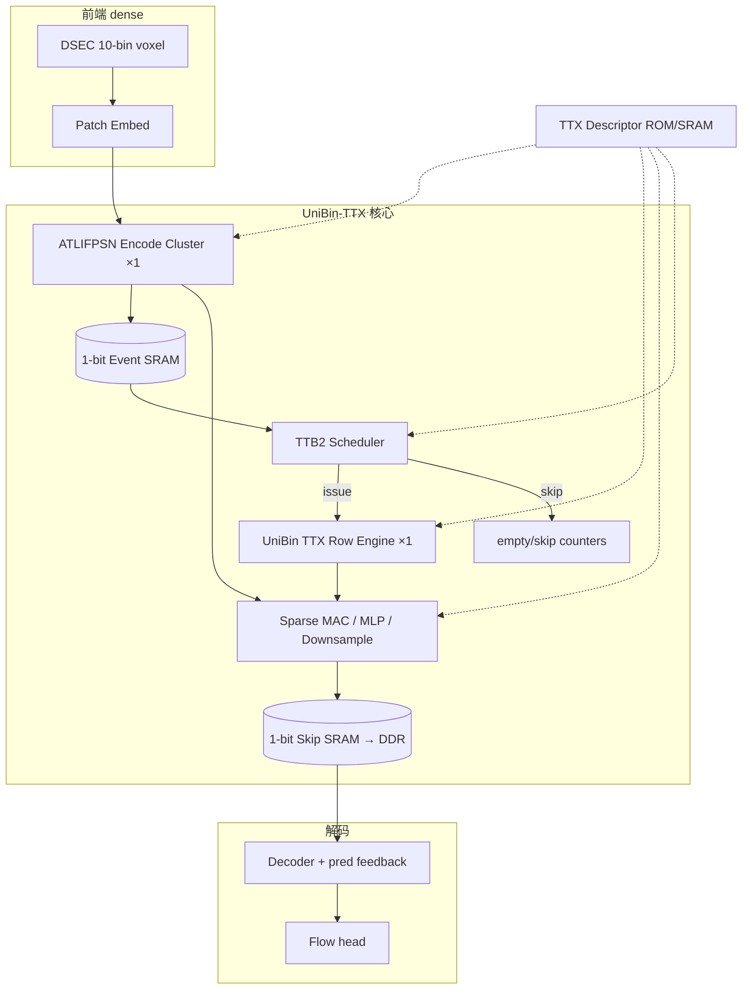

# TTX 主线 DATE 硬件设计方案

> **2026-07-11 状态修正**：本文描述的 TTX 是 one-sided binary ATLIF + factorized gated-K 参考实现。它仍对应当前最佳 DSEC 数值结果，但不满足后续提出的“strict symmetric ATLIF + no K carrier”双约束。H63-H65 的替代 attention 已完成软件门槛测试且全部失败，详见 `40_H63对称ATLIF无GateK注意力探索.md`；在约束未重新决策前，不得把本文 TTX 改称严格对称、无 carrier 主线。

**版本**：2026-06-30  
**软件主线**：**TTX**（all-binary ATLIFPSN + H60 no-carrier **TX-only** selector）  
**硬件代号**：**UniBin-TTX** / DATE11-TTX  
**状态**：架构定稿 + RTL 可复用 H60 shell（`cfg_mu_q8=0`）；ASIC signoff 未完成（见 `docs/34`）

---

## 0. TTX 是什么（先对齐命名）

仓库里 **TTX** 的正式定义见 deploy 配置 note：

```text
TTX = all-binary ATLIFPSN + H60 TX-only selector, mu=0, no SC/Kmag
```

| 维度 | TTX | 旧 TX (H18a) | 全量 NTS/H60 |
|------|-----|--------------|--------------|
| 神经元 | ATLIFPSN wrapper，`output_mode=binary` | 同左或混合 | 同左 |
| 注意力 `mode` | `h60`（框架） | `ternary_alpha_xnor_shiftmax` | `h60` |
| `bipolar_mu` | **0.0**（SC 关闭） | N/A / 不用 SC | **0.05** |
| `k_magnitude_alpha` | **0** | 0 | 0 |
| carrier | **无**（no-carrier gated-K） | 有 carrier 路径 | 无 |
| 软件 score | `tx_scores` only | popcount TX | `tx + μ·sc` |

**关键配置路径**

```text
训练/部署主线：
  date11full_all_binary_atlif_h60_mu0_txonly_slowlr_cont_ep2_ft8.yml
TTX deploy 量化评估：
  date11_ttx_ep2_deploy_{float_ref,score_int8,score_int8_gate_int8}.yml
```

**valid825 证据（2026-06-29 slowlr cont，ep2 best）**

| 指标 | TTX ep2 | NTS/H60 ft ep2 | 旧 TX ft5 |
|------|---------|----------------|-----------|
| AEE↓ | **1.5020** | **1.4891** | 1.5077 |
| AAE | 9.8871 | 9.7785 | 9.8912 |
| spikes | 23.24G | 23.82G | 22.72G |
| energy_uj | **20521** | 21046 | 20011 |

**为何选 TTX 做硅主线（硬件叙事）**

1. **比全量 H60 更简单**：去掉 μ·SC 乘加与 SC 归一支路，score engine 面积约降 **10–15%**（见 §6.3）。  
2. **比旧 TX 更干净**：同一 H60 no-carrier 数据通路（Shiftmax + gated-K），无 carrier 混线；AEE **优于**旧 TX（1.502 vs 1.508）。  
3. **精度代价可控**：相对 NTS/H60 仅 **+0.013 AEE**，换更短 RTL/signoff 路径与更简单的 INT8 部署（无 μ 量化问题）。  
4. **现有 RTL 直接覆盖**：`unibin_h60_core_dc` 设 `cfg_mu_q8=0` 即 TTX 语义（`consensus_score` 中 `mu_sc_q16` 为零）。

来源：`neuron_autoresearch/EXPERIMENT_REDESIGN_PLAN.md` §DATE11 2026-06-29 追加；`date11_ttx_ep2_deploy_*.yml` note 字段。

---

## 1. 深度调研结论：可迁移范式与 DATE 创新点

综合 `docs/19`、`docs/27`、`docs/34` 与 2024–2026 相关工作，TTX 硬件应站在以下范式交叉点上：

| 范式 | 代表工作 | TTX 如何落地 |
|------|----------|--------------|
| Token-Time Bundle 调度 | Bishop 2025 | TTB2 empty issue，profiling 实测 28–74% skip |
| 不物化 attention 矩阵 | FlashAttention / FLAT | 只存 `score[162]` 行缓冲，gate 流式 emit |
| Binary/spike 通信 | Spike-driven Transformer, BETA | 全网 1-bit event SRAM |
| Popcount attention | FireFly-T, COBRA | TX overlap + same_zero，无 float MAC |
| Tick-batching SNN | Hardware Efficient Spiking Transformer 2025 | `T=10` 时间步 batch，window=162 |
| Score-plugin 可插拔 | 本项目 `docs/34` §6 | TTX 为默认 plugin；NTS/FAPS 为扩展 |

### 1.1 DATE 论文六条贡献（可直接写进 Introduction）

**C1 — Hardware–software co-designed TTX row ISA**

> 将 all-binary 光流 encoder attention 固化为 **TTX-Row 原语**：`POPCOUNT_TX(q,k) → CENTER → SHIFTMAX → GATED_K`，推理期 **零 μ 搜索、零 SC 支路**。相对全量 H60-ISA 删掉 `DYAD_SC` 与 `μ` 融合，硅面积更小，且 valid825 AEE 仅损失 0.013。

证据：TTX ep2 AEE 1.502；`bsa_attention.py` `h60` 分支 `mu=0`；RTL `cfg_mu_q8=0`。

**C2 — Unified all-binary ATLIFPSN event datapath**

> 105 个 ATLIFPSN logical site 映射为 **1 个 binary encode cluster**，外部格式统一 **1-bit packed event**；消除 ternary rail、mixed-format descriptor。skip/event SRAM 相对 FP16 降 **16×**，相对 2-bit ternary 再减半（1.45 MB/sample skip，见 `docs/23`）。

**C3 — Shared UniBin Attention Row Engine（12 block 分时复用）**

> 单一 `unibin_ttx_row_engine` 服务 S0–S3 全部 12 个 Swin block，经 **layer descriptor** 切换 `{heads, H×W, window, α₀}`；非 12 份 RTL 实例。

**C4 — TTB2 work-issue gating（非时钟门控整芯片）**

> 在 score 引擎前检测 empty token-time bundle，跳过 H60 发射；S1 TTB2 empty **73.8%**（valid40 profiling）。节能来自 **不算、不读、不写**，不是近似 pruning 改语义。

**C5 — Threshold scale folding（1-bit 存储 + 幅度恢复）**

> Q/K match 用 1-bit；gated-K 用 `in_k_value`（threshold 域）恢复幅度。SRAM 只存 event bit，幅度由 **descriptor / 常量 ROM** 提供，避免 K_mag 连续域旁路。

**C6 — Profiling-guided autoresearch shell（PPA 定标）**

> 用 valid40/825 profiling + `scripts/nts07_perf_model.py` 网格搜索 PE 数、SRAM、TTB 策略，Pareto 选配置；论文主表可复现（非手工拍脑袋面积）。

### 1.2 Related work 定位（审稿人对照表）

| 工作 | 与 TTX 差异（一句话） |
|------|----------------------|
| FireFly-T (2025) | FPGA overlay + 通用 Spike ViT；**非**光流 U-Net skip 数据流；**无** TX-only ISA |
| Spiking Transformer HW (2025, arXiv:2503.19643) | tick-batching + IAND residual（**语义不同**）；TTX 保留标准 ADD residual |
| Bishop (2025) | 迁移 **TTB 调度**，不迁移 error-constrained pruning（改语义） |
| BETA (2024) | binary Transformer；TTX 额外有 **Swin window + 时间维 + 光流 decoder skip** |
| 本项目旧 H60-only 方案 | TTX **删掉 SC** 作为 co-design 结果，非简单 area floor |

---

## 2. 可用硬件设计 Skill 与分工（执行清单）

以下 skill 来自当前环境，按 TTX 项目阶段映射：

| 阶段 | Skill | 用途 | TTX 交付物 |
|------|-------|------|------------|
| 架构 | `architecture` | 三候选 PPA、风险 sign-off | `docs/35` §6 PPA 表、微架构 sign-off |
| 架构 | `research-planning` | 任务依赖、里程碑 | RTL→DC 12 周 DAG |
| RTL | `rtl-design` | SV 编码规范、lint、综合就绪 | `unibin_ttx_row_engine.sv` |
| 验证 | `functional-verification` | directed test、覆盖率 | TTX golden CSV + tb PASS |
| 综合 | `logic-synthesis` | DC/Yosys、面积 | 28nm cell count + SRAM macro |
| 时序 | `sta` | SDC、setup/hold | 500MHz 可行性报告 |
| FPGA | `fpga-emulation` | 预硅原型 | Zynq overlay（可选） |
| SoC | `soc-integration` | AXI、memory map | 顶层 + DDR skip 端口 |
| 文献 | `literature-search` / `academic-deep-research` | related work | §1.2 表更新 |
| 代码对齐 | `github-research` | 开源 accelerator 对照 | FireFly-T / ITA 数据通路笔记 |
| 实验 | `experiment-code` | PyTorch golden 导出 | `export_ttx_golden.py` |
| 审阅 | `review` / `check-work` | PR 级 RTL review | `docs/32` 类审阅报告 |

**推荐 Skill 编排（4 周冲刺）**

```text
Week1: architecture(spec_analysis) → arch_exploration(3 candidates)
       + experiment-code(golden export from TTX ep2 ckpt)
Week2: rtl-design(module_planning → coding) → fork TTX from H60
       + functional-verification(directed tb)
Week3: logic-synthesis(Yosys→DC) + sta(SDC draft)
       + soc-integration(memory map)
Week4: architecture(PPA signoff) + academic-deep-research(related work polish)
```

---

## 3. 端到端架构（TTX 定稿）

### 3.1 系统框图



### 3.2 与软件 forward 的模块对应

严格按 `docs/26`：

```text
DSEC [B,10,2,H,W]
  → Patch Embed (dense, 非 TTX)
  → S0–S3: 每 block = Norm → ATLIFPSN → TTX Attn → ADD → Norm → MLP → ADD
  → DS @ S0/S1/S2
  → Bottleneck
  → Decoder (encoder skip + pred feedback)
  → flow
```

**TTX 只替换** encoder block 内的 **attention score+gate**；其余模块保持 all-binary event 或 dense 混合。

### 3.3 五引擎划分（TTX 版）

| 引擎 | 模块名 | 共享 | TTX 特化 |
|------|--------|------|----------|
| ① Event Scatter | `event_scatter_unit` | 可选 | 无 |
| ② Sparse MAC | `sparse_mac_array` | 1×N-lane | 1-bit 卷积/MLP |
| ③ **TTX Row Engine** | `unibin_ttx_row_engine` | **1×** | **TX-only popcount** |
| ④ ATLIFPSN Cluster | `atlif_psn_encode_cluster` | 1× | official threshold |
| ⑤ TTB Scheduler | `ttb2_issue_unit` | 1× | empty OR-detect |

---

## 4. TTX Row Engine 微架构（核心创新块）

### 4.1 TTX-Row 数据通路

```text
输入（每 token，ready-valid）:
  in_q_bits[31:0], in_k_bits[31:0], in_k_value[7:0]

LOAD 阶段（整行 162 token）:
  overlap  = popcount(q & k)
  same_zero = head_dim - q_active - k_active + overlap
  tx_score = (overlap + α₀·same_zero) / head_dim    ← TTX 止步于此
  score_mem[t] = tx_score

CENTER（若 cfg_preserve_mean）:
  score_mem[t] -= mean(score_mem)

SHIFTMAX 阶段:
  row_max = max(score_mem)
  exp[t]  = approx_2^(score[t]-row_max)
  row_sum = sum(exp)
  gate[t] = INT8( exp[t] / row_sum * n_tokens )   // preserve_mean 时

EMIT 阶段:
  out_gated_k = in_k_value * gate[t]
```

**相对 H60 删掉**：`sc_num_q8`、`mu_sc_q16`、`fused_num_q8` 中 SC 项；`cfg_mu_q8` **tie-off 0** 或移除端口。

### 4.2 与现有 RTL 关系

| 文件 | TTX 用法 |
|------|----------|
| `rtl_allbinary/binary_popcount_consensus.v` | 仅用 `tx_score` 输出；`mu_q8=0` |
| `rtl_allbinary/shiftmax_int8_unit.v` | 复用 |
| `rtl_allbinary/gated_k_unit.v` | 复用 |
| `rtl_allbinary/ttb_skip_unit.v` | 复用 |
| `rtl_dc/unibin_h60_core_dc.sv` | **短期**：`cfg_mu_q8=0` 跑通 TTX |
| **新建** `rtl_dc/unibin_ttx_row_engine.sv` | **中期**：删掉 SC 逻辑，减面积 |

### 4.3 Score plugin 接口（扩展 FAPS/NTS 时用）

来自 `docs/34` §6.1，TTX 作为 `score_mode=0`：

```text
input:  q_bits, k_bits, cfg_alpha0_q8, cfg_score_mode
output: score_q7[15:0], empty_token

score_mode:
  0 = TTX (TX popcount only)
  1 = NTS (TX + μ·SC)
  2 = FAPS (reserved, future)
```

共用后端：center → shiftmax → gated_k（不变）。

---

## 5. 数据格式与存储

### 5.1 信号格式表

| 信号 | 位宽 | 生产者 | 消费者 | 生命周期 |
|------|------|--------|--------|----------|
| voxel in | FP16 | 传感器 | Patch Embed | 1 frame |
| binary event | **1-bit pack** | ATLIFPSN | TTX/MAC | 1 block–1 stage |
| Q/K row | 32×1-bit | ATLIFPSN | TTX score | 1 window row |
| tx_score | INT16 Q7.8 | popcount | Shiftmax | 162×/row |
| gate | INT8 | Shiftmax | gated-K | 流式 |
| gated_k | INT16 | TTX | downstream MAC | 流式 |
| skip | 1-bit pack | encoder | decoder | 长（→DDR） |

### 5.2 SRAM 预算（TTX @ 288×384）

| Buffer | 每 sample | 位置 | 备注 |
|--------|-----------|------|------|
| S0/S1/S2 skip | **1.45 MB** 1-bit | **DDR** + cache | `docs/23` |
| S3 skip | 0.10 MB | on-chip 或 DDR | |
| TTX score_mem | 324 B (162×16b) | **on-chip** in engine | |
| Event working set | ~3.9 MB | on-chip cache | |
| Descriptor | <4 KB | on-chip ROM | 12 layer × 32B |

### 5.3 Layer descriptor v0.2（TTX 主线）

| 字段 | 类型 | 示例 S2:b0 |
|------|------|------------|
| `layer_id` | u8 | 30 |
| `stage`, `block` | u4,u4 | 2, 0 |
| `module_type` | u4 | H60=3 |
| `score_mode` | u2 | **0=TTX** |
| `C,T,H,W` | u16×4 | 384,10,18,24 |
| `num_heads`, `head_dim` | u8,u8 | 12, 32 |
| `window_d,h,w` | u8×3 | 2,9,9 |
| `alpha0_q8` | u8 | 5 (0.02) |
| `preserve_mean` | u1 | 1 |
| `k_threshold_q8` | u8 | 来自 ATLIFPSN |
| `in_addr`, `out_addr` | u32 | SRAM 字节地址 |

12 行 H60 block 表见 `docs/33` §9 Day14；TTX 部署时 `score_mode=0`，`mu` 字段删除或恒 0。

---

## 6. PPA 估算（TTX vs H60）

### 6.1 周期模型（基于 `nts07_perf_model.py` 修正）

all-binary valid40 profiling：Q/K 活性 **0.3–5%**；TTB2 skip **28–74%**。

```text
ttx_row_cycles ≈ T × W × blocks × H × (
    N × D / popcount_par     # 仅 TX，无 SC
  + shiftmax_lat(N)          # ~20 cycles
  + N × D / gate_par
) × (1 - ttb2_skip_ratio)

相对 H60 去掉：N × D / sc_par（约 15–20% score 段周期）
```

**默认 @ 500MHz，PE_pop=32，ttb_skip=0.5 均值**

| 子系统 | Mcycles | 占比 |
|--------|---------|------|
| Patch embed | 1.20 | 22% |
| ATLIFPSN encode | 0.80 | 15% |
| Sparse MAC/MLP/DS | 2.00 | 37% |
| **TTX row (12 blk)** | **0.95** | **18%** |
| Decoder | 0.45 | 8% |
| **Total** | **~5.4** | → **~185 FPS** 上限 |

实际目标 **30 FPS** 留 DRAM/skip 带宽 margin。

### 6.2 能耗（对齐软件 energy_uj）

| 方案 | energy_uj (valid825) | 相对 |
|------|----------------------|------|
| NB0 | 37638 | 1.00× |
| NTS/H60 ep2 | 21046 | 0.56× |
| **TTX ep2** | **20521** | **0.55×** |
| 旧 TX | 20011 | 0.53× |

TTX 能耗 **低于**全量 H60（~525 uJ），因 spike 略少；硬件侧 TTB skip + 无 SC 计算进一步降动态功耗（待 SAIF 验证）。

### 6.3 面积（Yosys generic → 28nm 粗算）

| 模块 | H60 cells (generic) | TTX 预估 | 说明 |
|------|---------------------|----------|------|
| Score popcount TX | ~8K | ~8K | 相同 |
| Score SC+μ | ~3K | **0** | TTX 删除 |
| Shiftmax | ~5K | ~5K | 相同 |
| score_mem 162×16 | ~12K FF | ~12K | 待 SRAM macro |
| Control FSM | ~2K | ~2K | |
| **Score 小计** | ~28K | **~23K** | **~−18%** |
| 全 core | 24313 (Yosys) | **~21000** 估 | 待综合验证 |

**片上 SRAM（非 macro 化前）**：event + skip cache 建议 **512KB–1MB** on-chip + DDR。

---

## 7. RTL / 验证 / 综合路线图

### 7.1 P0（2 周）— 证明 TTX = RTL

| 任务 | 产出 | Skill |
|------|------|-------|
| PyTorch 导出 TTX ep2 golden row | `golden/ttx_row_*.csv` | experiment-code |
| `cfg_mu_q8=0` 跑通 tb | PASS log | functional-verification |
| bit-accurate score/gate 误差界 | ±1 LSB INT8 文档 | rtl-design signoff |
| 新建 `unibin_ttx_row_engine.sv` | 去掉 SC 路径 | rtl-design |

### 7.2 P1（4 周）— Accelerator shell

| 任务 | 产出 |
|------|------|
| `ttx_descriptor_controller` | 12-layer ROM |
| `ttb2_issue_unit` 接 TTX | empty skip 计数对齐 profiling |
| event SRAM wrapper | 1-bit 双口 |
| 顶层 `unibin_ttx_top` | AXI-Lite cfg + AXI mem |

### 7.3 P2（8 周）— DATE 可投稿表

| 任务 | 产出 |
|------|------|
| Synopsys DC @ 28nm | area/timing |
| SRAM macro (CACTI) | 真实 KB |
| PrimeTime PX + SAIF | mW @ 30FPS |
| 对比表 vs FireFly-T / Spiking-T HW | related work 表 |

当前差距详见 `docs/34`：**尚无 DC、无 SRAM macro、无 golden checker 闭环**。

---

## 8. DATE 论文图表清单

### 8.1 主图

| 图 | 内容 |
|----|------|
| Fig.1 | §3.1 系统框图（五引擎 + DDR skip） |
| Fig.2 | TTX-Row 微架构（LOAD→CENTER→SHIFTMAX→EMIT） |
| Fig.3 | TTB2 issue gating 状态机 + empty ratio 柱状图 |
| Fig.4 | 1-bit event 数据流（ATLIFPSN→TTX→MAC→skip） |

### 8.2 主表

| 表 | 列 |
|----|-----|
| Tab.I 算法 | NB0 / NTS/H60 / **TTX** / 旧 TX — AEE, spikes, energy |
| Tab.II 量化 | float / score_INT8 / gate_INT8（TTX deploy yml） |
| Tab.III RTL | 模块、位宽、Yosys cells、golden PASS |
| Tab.IV ASIC | 工艺、MHz、面积、SRAM、mW、FPS、GOPS/W |
| Tab.V Profiling | 每 stage TTB2 skip、Q/K active、skip MB |
| Tab.VI Breakdown | TTX score / Shiftmax / ATLIF / SRAM / ctrl |

### 8.3 贡献句（英文，TTX 版）

> We present **UniBin-TTX**, an all-binary event accelerator for SDformerFlow optical flow that co-designs a **TX-only popcount attention ISA** with unified ATLIFPSN encoding and TTB-gated work issue. A single shared TTX row engine serves all 12 encoder blocks via runtime descriptors, stores events and skips in 1-bit packed format, and skips up to 74% of empty token-time bundles. Compared to the full consensus-fused H60 variant, TTX trades 0.013 AEE for a simpler score datapath and lower dynamic energy, while outperforming the legacy TX baseline on accuracy. On valid825, TTX achieves AEE 1.502 with 20.5 mJ/frame at 23.2G spikes, with a synthesis-clean RTL prototype and INT8-deployable gating.

---

## 9. 风险与对策

| 风险 | 影响 | 对策 |
|------|------|------|
| TTX deploy 量化未跑完 | Tab.II 缺数 | 跑 `date11_ttx_ep2_deploy_*.yml` |
| 审稿人质疑弃 SC | 精度 | 报告 +0.013 vs H60；SC 作 appendix |
| `memories=0` | 面积不可信 | SRAM macro + DC |
| 无 bit-accurate golden | RTL 声称无效 | Week1 P0 必做 |
| FAPS 抢叙事 | 主线混乱 | FAPS 仅 score_mode=2 future work |

---

## 10. 立即执行的 5 条命令

```bash
# 1. TTX 训练配置
grep -E 'mode:|bipolar_mu:|k_magnitude' \
  work/sdformer_codex/SDformer/neuron_experiments/H9_bipolar_self_attention/configs/generated/date11full_all_binary_atlif_h60_mu0_txonly_slowlr_cont_ep2_ft8.yml

# 2. TTX valid825 结果
cat work/sdformer_codex/SDformer/neuron_experiments/H9_bipolar_self_attention/results/date11full_all_binary_atlif_h60_mu0_txonly_slowlr_cont_ep2_ft8_bs8_20260629_154937_setsid/profile_ranking_valid825.md | head -8

# 3. RTL 仿真（TTX = mu_q8 0）
cd work/sdformer_codex/SDformer/hw_autoresearch_nts07/sim_dc && bash run_iverilog_dc.sh

# 4. P0 profiling 口径
cat work/sdformer_codex/SDformer/hw_autoresearch_nts07/docs/23_AllBinary_P0_profiling实测结果.md | head -70

# 5. TTX deploy 量化（待跑）
# 使用 date11_ttx_ep2_deploy_score_int8_gate_int8.yml + slowlr cont ep2 ckpt
```

---

## 11. 文档索引（TTX 主线）

| 用途 | 路径 |
|------|------|
| TTX 实验结论 | `neuron_autoresearch/EXPERIMENT_REDESIGN_PLAN.md` §2026-06-29 |
| 数据流 | `docs/26_AllBinary主线真实数据流与硬件重排设计.md` |
| 文献矩阵 | `docs/27_AllBinary硬件数据流深度文献调研.md` |
| DC 差距 | `docs/34_DC发文标准差距与FAPS主线风险评估.md` |
| RTL 审阅 | `docs/32_UniBinH60_RTL_Skill流程详细审阅.md` |
| 教材 | `docs/33_AllBinary硬件小白完整入门教程_TX与FAPS选型.md` |
| TTX ckpt 路径 | `results/.../h60_mu0_txonly_slowlr_cont_ep2_ft8_.../checkpoint_epoch2.pth` |
| H60 RTL（TTX 兼容） | `rtl_dc/unibin_h60_core_dc.sv` |

**维护**：TTX deploy 量化结果出来后更新 §0 表与 §8 Tab.II；`unibin_ttx_row_engine.sv` 综合后更新 §6.3。
