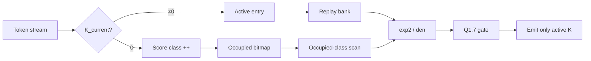

# Motion-Aware Score-Class Streaming for All-Binary Spiking Optical Flow: H67 Deployment Contracts and the HIT-Flow / SCS-Shiftmax / G1 Backend

**DATE-style draft (English)**  
**Deployed algorithm:** H67 all-binary Motion-XOR TTX (no-carrier, μ=0)  
**Hardware slice:** HIT-Flow / SCS-Shiftmax / G1 projection backend  
**Evidence cut-off:** latest `results/` and `docs/49–74` in this repository  
**Status:** compile-explore ready; **not** DC/ASIC sign-off

---

## Abstract

Deploying event-based optical-flow Transformers under a fully binary Q/K contract exposes three tensions: high K-zero rates conflict with a non-prunable Softmax-style denominator; fixed-point Shiftmax must follow a *hardware execution order*, not the original floating-point training graph bit-for-bit; and the projection stage must avoid materializing a dense gated-K tensor. We take **H67 (Motion-XOR TTX)** as the sole deployment mainline and report only claims backed by repository evidence: **(1)** a motion-aware all-binary token-attention fixed-point contract co-designed for hardware-order quantization; **(2)** **SCS-Shiftmax**—when \(K=0\), the gated output is zero while the denominator contribution is retained exactly, tokens are aggregated by final Q7 score class, and only occupied classes are scanned; **(3)** a **G1** projection path (final-gate directory → product reuse → segmented multicast → banked accumulate) that is algebraically equivalent to a direct active-lane formulation; **(4)** descriptor time-multiplexing of twelve attention blocks on a no-carrier execution graph (105 installed / 93 dynamic / 81 functionally live ATLIF sites). On valid825, the RTL-exact path reaches AEE ≈ 1.4627 (about +0.0001 vs. the prior deploy path) [algorithm accuracy]. Occupied-class scan reduces a *row-engine-only* cycle proxy by 12.86% [profiling]. A directed G1 top-level TB shows integer equivalence to direct accumulation at reduced parameters [RTL sim]. This host has no `dc_shell`, target `.db/.lib`, or SRAM macros; we report **no** area/power/\(F_{\max}\) primary table. The system boundary starts after packed Q/K events (or patch-embed); the voxel front-end is out of scope.

---

## 1. Introduction

### 1.1 Problem setting

The SDformer-family H67 checkpoint stacks binary ATLIF stages, windowed token attention, and linear projections for event optical flow. Unlike a generic ViT accelerator, the H67 *deployment* graph fixes the following constraints:

1. **Not dense MatMul–Softmax–V.** Each token/head forms a bounded integer score from α-XNOR-style sufficient statistics (overlap, same-zero) plus a temporal Motion-XOR term, then applies fixed-point Shiftmax to obtain a gate. The attention output is \(\mathrm{gate}\cdot K_{\mathrm{current}}\) (gated-K), not an \(N\times N\) matrix.
2. **Asymmetry of \(K=0\).** If \(K_{\mathrm{current}}=0\), the projected contribution is identically zero, yet the score **must** enter the Shiftmax denominator; dropping the token changes gates of non-zero-\(K\) tokens [algorithm accuracy / algebra].
3. **Hardware-order quantization.** The RTL path is  
   \(\mathrm{raw\ score}\rightarrow\mathrm{Q7\ RNE}\rightarrow\mathrm{Q8\ exp2\ LUT}\rightarrow\mathrm{integer\ denominator}\rightarrow\mathrm{Q1.7\ gate}\).  
   This can diverge from a “center-then-quantize” software path on half-grid ties. “Bit-exact” in this paper means **hardware-order golden ↔ RTL only**; task quality is reported via valid825 AEE [algorithm accuracy].
4. **Module count ≠ hardware instances.** 105 ATLIF wrappers are installed; 93 are invoked in a profiled forward; 81 are functionally live under fixed normal inference; twelve `sn2_q` carriers never run on the H60/H67 deploy graph [profiling].

### 1.2 Contributions (four, evidence-bounded)

| # | Contribution | Evidence tag |
|---|--------------|--------------|
| C1 | **H67 motion-aware all-binary deploy co-design and fixed-point contract** (Motion-XOR + unified all12 token score; frozen Q7/Q1.7, RNE, LUT; acceptable valid825) | [algorithm accuracy] |
| C2 | **SCS-Shiftmax**: exact class aggregation for zero-\(K\) denominators; occupied-class scan; active-\(K\) replay | [RTL sim] + [profiling] |
| C3 | **G1 projection backend**: final-gate directory (NMF) → gate×weight product → segmented multicast → banked accumulate; integer-equivalent to direct active-lane (directed, reduced params) | [RTL sim]; production \(162\times32\) [to-do] |
| C4 | **Descriptor time-multiplexing and no-carrier execution graph** for 12 blocks; installed / executed / live sites reported separately | [profiling] + [architecture (partial RTL)] |

**We do not claim:** inventing Shiftmax; first spiking attention / first TTB; completed ASIC or DC primary PPA tables; bit-accuracy vs. the original PyTorch training graph; Yosys generic cells as chip area; cycle proxies as end-to-end FPS/efficiency; an H68 matrix path in inference RTL; a hardware voxel front-end.

### 1.3 System boundary

```text
[Event voxel / front-end] -- out of HW scope -->
[Packed Q/K events or post patch-embed]
        |
        v
  HIT-Flow slice (this paper)
  - Attention: H67 Motion-XOR + SCS-Shiftmax
  - Projection: G1 NMF → product → multicast → acc
  - Control: 12-block descriptor time-mux
        |
        v
[Residual / MLP / long skip / decoder] -- interfaces only; no full-net PPA --
```

---

## 2. Background and Related Work

For each neighbor we state what we borrow, what we cannot copy, and how we differ.

| Work | Borrowed | Not portable | Our difference |
|------|----------|--------------|----------------|
| **Bishop** (ISCA’25) | TTB discipline, dense/sparse routing caution, sparsity-aware training | ECP-style approximate pruning; AND-acc attention vs. α-XNOR+Shiftmax; their PPA numbers | No ECP; dual paths (if any) emit the same H67 sufficient statistics; backend is class-aware SCS + gated-K |
| **SpAtten** (HPCA’21) | Cascaded score-driven scheduling | Dynamic token/head *deletion* needing model adaptation | SCS **does not drop** tokens; zero-\(K\) only folds denominator multiplicity |
| **Softermax / I-ViT Shiftmax** | Base-2 online max–exp–sum; integer Softmax factorization | Per-score ShiftExp; ViT-oriented contracts | **We never claim to “propose Shiftmax.”** Our increment is **final score-class multiplicity + exact zero-\(K\) denominator + occupied-class scan** |
| **FireFly-T / SpikeTA** | Sparse/binary dual engines, time-step parallelism, bank-conflict awareness | FPGA/overlay metrics; SpikeTA residual rewrites | Digital exact deploy contract; fixed \(T=2\) pairs and 35-class H67 semantics |
| **LoAS / FLAT-class fusion** | Time-inner layouts; fusion and residency discipline | LoAS lacks gated-K Shiftmax; fusion alone is not new | Reuse key is the **final Q1.7 gate code + \(K\) bitmap**; score classes are *not* reusable across rows |
| **Castling-ViT** (H68 context) | Train-rich attention auxiliaries, deploy-side simplification | Keeps linear-angular / DWConv-style deploy branches | H68 anneals a **parameter-free matrix aux to zero at eval**; **no inference matrix engine**; training ablation only |

α-XNOR / bipolar self-attention supply silence-match and shift-normalization *algorithmic* precedents. BLADE covers partial-product redundancy—not final score-class histograms—so “redundancy elimination” alone is not a novelty claim.

---

## 3. Algorithm–Hardware Contract

### 3.1 Frozen H67 score

For timestep \(t\) and head dimension \(D=32\):

```text
o_t = popcount(Q_t ∧ K_t)
q_t = popcount(Q_t)
k_t = popcount(K_t)
z_t = D - q_t - k_t + o_t          # same-zero
m   = popcount(K_0 ⊕ K_1)          # Motion-XOR, shared across the pair
N_t = 64·o_t + z_t + 16·m
score_q7 = RNE(N_t / 16)           # round-to-nearest-even; matches RTL
```

Software form: \(\mathrm{overlap} + \mathrm{same\_zero}/64 + \mathrm{motion}/4\), then Q7 quantization. With \(K_t=0\), the score still depends on \(Q_t\) and peer-\(K\); the reachable codes are **0…34 (35 classes)**—not a single K-zero constant [algorithm accuracy] + [RTL sim].

**Temporal-pair predicates (to avoid incorrect routing):**

- `PAIR_EMPTY = (Q0|Q1|K0|K1)==0`: both timesteps may skip payload reads but must each inject a **class-2** denominator term; dropping the token is illegal.
- `CURRENT_EMPTY=(Qt|Kt)==0` alone is **not** a constant score: non-zero peer-\(K\) still moves the motion term.
- When \(u=0\) (identical Q/K across the pair), reusing the already-rounded score is hardware-order exact; delta updates must buffer pre-round \(N_t\), never add deltas only in Q7 [algorithm accuracy].

### 3.2 Hardware-order vs. legacy deploy path

| Path | Order | Paper usage |
|------|-------|-------------|
| Legacy deploy reference | raw → center → Q7 → float Shiftmax → Q1.7 | Task baseline |
| **RTL / exact in this paper** | raw → Q7 RNE → 16-entry Q8 exp2 LUT → integer den → ceil-log2 PoT normalize → Q1.7 RNE, sat. to [0, 2] | Hardware-order golden |

A documented counter-example: a 162-token row with 81 scores of class 0 and 81 of class 1 yields different class sets under `center→RNE` vs. `raw→RNE` [algorithm accuracy]. Therefore we **do not** claim bit-accuracy to the original training graph.

### 3.3 No-carrier execution graph

| Scope | Count | Meaning |
|-------|------:|---------|
| Installed ATLIF wrappers | 105 | Software conversion / compatibility cover |
| Dynamic forward calls | 93 | Profiled invocations |
| Never called | 12 | All `sn2_q` carriers on attention blocks |
| Functionally live (fixed normal inference) | 81 | 45×\(T{=}10\) + 36×\(T{=}2\); 12 `attn_sn` results unused by projection |

Hardware **does not** replicate 105 arithmetic instances; a descriptor-scheduled shared datapath is used [profiling].

### 3.4 Gated-K and integer projection

```text
a[n,i] = K[n,i] · g[n, head(i)]     # g: 9-bit unsigned Q1.7; 1.0=128, 2.0=256
y[n,o] = bias[o] + Σ_i a[n,i] · W_fold[o,i]
```

`W_fold`/`bias` fold Linear with eval-BN. Tokens sharing the same final gate and global input channel with \(K=1\) share one \(g\cdot W[:,i]\) product—the algebraic basis of G1 reuse [architecture → RTL].

---

## 4. Architecture

### 4.1 HIT-Flow top-level dataflow

```text
                 ┌──────── Descriptor Scheduler (12 blocks) ────────┐
                 │ stage / block / head / window / tokens            │
                 └───────────────┬───────────────────────────────────┘
                                 │
         ┌───────────────────────┼───────────────────────┐
         v                       v                       v
   [DP-TME / ATLIF]*      Temporal-pair Q/K        Residual/Skip RPI*
   T10/T2 time matrix     128b {Q0,Q1,K0,K1}       multi-bit island (partial)
         │                       │
         └──────────┬────────────┘
                    v
         ┌──────────────────────┐
         │ H67 Motion-XOR Score │  AND/XOR popcount + RNE Q7
         └──────────┬───────────┘
                    v
         ┌──────────────────────┐
         │   SCS-Shiftmax       │  class hist + occupied scan
         │   + active replay    │  → sparse {token,K,gate}
         └──────────┬───────────┘
                    v
         ┌──────────────────────┐
         │ NMF G1 Builder       │  final_gate × lane → dest bitmap
         └──────────┬───────────┘
                    v
         ┌──────────────────────┐
         │ Gate Product Engine  │  g × int8 W → int17 product
         └──────────┬───────────┘
                    v
         ┌──────────────────────┐
         │ Segmented Multicast  │  segment-resident, bank-aware issue
         └──────────┬───────────┘
         ┌──────────────────────┐
         │ Banked Accumulator   │  product RMW → bias-commit final
         └──────────────────────┘

* DP-TME/RPI: specified / partial RTL. Primary numbers use attention-row + G1 slices.
```

### 4.2 SCS-Shiftmax

**Exact algebra (not pruning):**

```text
den = Σ_{active K} exp2(score_i − row_max)
    + Σ_c count[c] · exp2(c − row_max)
```

- Active \(K\): write `{score,K,token}` to the active-entry bank; replay gates and sparse emit.
- Zero \(K\): update class histogram + occupancy bitmap only; **no** active-bank write.
- H67: 35 classes, two-beat FIND_CLASS / CLASS_MAC; H68 deploy: 3 classes, one-beat (ablation).
- Occupied-class scan: pop only non-empty classes; no fixed empty sweep of all 35 bins.



### 4.3 G1 projection backend

```text
SCS sparse stream
  → NMF: allocate SLOTS by final_gate_code; merge destination_bitmap per (gate, lane)
  → Product: one weight-column read; g×W vector (OUT_TILE lanes)
  → Segmented multicast: segment-local pending + bank arbitration (no global 162-way priority encode)
  → Accumulator: synchronous RMW; bias commit emits final (BCOD schedule rewrite; same sums)
```

On directory overflow, the present integration marks sticky overflow; directed cases keep unique gates ≤ SLOTS. **Lossless fallback expansion is [to-do]** [RTL sim].

### 4.4 Descriptor reuse

A single `h67_attention_top` issues the twelve blocks **serially** through one score/SCS pipeline—not twelve physical Shiftmax copies [RTL sim]. All four stages share head_dim=32 and \(9\times9\) windows; only head and window counts change. That favors a homogeneous datapath with descriptors rather than per-stage heterogeneous cores [profiling] + [architecture]. Block activity can differ by an order of magnitude (e.g., S0B0 vs. S1B0); scheduling should be at least stage/block-aware. The present RTL is fixed serial descriptors—**not** multi-context OOO balancing [profiling].

### 4.5 Row-engine storage and sparse egress

- Active-entry bank: depth 162; packed `{score,K,token}` (~56b); shared logical read for sum/emit.
- H67 histogram: \(35\times8\) plus a 35-bit occupancy map; small register bank with single-cycle same-class RMW.
- Sparse egress: only active \(K\) produces beats; fully folded rows may assert only `done`—sinks must pre-clear or scatter by token index [RTL sim].
- Exact-depth vs. 256-pad Yosys structure gains appear in §6.5; **formal sync SRAM macros are not swapped in** [Yosys] + [to-do].

---

## 5. Implementation and Verification

### 5.1 RTL scope

| Tree | Contents | Status |
|------|----------|--------|
| `rtl_h67/` | Motion-XOR score, score-class row engine, attention top | Open-tool regression pass |
| `rtl_hitflow/` | NMF G1, product, multicast, accumulator, G1 top; router/DP-TME slices | Leaf + directed G1 integration pass |
| `rtl_h68/` | Deploy top without matrix / Motion | Ablation only |
| `dc_handoff/` | SDC, compile scripts, Formality handoff | **No local `dc_shell` / `.db` / SRAM macro** |

### 5.2 Verification summary

| Layer | Result | Tag |
|-------|--------|-----|
| H67 score: 35 937 combos + 1e5 random | 0 mismatch | [RTL sim] / [algorithm accuracy] |
| Gate quantization reference | 0 mismatch | [RTL sim] |
| Row engine 8/162 tokens, fold on/off, back-pressure, SVA | PASS | [RTL sim] |
| Yosys hierarchy/check (generic) | 0 structural issues; **not** area | [Yosys] |
| Row-level netlist scoreboard | PASS | [RTL sim] |
| valid825 hardware-order model | §6 | [algorithm accuracy] |
| G1 top direct/NMF, TOKENS=6, LANES=4, SLOTS=4 | 3 cases PASS | [RTL sim] |
| Full production \(162\times32\) random equivalence | **Not run** | [to-do] |
| Full-top Yosys sequential LEC | Timed out / open | [to-do] |
| DC WNS/area/power / Formality | **Not run** | [to-do] |

**Status line:** compile-explore ready, **not signoff**.

Open entry points include `sim_h67/run_all_checks.sh`, `sim_hitflow/run_projection_g1_checks.sh`, and `dc_handoff/run_open_checks.sh`. Yosys generic maps support row-level netlist scoreboarding; full-top sequential LEC timed out and must stay **open**. DC scripts fail cleanly without `LIB_DB` and do not invent QoR [RTL sim] + [Yosys].

---

## 6. Evaluation

### 6.1 Evidence tags (mandatory throughout)

| Tag | Meaning | Supports |
|-----|---------|----------|
| **[algorithm accuracy]** | valid825 / fixed-point software / algebra | Task AEE; deploy-order acceptability |
| **[profiling]** | profile100 stats and cycle/storage **proxy models** | Sparsity structure; row-engine cycle proxies; **not** chip FPS/energy |
| **[RTL sim]** | Icarus/Verilator/SVA/directed equivalence | Function vs. hardware-order golden; reduced-param equivalence |
| **[Yosys]** | Technology-free generic synthesis | Structural contrasts; **≠ μm²/mW/MHz** |
| **[architecture]** | Specs / candidates without closed PPA | Candidates and bounds only |
| **[to-do]** | Explicit gaps | Must not appear as results |

### 6.2 Task quality: valid825 RTL-exact

| Candidate | AEE | ΔAEE vs. prior deploy | AAE | spikes (G) | Tag |
|-----------|----:|----------------------:|----:|-----------:|-----|
| **H67 Motion-XOR TTX** | **1.4627** | **+0.0001** | 9.4040 | 26.3544 | [algorithm accuracy] |
| H68 castling train / TTX deploy | 1.4727 | +0.0012 | 9.4714 | 26.4164 | [algorithm accuracy] |

Freeze rule: AEE degradation ≤ 0.02 admits the current LUT. H68 has **no matrix engine at deploy**—training ablation only [algorithm accuracy] + [profiling].

### 6.3 Workload: K-zero / occupied classes / empty pairs (profile100, H67)

| Metric | Value | Tag |
|--------|------:|-----|
| Attention rows / frame | 6720 | [profiling] |
| Pair fully empty | 73.90% | [profiling] |
| K-zero | 83.11% | [profiling] |
| Motion-zero | 83.18% | [profiling] |
| Active entries / row (mean) | 18.38 | [profiling] |
| Occupied fold classes / row | 2.27 | [profiling] |
| TTB empty (bundle=1) | 73.90% | [profiling] |

Per-stage means (why SCS pays on H67’s 35 classes more than on H68’s 3):

| Stage | Occupied classes / row | Active entries / row | Tag |
|------:|-----------------------:|---------------------:|-----|
| 0 | 2.75 | 31.47 | [profiling] |
| 1 | 1.36 | 3.63 | [profiling] |
| 2 | 2.34 | 10.88 | [profiling] |
| 3 | 2.13 | 24.43 | [profiling] |

### 6.4 Occupied-class scan cycle proxy (row engine only)

| Design | Fixed-scan cycles/frame | Occupied-scan cycles/frame | Reduction | 500 MHz row-engine FPS proxy | Tag |
|--------|------------------------:|---------------------------:|----------:|-----------------------------:|-----|
| **H67** | 1 591 065 | 1 386 424 | **12.86%** | 360.64 | [profiling] |
| H68 | 1 376 202 | 1 371 097 | 0.37% | 364.67 | [profiling] |

**Scope:** attention row FSM without external stalls; **excludes** Q/K projection, ATLIF, residual, sync SRAM reads, and decoder. **Not** end-to-end FPS/energy. 500 MHz is an exploration constraint, not a closed \(F_{\max}\).

### 6.5 Storage ablation (exact depth vs. padded banks)

| Config | Storage bits | Yosys generic cells | FFs | muxes | Tag |
|--------|-------------:|--------------------:|---:|------:|-----|
| H67 exact 162 | 9 352 | 25 045 | 8 441 | 8 875 | [Yosys] |
| H67 pad 256 | 14 848 | 37 132 | 13 308 | 13 973 | [Yosys] |
| Relative drop | 37.02% | 32.55% | 36.57% | 36.48% | [Yosys] |

Structural contrast under one open flow; **not** μm². Formal SRAM macros and sync-read FSM retiming remain [to-do].

### 6.6 G1 equivalence

| Claim | Status | Tag |
|-------|--------|-----|
| Reduced-param direct vs. NMF integer match | 3 directed cases PASS | [RTL sim] |
| Production \(162\times32\times\mathrm{SLOTS}\) | **Not run** | [to-do] |
| Lossless overflow fallback | **Not implemented** | [to-do] |
| Projection DC | **Not run** | [to-do] |

Direct golden: \(\mathrm{acc}[t][o]=\mathrm{bias}[t][o]+\sum_{l:K[t,l]=1}\mathrm{gate}[t]\cdot W[l][o]\). The NMF path merges destination bitmaps by `(gate,lane)`, multiplies weights once, multicasts, then bias-commits per token. Directed cases cover gate sharing, gate=0/K-zero filtering, and int8 corner weights; **not** a production-parameter cover [RTL sim].

### 6.7 Ablation framing (what we may write)

| Contrast | Role | Do not over-claim |
|----------|------|-------------------|
| TTX / no-Motion deploy | Motion accuracy vs. logic | No area delta without same-lib DC |
| Fixed 35-class vs. occupied scan | SCS cycle proxy | Row engine only |
| H68 train aux | Train-rich / deploy-simple | No inference matrix HW |
| Exact 162 vs. pad 256 | Storage structure | Yosys ≠ chip area |
| Direct projection vs. G1 | Algebraic equivalence | Transaction gains need real traces |

---

## 7. Discussion and Limitations

1. **Evidence ceiling.** Algorithm accuracy and subsystem RTL are closed; architecture-level EDP, full-encoder 30 FPS, and real SAIF are not [to-do].
2. **SCS model dependence.** The 12.86% figure is a profile-mean cycle model, not gate-level timed simulation. H68’s three-class space shows almost no occupied-scan gain—the mechanism is tied to the **35-class H67 contract**.
3. **G1 novelty bound.** Product reuse, segmented multicast, and butterfly fabrics all have precedents. The defensible increment is using **SCS final gates as projection metadata** with exact destinations, and it still needs real gate histograms and transaction counters [architecture] + [to-do].
4. **Other HIT-Flow pieces** (LR-HTT, full DP-TME utilization, RPI) are specified or partially RTL’d; they are **not** primary measured contributions here.
5. **H68** may appear as a train-rich / deploy-simple ablation; it must **not** be sold as inference matrix hardware.

---

## 8. Conclusion

At a DATE-verifiable grain size, we freeze the H67 all-binary Motion-XOR deployment mainline and its hardware-order fixed-point contract, implement SCS-Shiftmax (exact zero-\(K\) class folding with occupied-class scan) and a G1 final-gate directory multicast projection slice, and map the twelve-block, no-carrier execution graph onto a descriptor-time-multiplexed row engine. Valid825 shows negligible task degradation under the RTL-exact path; row-engine cycle proxies and Yosys storage ablations give **structural** evidence only. An ASIC primary table still requires target-library DC, SRAM macros, SAIF, and full production-parameter G1 equivalence. We advance the P0/P1 gap list rather than unsubstantiated claims.

---

## Appendix A. Glossary

| Term | Meaning |
|------|---------|
| H67 | Motion-XOR TTX all-binary deploy mainline (μ=0, no-carrier) |
| H68 | Train-time castling-style matrix aux; deploy off; no matrix RTL |
| SCS-Shiftmax | Score-Class Streaming: fold zero-\(K\) denominators by final score class |
| OCS | Occupied-Class Scan |
| NMF | Normalization Metadata Forwarding (gate directory instructions) |
| G1 | Window-group \(G{=}1\) conservative projection configuration |
| HIT-Flow | Head-Invariant Temporal-Tile full-encoder architecture umbrella |
| Hardware-order golden | Fixed-point order matching RTL; ≠ original float graph |
| RNE | Round to nearest even |
| Gated-K | Sparse \(\mathrm{gate}\cdot K_{\mathrm{current}}\) output |

## Appendix B. Interface notes

| Port | Fields / semantics |
|------|--------------------|
| Row request | stage2, block3, head5, window10, tokens8 |
| H67 input | time1, Q32, Kpair64; ~97b payload |
| Sparse out | token8, K32, gate9 (Q1.7), thr8; all-folded rows may emit only `done` |
| G1 directory term | gate, lane, dest_bitmap[161:0] |
| Note | `out_gate_q8` is a legacy name; encoding is 9-bit Q1.7 |

## Appendix C. Non-claims

- Inventing Shiftmax / first spiking attention / first TTB / first butterfly  
- Completed ASIC or DC area–power tables; Yosys cells as chip area  
- Bit-accuracy to the original PyTorch training graph  
- Cycle proxy = end-to-end FPS/energy; spike proxy = chip power  
- H68 matrix path in inference RTL  
- Hardware voxel front-end; 105 modules = 105 HW instances  
- Proven full-param G1 equivalence; 80.13% event forward as measured bypass  

## Appendix D. Claim / Evidence / File map

| Claim | Evidence | File |
|-------|----------|------|
| H67 RTL-exact AEE 1.4627, Δ≈+0.0001 | valid825 model of RTL numerics | `results/h67_h68_rtl_exact_valid825.md/.json` |
| SCS algebra exact; occupied scan −12.86% row proxy | RTL + profile cycle model | `docs/49`; `results/h67_h68_score_class_scan_cycle_model.md` |
| K-zero 83.11%, ~2.27 occupied classes | profile100 | `results/h67_h68_profile100_arch_features.md` |
| 105 install / 93 execute / 12 carriers | Coverage audit | `results/h67_h68_atlif_module_coverage.md` |
| Exact depth −32.55% generic cells | Yosys contrast | `results/h67_h68_storage_ablation.md` |
| Score 35937+1e5 match; 35 classes | Independent reference | `results/h67_score_reference.md` |
| G1 direct/NMF directed PASS | iverilog TB | `docs/74`; `rtl_hitflow/hitflow_g1_projection_top.sv` |
| No DC / no library | Handoff note | `dc_handoff/README.md`; `docs/49` §§6–7 |
| H68 no inference matrix | Deploy contract | `results/h68_deploy_contract.md`; `docs/50` |
| Contribution freeze bounds | Sign-off lists | `docs/50`; `docs/51`; `docs/68` |

## Appendix E. Pre-submission hard gaps

### P0 (required before a hardware DATE primary paper)

1. Target library, same-constraint DC for TTX / H67 dense-class / H67+SCS (and G1 if primary): WNS/TNS/area/power  
2. Active-entry / accumulator as SRAM macros **or** an explicit FF plan with read latency in the cycle model  
3. Real H67 traces → SAIF/VCD with power breakdown  
4. Formality (or equivalent formal LEC) RTL↔mapped netlist, all compare points  
5. G1: random/real vectors at `TOKENS=162, LANES=32`; lossless overflow fallback  
6. If claiming encoder/system: 81 live ATLIF, projection, S0–S2 skips, residual in a system PPA model  
7. Multi-seed H67 training if generalization is claimed  

### P1 (strongly recommended)

1. Break-even curves: fixed 35-class vs. occupied-class vs. dense denominators  
2. Motion-XOR front-end area/power delta vs. TTX  
3. Ordered traces: gate-code histograms, dual K-zero same-class rates, bank stalls  
4. Expanded claim chart vs. Softermax/I-ViT/BLADE/Bishop  
5. p50/p90/p99 row latency and active-class distributions  

## Appendix F. Figure / table plan

| ID | Content | Data status |
|----|---------|-------------|
| Fig.1 | Train vs. deploy graph (H67 main; H68 aux dashed; carriers removed) | Drawable; semantics frozen |
| Fig.2 | HIT-Flow top-level + system boundary | Drawable; mark PPA unsigned |
| Fig.3 | H67 row: pair → Motion-XOR → SCS → sparse out | RTL exists |
| Fig.4 | SCS two-beat timing vs. H68 one-beat | Cycle model available |
| Fig.5 | G1: NMF→product→mcast→acc | Directed equivalence; full-param [to-do] |
| Fig.6 | Related-work boundary (or table) | Docs 47/50 |
| Tab.1 | valid825 AEE/AAE/spikes | **Available** |
| Tab.2 | profile100 sparsity | **Available** |
| Tab.3 | Occupied-class cycle proxy | **Available** |
| Tab.4 | Yosys storage ablation | **Available** (label non-chip-area) |
| Tab.5 | RTL/Yosys/DC verification matrix | Partial; DC column empty |
| Tab.6 | DC area/power/\(F_{\max}\) | **To-do** |
| Tab.7 | G1 transactions/cycles vs. direct | **To-do** (real traces) |

---

*Draft docs/75 EN. No RTL edits, no retraining, no deletion of prior documents.*
