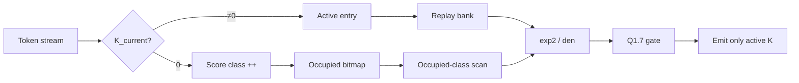

# 面向全二值脉冲光流的运动感知分数类流式加速：H67 部署协同与 HIT-Flow / SCS-Shiftmax / G1 投影后端

**DATE 风格初稿（中文）**  
**主线**：H67 all-binary Motion-XOR TTX（no-carrier，μ=0）  
**硬件子系统**：HIT-Flow / SCS-Shiftmax / G1 projection backend  
**证据基准日**：以仓库 `results/` 与 `docs/49–74` 最新结果为准  
**状态**：compile-explore ready，**非** DC/ASIC sign-off

---

## Abstract

事件光流 Transformer 的部署面临三重矛盾：全二值 Q/K 带来的高 K 零占比与“分母不可删”的归一化语义冲突；定点 Shiftmax 必须与硬件执行顺序一致，而非与原浮点训练图逐位一致；投影侧又需避免物化 dense gated-K。本文以 H67（Motion-XOR TTX）为唯一部署主线，给出可核验的算法–硬件合同与增量加速器切片。贡献限于仓库证据内：**(1)** H67 运动感知全二值 token attention 的定点部署协同与 hardware-order 量化合同；**(2)** SCS-Shiftmax——K=0 时输出为零但分母 exact 保留，按最终 Q7 score class 聚合 multiplicity，并做占用类扫描；**(3)** G1 最终门码目录 + 乘积复用 + 分段多播投影后端，相对 direct active-lane 路径代数等价；**(4)** 12-block descriptor 时分复用与无 carrier 执行图（安装 105 / 动态执行 93 / 功能活跃 81）。valid825 上 RTL-exact 路径 AEE≈1.4627（相对原部署约 +0.0001）[算法精度]；占用类扫描使 attention 行核周期代理下降约 12.86% [profiling]；G1 集成顶层在缩小参数下 direct/NMF 整数等价 directed TB 通过 [RTL仿真]。本机无 `dc_shell`、目标库与 SRAM macro，**不报告**面积/功耗/Fmax 主表。系统边界在 packed Q/K event（或 patch-embed）之后；voxel 前端不做硬件。

---

## 1. Introduction

### 1.1 问题

面向事件相机的场景流/光流估计网络（本文部署对象为 SDformer 族 H67 检查点）在 encoder 中堆叠大量二值 ATLIF、窗口化 token attention 与线性投影。与通用 ViT 加速不同，H67 的部署图具有以下硬约束：

1. **Score 不是 dense MatMul-Softmax-V**：每 token/head 由 α-XNOR 类充分统计量（overlap / same-zero）与跨时间 Motion-XOR 构成有限整数 score，再经定点 Shiftmax 得到 gate，输出为 `gate * K_current`（gated-K），而非完整 N×N attention 矩阵。
2. **K=0 的不对称语义**：`K_current=0` 时投影输出恒为零，但其 score **必须**进入 Shiftmax 分母；删除该 token 会改变非零 K 的 gate [算法精度/代数]。
3. **硬件顺序量化**：RTL 路径为 `raw score → Q7 RNE → Q8 exp2 LUT → 整数分母 → Q1.7 gate`；与“先 center 再量化”的原部署路径在半格点上可不等价。论文“逐位”仅指 **hardware-order golden ↔ RTL**，任务精度用 valid825 AEE 报告 [算法精度]。
4. **不能按 PyTorch module 数实例化硬件**：安装 ATLIF wrapper 105 个，动态 forward 调用 93 个，固定正常推理功能活跃 81 个；12 个 `sn2_q` carrier 在 H60/H67 部署中不执行 [profiling]。

### 1.2 贡献（4 条，均在证据内）

| # | 贡献 | 证据级 |
|---|------|--------|
| C1 | **H67 运动感知全二值部署协同与定点合同**：Motion-XOR + 统一 all12 token score；冻结 Q7/Q1.7、RNE、LUT；valid825 可接受 | [算法精度] |
| C2 | **SCS-Shiftmax**：零 K 按最终 score class 精确聚合；占用类扫描；分母 exact | [RTL仿真]+[profiling] |
| C3 | **G1 投影后端**：最终门码目录（NMF）→ 门码×权重乘积 → 分段多播 → banked 累加；相对 direct 整数等价（缩小参数 directed） | [RTL仿真]；生产 162×32 全量 [待补] |
| C4 | **Descriptor 时分复用 + 无 carrier 执行图**：12 block 共享 row engine；安装/执行/活跃分列 | [profiling]+[架构设想 部分 RTL] |

**明确不宣称**：提出 Shiftmax；首次 spiking attention / 首次 TTB；已完成 ASIC/DC 主表；与原 PyTorch 训练图 bit-accurate；Yosys cells = 芯片面积；周期代理 = 端到端 FPS；H68 矩阵分支进推理 RTL；voxel 前端硬件。

### 1.3 系统边界

```text
[事件体素/前端] --不在本文硬件范围-->
[packed Q/K event 或 patch-embed 后]
        |
        v
  HIT-Flow 子系统（本文）
  - Attention: H67 Motion-XOR + SCS-Shiftmax
  - Projection: G1 NMF→product→multicast→acc
  - 控制: 12-block descriptor 时分复用
        |
        v
[残差/MLP/长 skip / decoder] --接口预留，未做全网 PPA--
```

Encoder 长 skip 仅 S0/S1/S2 三条；S3 为 bottleneck 局部，不得称为第四条 encoder–decoder skip。Block 内两次 ADD 残差与二值 event bank 物理分离（RPI 多位精度岛），本文不把残差压成 1 bit [架构设想]。全网 ATLIF 时间矩阵吞吐大、参数存储小，硬件应复用阵列与瓦片而非按 105 个 wrapper 复制小 ROM——但 **DP-TME 全量 PPA 与 30 FPS 闭合不在本轮主表** [profiling]+[待补]。

### 1.4 论文定位

本稿是 **DATE 硬件/加速器方向** 的可核验初稿：以算法–硬件合同与已实现 RTL 切片为中心，用 profiling 代理说明 workload 结构，用 Yosys 做结构消融，明确 DC/ASIC 主表缺口。读者应能从附录 D 回溯每条数字到仓库文件。

---

## 2. Background & Related Work

邻近工作用“借了什么 / 不能照搬 / 我们的差异”一句话划界。

| 工作 | 借鉴 | 不能照搬 | 本工作差异 |
|------|------|----------|------------|
| **Bishop** (ISCA’25) | TTB、dense/sparse 分流纪律、稀疏训练意识 | ECP 近似剪枝；attention 为 AND-acc 而非 α-XNOR+Shiftmax；PPA 数字 | 不采用 ECP；路径输出同一 H67 充分统计量；后端为 class-aware SCS + gated-K |
| **SpAtten** (HPCA’21) | 级联 token/head 处理与 score 驱动调度思想 | 动态删除 token/head，需模型适配 | SCS **不删除** token；零 K 只折叠分母 multiplicity |
| **Softermax / I-ViT Shiftmax** | base-2、online max–exp–sum、整数 Softmax 分解 | 对每个 score 做 ShiftExp；I-ViT 面向常规 ViT | **禁止写“提出 Shiftmax”**；我们的增量是 **最终 score class multiplicity + K=0 分母保留 + 占用类扫描** |
| **FireFly-T / SpikeTA** | 稀疏/二值双引擎、时间步并行、bank 冲突意识 | FPGA/overlay 指标；SpikeTA 改 residual 语义 | 数字 exact 部署合同；固定 T=2 pair 与 35 类 H67 语义 |
| **LoAS / FLAT（类）** | 时间维并行布局、算子融合与中间量驻留纪律 | LoAS 无 gated-K Shiftmax；融合本身不新 | 融合键是 **最终 Q1.7 gate code + K bitmap**，跨 row 不能按 score class 复用 |
| **Castling-ViT**（对 H68） | 训练期昂贵注意力辅助、部署侧简化 | 保留 linear-angular / DWConv 等部署分支 | H68 仅 **训练退火 matrix aux、eval 强制 0**；**无推理矩阵引擎**；只作消融/related |

另：α-XNOR / Bipolar Self-attention 提供 silence match 与 shift 归一化算法先例；BLADE 覆盖 partial-product 级重复消除——与“最终 score 类直方图”不同，故 **不能**把“冗余消除”写成首次。

---

## 3. Algorithm–Hardware Contract

### 3.1 H67 分数公式（冻结）

对时间片 `t`、head_dim `D=32`：

```text
o_t = popcount(Q_t ∧ K_t)
q_t = popcount(Q_t)
k_t = popcount(K_t)
z_t = D - q_t - k_t + o_t          # same-zero
m   = popcount(K_0 ⊕ K_1)          # Motion-XOR，两时间片共享
N_t = 64·o_t + z_t + 16·m
score_q7 = RNE(N_t / 16)           # 最近偶数；与 RTL 统一
```

等价软件表述：`overlap + same_zero/64 + motion/4`，再量化到 Q7 网格。零 K 时 score 仍依赖 `Q_t` 与 peer-K，**可达类 0..34（35 类）**，不可注入单一 K-zero 常量 [算法精度]+[RTL仿真]。

**Temporal-pair 谓词（避免误路由）：**

- `PAIR_EMPTY = (Q0|Q1|K0|K1)==0`：两时间片均可不读 payload，但必须各注入 **class-2** 分母项；删除 token 非法。
- 仅 `CURRENT_EMPTY=(Qt|Kt)==0` **不是**常量：peer-K 非零时 motion 项仍改变 score。
- `u=0`（两时间片 Q/K 完全相同）时复用已舍入 score 对 hardware-order 逐位合法；增量更新必须缓存舍入前 `N_t`，不可只在 Q7 上加 delta [算法精度]。

### 3.2 Hardware-order 量化（与原部署路径的边界）

| 路径 | 顺序 | 论文用语 |
|------|------|----------|
| 原部署参考 | raw → center → Q7 → float Shiftmax → Q1.7 | 任务对照 |
| **RTL / 本文 exact** | raw → Q7 RNE → Q8 exp2 LUT(16 项) → 整数分母 → ceil-log2 二次幂归一 → Q1.7 RNE，饱和 [0,2] | hardware-order golden |

已知反例：162-token 行中 Q7 类 0/1 各 81 时，`center→RNE` 与 `raw→RNE` 类集合可不同 [算法精度]。故 **不得**写“与 PyTorch 原训练图 bit-accurate”。

### 3.3 无 carrier 执行图

| 口径 | 数量 | 含义 |
|------|-----:|------|
| 安装 ATLIF wrapper | 105 | 软件转换/兼容覆盖 |
| 动态 forward 调用 | 93 | profile 实测调用 |
| 未调用 | 12 | 全部为各 attention block 的 `sn2_q` carrier |
| 功能活跃（固定正常推理） | 81 | 含 45×T=10 + 36×T=2；另 12 个 `attn_sn` 结果不进投影 |

硬件 **不按 105 个 module 复制 105 套算术单元**；描述符时分复用共享阵列 [profiling]。

### 3.4 Gated-K 与投影整数式

```text
a[n,i] = K[n,i] · g[n, head(i)]     # g: 9-bit 无符号 Q1.7，1.0=128，2.0=256
y[n,o] = bias[o] + Σ_i a[n,i] · W_fold[o,i]
```

`W_fold/bias` 为 Linear 与 eval-BN 静态折叠。同一 `(g, 全局输入通道 i)` 且 K=1 的多个 token 共享同一 `g·W[:,i]` 向量——此为 G1 乘积复用代数基础 [架构设想→RTL]。

---

## 4. Architecture

### 4.1 HIT-Flow 顶层数据流（文字框图）

```text
                 ┌──────── Descriptor Scheduler (12 blocks) ────────┐
                 │ stage / block / head / window / tokens            │
                 └───────────────┬───────────────────────────────────┘
                                 │
         ┌───────────────────────┼───────────────────────┐
         v                       v                       v
   [DP-TME / ATLIF]*      Temporal-pair Q/K        Residual/Skip RPI*
   T10/T2 时间矩阵        128b {Q0,Q1,K0,K1}       多位精度岛（未全 RTL）
         │                       │
         └──────────┬────────────┘
                    v
         ┌──────────────────────┐
         │ H67 Motion-XOR Score │  popcount AND/XOR + RNE Q7
         └──────────┬───────────┘
                    v
         ┌──────────────────────┐
         │   SCS-Shiftmax       │  class hist + occupied scan
         │   + active replay    │  → sparse {token,K,gate}
         └──────────┬───────────┘
                    v
         ┌──────────────────────┐
         │ NMF G1 Builder       │  final_gate × lane → dest bitmap
         └──────────┬───────────┘
                    v
         ┌──────────────────────┐
         │ Gate Product Engine  │  g × int8 W → int17 product
         └──────────┬───────────┘
                    v
         ┌──────────────────────┐
         │ Segmented Multicast  │  段驻留 + bank-aware 发射
         └──────────┬───────────┘
         ┌──────────────────────┐
         │ Banked Accumulator   │  product RMW → bias-commit final
         └──────────────────────┘

* DP-TME/RPI 有规格与部分 RTL；本文评估主表以 attention row + G1 切片为准。
```

### 4.2 SCS-Shiftmax

**代数（exact，非 pruning）：**

```text
den = Σ_{active K} exp2(score_i − row_max)
    + Σ_c count[c] · exp2(c − row_max)
```

- 活动 K：写入 active-entry bank `{score,K,token}`，回放生成 gate 与稀疏输出。
- 零 K：只累加 class histogram + 占用位图；**不写** active bank。
- H67：35 类，两拍 FIND_CLASS / CLASS_MAC；H68 部署仅 3 类、单拍（对照/消融）。
- 占用类扫描：load 阶段维护位图，**只弹出非空类**，不做固定 35 类空扫。



### 4.3 G1 投影后端

```text
SCS sparse stream
  → NMF: 按 final_gate_code 分配 SLOTS，合并 (gate, lane) 的 destination_bitmap
  → Product: 一次读 W 列，生成 g×W 向量（OUT_TILE 路）
  → Segmented multicast: 当前段 pending + bank 仲裁，无全局 162 路优先编码
  → Accumulator: 同步 RMW；bias 提交时即输出 final（BCOD 时序重排，数值不变）
```

overflow 时目录满则 sticky overflow / fallback 语义：当前集成切片对 overflow **仅标记**，directed 用例保证唯一 gate ≤ SLOTS；**无损 fallback 展开为 [待补]** [RTL仿真]。

### 4.4 Descriptor 复用

单 `h67_attention_top`：descriptor scheduler **串行**发放 12 个 block 的行请求，共享一套 score/SCS 流水。不是 12 套 Shiftmax 物理实例 [RTL仿真]。四 stage 几何固定为 head_dim=32、9×9 窗口，变化的是 head 数与 window 数；这支持“同构 datapath + 描述符参数”而非按 stage 复制异构核 [profiling]+[架构设想]。Block 间活动密度可差一个数量级（如 S0B0 与 S1B0），调度粒度至少到 stage/block；当前实现为固定 descriptor 串行，**未**做 OOO 多 context 负载均衡 [profiling]。

### 4.5 存储与稀疏输出合同（行核）

- Active-entry bank：深度 162，项宽合并 score/K/token（约 56 bit），求和与发射共享逻辑读口。
- H67 histogram：35×8 bit + 35-bit 占用位图；按小寄存器 bank，支持同类 token 单拍 RMW。
- 稀疏输出：仅活动 K 产生 beat；全折叠行可无 `out_last`、仅 `done`——下游须预清零或按 token 散写 [RTL仿真]。
- 精确深度相对 256 填充的 Yosys 结构收益见 §6.5；**正式同步 SRAM 宏未替换** [Yosys]+[待补]。

---

## 5. Implementation & Verification

### 5.1 RTL 范围

| 目录 | 内容 | 状态 |
|------|------|------|
| `rtl_h67/` | Motion-XOR score、score-class row engine、attention top | 开放工具回归通过 |
| `rtl_hitflow/` | NMF G1、product、multicast、accumulator、G1 top；另有 router/DP-TME 等 | 叶模块 + G1 集成定向通过 |
| `rtl_h68/` | 无矩阵、无 Motion 的部署顶层 | 消融/对照 |
| `dc_handoff/` | SDC、compile 脚本、Formality 交接 | **本机无 dc_shell / .db / SRAM macro** |

### 5.2 验证摘要

| 层级 | 结果 | 证据级 |
|------|------|--------|
| H67 score 穷举 35937 + 随机 1e5 | 0 mismatch | [RTL仿真]/[算法精度] |
| Gate 量化独立参考 | 0 mismatch | [RTL仿真] |
| Row engine 8/162 token、fold 开/关、反压、SVA | PASS | [RTL仿真] |
| Yosys hierarchy/check（通用门） | 结构 0 problem；**非** 面积 | [Yosys] |
| 行级网表回灌 scoreboard | PASS | [RTL仿真] |
| valid825 hardware-order 软件模型 | 见 §6 | [算法精度] |
| G1 top direct/NMF，TOKENS=6,LANES=4,SLOTS=4 | 3 CASE PASS | [RTL仿真] |
| G1 生产参数 162×32 全量随机等价 | **未做** | [待补] |
| 全顶层 Yosys LEC | 超时未关闭 | [待补] |
| DC WNS/area/power / Formality | **未做** | [待补] |

**一句话状态**：compile-explore ready，**not signoff**。

开放工具入口包括 `sim_h67/run_all_checks.sh`、`sim_hitflow/run_projection_g1_checks.sh` 与 `dc_handoff/run_open_checks.sh`。Yosys 通用映射可做行级网表回灌；全顶层顺序 LEC 超时，**不得**标记等价关闭。DC 脚本在缺少 `LIB_DB` 时明确失败，不生成伪 QoR [RTL仿真]+[Yosys]。

---

## 6. Evaluation

### 6.1 证据分级说明（全文强制）

| 标签 | 含义 | 可支持结论 |
|------|------|------------|
| **[算法精度]** | valid825 / 定点软件对照 / 代数 | 任务 AEE、部署顺序可接受性 |
| **[profiling]** | profile100 等 workload 统计与周期/存储**代理模型** | 稀疏结构、行核周期代理；**非** 芯片 FPS/能效 |
| **[RTL仿真]** | Icarus/Verilator/SVA/定向等价 | 功能与 hardware-order 一致；缩小参数等价 |
| **[Yosys]** | 无工艺库通用综合 | 结构对照、mux/reg 趋势；**≠ um²/mW/MHz** |
| **[架构设想]** | 规格/候选/未闭环 PPA | 只能写候选与边界 |
| **[待补]** | 明确缺口 | 不得当结果写 |

### 6.2 任务精度：valid825 RTL-exact

| 候选 | AEE | ΔAEE vs 原部署 | AAE | spikes (G) | 证据 |
|------|----:|---------------:|----:|-----------:|------|
| **H67 Motion-XOR TTX** | **1.4627** | **+0.0001** | 9.4040 | 26.3544 | [算法精度] |
| H68 Castling 训练 / TTX 部署 | 1.4727 | +0.0012 | 9.4714 | 26.4164 | [算法精度] |

判据：AEE 退化 ≤0.02 可冻结当前 LUT。H68 **部署无矩阵引擎**，仅作训练消融 [算法精度]+[profiling]。

### 6.3 Workload：K-zero / 占用类 / pair 空（profile100，H67）

| 指标 | 值 | 证据 |
|------|---:|------|
| Attention 行/帧 | 6720 | [profiling] |
| pair 全空 | 73.90% | [profiling] |
| K-zero | 83.11% | [profiling] |
| motion-zero | 83.18% | [profiling] |
| 活动项/行（均值） | 18.38 | [profiling] |
| 占用 fold 类/行 | 2.27 | [profiling] |
| TTB empty（bundle=1） | 73.90% | [profiling] |

分 stage 占用类/活动项（支撑 SCS 收益主要来自 H67 35 类而非 H68 3 类）：

| Stage | 占用类/行 | 活动项/行 | 证据 |
|------:|----------:|----------:|------|
| 0 | 2.75 | 31.47 | [profiling] |
| 1 | 1.36 | 3.63 | [profiling] |
| 2 | 2.34 | 10.88 | [profiling] |
| 3 | 2.13 | 24.43 | [profiling] |

### 6.4 占用类扫描周期代理（仅 row engine）

| 设计 | 固定扫描周期/帧 | 占用扫描周期/帧 | 下降 | 500 MHz 行核帧率代理 | 证据 |
|------|----------------:|----------------:|-----:|---------------------:|------|
| **H67** | 1 591 065 | 1 386 424 | **12.86%** | 360.64 | [profiling] |
| H68 | 1 376 202 | 1 371 097 | 0.37% | 364.67 | [profiling] |

**边界**：口径为无外部停顿的 attention 行核 FSM；**不含** Q/K 投影、ATLIF、残差、SRAM 同步读、decoder。**不得**写端到端 FPS/能效。500 MHz 为探索约束，非已达成 Fmax。

### 6.5 存储消融（active bank 精确深度 vs 填充）

| 配置 | 存储位 | Yosys 通用单元 | 触发器 | mux | 证据 |
|------|-------:|---------------:|-------:|----:|------|
| H67 精确 162 | 9 352 | 25 045 | 8 441 | 8 875 | [Yosys] |
| H67 填充 256 | 14 848 | 37 132 | 13 308 | 13 973 | [Yosys] |
| 相对下降 | 37.02% | 32.55% | 36.57% | 36.48% | [Yosys] |

说明：同一开源流程结构对照；**不能**换算 um²。正式 SRAM macro 与同步读 FSM **未**进入签核 [待补]。

### 6.6 G1 等价

| 声明 | 状态 | 证据 |
|------|------|------|
| 缩小参数 direct vs NMF 整数一致 | 3 directed cases PASS | [RTL仿真] |
| 生产 162×32×SLOTS 全量 | **未跑** | [待补] |
| overflow 无损 fallback | **未实现展开** | [待补] |
| 投影子系统 DC | **未做** | [待补] |

Direct 金参考：`acc[t][o]=bias[t][o]+Σ_{l:K[t,l]=1} gate[t]·W[l][o]`。NMF 路径按 `(gate,lane)` 合并目的 bitmap，一次乘权重后多播累加，每 token 一次 bias-commit 输出。CASE 覆盖同 gate 合并、gate=0/K-zero 过滤、int8 边界权重；**不能**外推为生产参数全覆盖 [RTL仿真]。

### 6.7 对照与消融口径（可写、不可夸大）

| 对照 | 用途 | 不可夸大 |
|------|------|----------|
| TTX / 无 Motion 部署 | 运动项精度与逻辑增量 | 无同库 DC 前不报面积差 |
| 固定 35 类扫描 vs 占用类 | SCS 周期代理 | 仅 row engine 代理 |
| H68 训练 aux | 训练富/部署简 | 无推理矩阵硬件 |
| 精确 162 vs 填充 256 | 存储结构 | Yosys≠芯片面积 |
| Direct projection vs G1 | 代数等价 | 事务收益待真实 trace |

---

## 7. Discussion / Limitations

1. **证据天花板**：算法精度与子系统 RTL 已闭环；架构级 EDP、30 FPS 全 encoder、真实 SAIF 均未闭环 [待补]。
2. **SCS 收益模型依赖**：12.86% 来自 profile 均值驱动的周期模型，非门级时序仿真；H68 类空间过小，占用扫描几乎无收益——说明机制与 **35 类 H67 合同**绑定。
3. **G1 创新边界**：门码乘积复用、分段多播、蝶形拓扑均有先例；可辩护点是 **SCS 最终 gate 直接作为投影指令元数据** 与 exact destination 语义，且须用真实 gate 直方图与事务统计证明净收益 [架构设想]+[待补]。
4. **HIT-Flow 其余部件**（LR-HTT、DP-TME 满利用、RPI）有规格与部分 RTL，**不得**在本文主贡献表中写成已测系统收益。
5. **H68**：训练富 / 部署简的故事可作消融，**不得**宣称推理侧矩阵硬件。

---

## 8. Conclusion

本文在 DATE 可检验的粒度上，固定了 H67 all-binary Motion-XOR 部署主线及其 hardware-order 定点合同，实现了 SCS-Shiftmax（零 K 分母 exact 折叠 + 占用类扫描）与 G1 门码目录多播投影切片，并用 descriptor 时分复用落地 12-block 执行图与无 carrier 核算。valid825 显示 RTL-exact 路径任务精度几乎不变；行核周期代理与 Yosys 存储消融给出**结构级**收益，但 **ASIC 主表仍缺目标库 DC、SRAM、SAIF 与生产参数全量等价**。后续工作按投稿前硬缺口清单推进，不扩展不可核验 claim。

---

## Appendix A. 术语表

| 术语 | 含义 |
|------|------|
| H67 | Motion-XOR TTX 全二值部署主线（μ=0，no-carrier） |
| H68 | 训练期 Castling 式 matrix aux；部署关闭，无矩阵 RTL |
| SCS-Shiftmax | Score-Class Streaming：按最终 score 类聚合零 K 分母 |
| OCS | Occupied-Class Scan，占用类扫描 |
| NMF | Normalization Metadata Forwarding：gate 目录指令化 |
| G1 | 窗口组 G=1 保守投影参数 |
| HIT-Flow | Head-Invariant Temporal-Tile 全 encoder 架构候选总称 |
| hardware-order golden | 与 RTL 一致的定点顺序参考，≠ 原 float 图 |
| RNE | Round to nearest even |
| gated-K | `gate * K_current` 稀疏输出 |

## Appendix B. 接口要点

| 接口 | 字段/语义 |
|------|-----------|
| 行请求 | stage2, block3, head5, window10, tokens8 |
| H67 输入 | time1, Q32, Kpair64；payload 约 97b |
| 稀疏输出 | token8, K32, gate9(Q1.7), thr8；全折叠行可无 beat 仅 done |
| G1 目录 term | gate, lane, dest_bitmap[161:0] |
| 注意 | `out_gate_q8` 历史名，实为 9b Q1.7 |

## Appendix C. 不可 Claim 清单

- 提出 Shiftmax / 首次 spiking attention / 首次 TTB / 首次蝶形  
- 已完成 ASIC 或 DC 面积功耗主表；Yosys cells = 芯片面积  
- 与 PyTorch 原训练图 bit-accurate  
- 周期代理 = 端到端 FPS / 能效；spike 代理 = 芯片功耗  
- H68 矩阵分支进入推理 RTL  
- voxel 前端已硬件化；105 个 module = 105 硬件实例  
- G1 生产参数全量等价已证明；80.13% event forward 为实测 bypass  

## Appendix D. Claim / Evidence / File 对照表

| Claim | Evidence | File |
|-------|----------|------|
| H67 RTL-exact AEE 1.4627，Δ≈+0.0001 | valid825 软件模型复现 RTL 数值路径 | `results/h67_h68_rtl_exact_valid825.md/.json` |
| SCS 代数 exact；占用扫描 | RTL 公式 + profile 周期模型 −12.86% | `docs/49`；`results/h67_h68_score_class_scan_cycle_model.md` |
| K-zero 83.11%、占用类~2.27 | profile100 | `results/h67_h68_profile100_arch_features.md` |
| 安装 105 / 执行 93 / carrier 12 | 模块覆盖审计 | `results/h67_h68_atlif_module_coverage.md` |
| 存储精确深度 −32.55% cells | Yosys 对照 | `results/h67_h68_storage_ablation.md` |
| Score 35937+1e5 一致；35 类 | 独立参考 | `results/h67_score_reference.md` |
| G1 direct/NMF directed PASS | iverilog TB | `docs/74`；`rtl_hitflow/hitflow_g1_projection_top.sv` |
| 无 DC / 无库 | 交付说明 | `dc_handoff/README.md`；`docs/49` §6–7 |
| H68 无推理矩阵 | 部署合同 | `results/h68_deploy_contract.md`；`docs/50` |
| 贡献冻结边界 | 签核清单 | `docs/50`；`docs/51`；`docs/68` |

## Appendix E. 投稿前硬缺口清单

### P0（投稿硬件主文前必须）

1. 目标工艺库 + 同约束 DC：TTX / H67 dense-class / H67+SCS（及 G1 若作主贡献）WNS/TNS/area/power  
2. active-entry / accumulator 的 SRAM macro 或明确触发器方案 + 读延迟计入周期  
3. 真实 H67 trace → SAIF/VCD，分项功耗  
4. Formality（或等价正式 LEC）RTL↔mapped netlist 全 compare point  
5. G1：`TOKENS=162, LANES=32` 随机/真实向量整数等价；overflow fallback 无损路径  
6. 若称 encoder/系统：纳入 81 活跃 ATLIF、投影、S0–S2 skip、残差的系统 PPA 模型  
7. 多随机种子 H67 训练复现（论文强调泛化时）  

### P1（强烈建议）

1. 固定 35 类 / 占用类 / dense 分母 break-even 曲线  
2. Motion-XOR 前端相对 TTX 的面积/功耗差分  
3. ordered-trace：gate code 直方图、双 K-zero 同类率、bank stall  
4. SCS/G1 与 Softermax/I-ViT/BLADE/Bishop 的 claim chart 扩检索  
5. p50/p90/p99 行延迟与 active class 分布  

## Appendix F. 图表清单（Fig/Tab 计划）

| 编号 | 内容 | 数据状态 |
|------|------|----------|
| Fig.1 | 训练图 vs 部署图（H67 主支；H68 aux 虚线；carrier 删除） | 可画，语义已冻结 |
| Fig.2 | HIT-Flow 顶层 + 系统边界 | 可画；PPA 未签核须标注 |
| Fig.3 | H67 row：pair → Motion-XOR → SCS → 稀疏输出 | RTL 已实现 |
| Fig.4 | SCS 两拍时序 vs H68 单拍 | 周期模型有数 |
| Fig.5 | G1：NMF→product→mcast→acc | directed 等价有；全量 [待补] |
| Fig.6 | Related-work 边界表（可作表） | 文档 47/50 已整理 |
| Tab.1 | valid825 AEE/AAE/spikes | **已有** |
| Tab.2 | profile100 稀疏统计 | **已有** |
| Tab.3 | 占用类周期代理 | **已有** |
| Tab.4 | Yosys 存储消融 | **已有**（须标非芯片面积） |
| Tab.5 | RTL/Yosys/DC 验证矩阵 | **已有** 部分；DC 列空 |
| Tab.6 | DC area/power/Fmax 主表 | **待补** |
| Tab.7 | G1 事务/周期 vs direct | **待补**（真实 trace） |

---

*文稿版本：docs/75 初稿。不修改 RTL、不重训、不删旧文档。*
