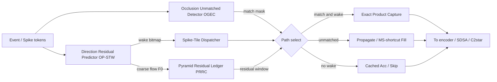
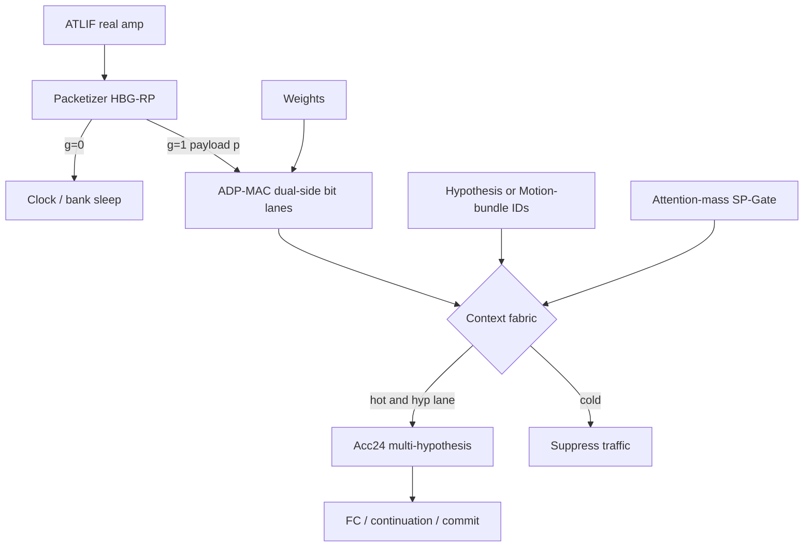

# C1* / C2* 微架构草图 + 工作量对比

**作者:** Grok Bot (`iscas_ssh`) — NEW FILE（不修改现有 RTL/合同）  
**日期:** 2026-09-05 (Asia/Shanghai)  
**依据:** `04_SYNTHESIS_C1_C2_REMAKE.md` + 三线调研底稿  
**目标:** 把 C1* / C2* 拆到可画框图 / 可估人周的粒度。

---

## 0. 对照：旧贡献 vs 新机制

| | 旧 C1 | **C1*** | 旧 C2+TSBG | **C2*** |
|---|---|---|---|---|
| 一句话 | 有限容量精确积捕获 | **预测/金字塔/遮挡门控的精确路径** | 多上下文 Acc + 换序/分发 | **实值 ATLIF 双轨 + 运动假设/motion-bundle** |
| 审稿风险 | 又一个 sparse MAC | 光流语义调度 | 换乘法顺序 | 机制可命名、可消融 |
| 核心新块 | — | Predictor / Residual ledger / Occlusion gate | — | HBG-RP / ADP-MAC / Hyp-Motion fabric |

---

## 1. C1* 微架构草图

### 1.1 顶层数据流

### 1.2 模块拆分（可直接变 SV 目录）

#### M1 `c1s_op_stw_predictor`（OP-STW）
- 输入: 上一帧/步 coarse flow 或 membrane 差分；可选 Motion-XOR/TTX 仅作地址键
- 输出: `wake[T_tiles]`；可选每 tile 2-3 bit 方向
- 实现: 每 tile `wake = (abs(F0-F_prev) > th_w) OR (event_count > th_e)`；小 SRAM 存低分辨率 F0
- 时序: dispatcher 发 tile 前 1-2 cycle 就绪
- 面积: 远小于 exact MAC 阵列

#### M2 `c1s_prrc_ledger`（PRRC）
- 输入: 金字塔级 L in {0,1,2}；粗层 residual
- 输出: 细层 residual window 地址；每级 capacity budget B_L
- 实现: 三级 budget 计数器；用 F0 做整数 warp 得到 ROI；exact 只对 ROI 与 wake 交集计费
- 耗尽: 强制 REUSE/PROP，并打 `budget_overflow` 计数（禁止静默丢精度）

#### M3 `c1s_ogec_gate`（OGEC）
- 输入: 前向/后向一致性或 event-density 不一致
- 输出: match / unmatched
- ExactMatch 走精确积；Propagate 走邻域填充 / MS-shortcut
- 消融: 关 OGEC = 全部 ExactMatch

#### M4 `c1s_exact_capture_core`
- 仍有限容量；入队条件改为 `wake AND match AND in_residual_window`

#### M5 `c1s_stats`
- wake_rate / exact_products / propagate_tokens / budget_overflow / pred_hit_rate

### 1.3 C1* 验证梯子
1. always-exact（旧）
2. zero-spike skip
3. OP-STW only
4. OP-STW + PRRC
5. 满配 C1*（+OGEC）

### 1.4 C1* 工作量

| 项 | 人周 | 说明 |
|---|---:|---|
| Predictor + wake dispatcher | 1.5-2 | |
| PRRC ledger + ROI 地址 | 2-3 | warp 边角多 |
| OGEC + propagate | 2-3 | |
| exact 入队改造 + stats | 1-1.5 | |
| 联调 / 消融 | 2-3 | |
| **合计** | **8.5-12.5** | 约 2-3 周一人之力 |
| 风险缓冲 | +30% | |

---

## 2. C2* 微架构草图

### 2.1 顶层数据流

### 2.2 模块拆分

#### N1 `c2s_hbg_rp_packetizer`（HBG-RP）— 算法绑定最强
- `{g,p}`: `g=(abs(amp)>eps)`，`p`=4/6/8-bit 量化
- `g` 门控 PE 时钟 / SRAM / NoC
- 论文刀口: 二值 vs 可吸收 AT-LIF vs **不可吸收实值**

#### N2 `c2s_adp_mac`（ADP-MAC）— 替换换序叙事
- W 与 p 双侧 bit 跳零；slot donation 负载均衡
- **禁止**做成先乘 A 再乘 B 换序
- 可参考 FireFly-v2 bit-decompose / L-SPINE 多精度
- 消融: 单侧 vs 双侧；有/无 donation

#### N3a `c2s_arm_acc`（ARM-Acc）
- Acc 上下文 = K 个方向假设（K=4/8）；证据选赢家 commit
- OF 独特性最强

#### N3b `c2s_mfbd`（MFBD）— 可与 N3a 二选一先做
- 同 weight-row 广播到相邻时间片 / motion state
- 指标: bank 请求、context hit、早停率

#### N4 `c2s_sp_gate`（可二期）
- attention-mass 抑制 cold token；`issue = g AND hot`

#### N5 `c2s_stats`
- gate_sparsity / bit_skip / donation / hyp_switch / att_suppress

### 2.3 C2* 验证梯子
1. 旧 TSBG 换序基线
2. HBG-RP only
3. HBG-RP + ADP-MAC
4. + ARM-Acc 或 MFBD
5. + SP-Gate 满配

### 2.4 C2* 工作量

| 项 | 人周 | 说明 |
|---|---:|---|
| HBG-RP + 门控 | 1.5-2 | 先钉 eps/量化 |
| ADP-MAC + donation | 3.5-5 | **最重** |
| ARM-Acc 或 MFBD | 3-4 | |
| SP-Gate 二期 | 1.5-2.5 | |
| 联调消融 | 2.5-3.5 | |
| **合计无 SP-Gate** | **10.5-14.5** | |
| **满配** | **12-17** | 约 3-4 周一人 |
| 风险缓冲 | +40% | |

---

## 3. 两边对比（决策表）

| 维度 | C1* | C2* |
|---|---|---|
| 人周 | 9-13 | 11-17 |
| RTL 难度 | 中（控制调度） | 高（datapath） |
| 算法绑定 | 中（启发式可用） | 强（实值 ATLIF 必须成立） |
| 创新可讲性 | 高 | 很高 |
| 打旧审查意见 | 不是普通 sparse MAC | **直接杀死换序** |
| TB/VCS 风险 | 中 | 高 |
| 可分期 | OP-STW 再加 PRRC/OGEC | HBG 再加 ADP 再加 ARM |
| 与 M2067/FC2 | 偏前端，易并行 | 深改 C2 核心 |

### 推荐排期

**R1 稳:**  
W1-2: C1* OP-STW + 并行冻结 ATLIF `{g,p}`  
W2-4: C2* HBG-RP + 简化 ADP（可先无 donation）  
W4-5: 补 OGEC **或** ARM-Acc 二选一

**R2 攻 C2:**  
主攻 HBG+ADP+ARM；C1* 只做轻量 OP-STW 配套

### 最小可发表集（两边都碰）
- C1*: **OP-STW only**
- C2*: **HBG-RP only**
- 合计约 **4-6 人周**，已能讲完整共设故事；其余按审稿加

---

## 4. 共享基建
1. ep34 profiling: 方向可预测率、遮挡、`abs(amp)>eps`、attention-mass
2. 统一 stats CSV
3. 新目录仅 `*_grokbot_*`，旧 C1/C2 留作 ladder
4. Profiling 本身 0.5-1 人周

---

## 5. 一页结论
- **C1*** = 调度/记账创新，更快出消融图
- **C2*** = datapath 创新，才能换掉换序，但更重
- 若时间紧: 最小集 OP-STW + HBG-RP；若审稿已盯死 C2: 优先 HBG+ADP

## 6. 待你批准后再动的工程
1. 冻结 ATLIF 契约（位宽、eps、是否不可吸进 W）
2. ep34 profiling
3. 新建 `rtl_c1star_grokbot/`、`rtl_c2star_grokbot/`（空壳也先问）
4. 选 R1 或 R2
