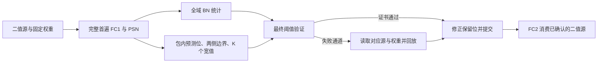

# M2272 接手后的取舍与新增实验

2026-09-06。目标仅为 TCAS-II。主仓现场为 `d5d33b8f`；他人修改的 `tcasii_accelerator_story_and_next_ideas_20260905.md` 保留。

**当前优先研究：FC1—BN—满秩 PSN 之间的晚知阈值提交，以及失败后的细粒度回放。** 原 C1 和 C2/TSBG 继续作为实现与强对照；没有证据支持把它们换个名字升级为主贡献。本轮压缩固定槽方案已被真实权重否定。源统计 Gram 路线仍是竞争方案，不与晚阈值方案免费拼接。当前不存在可诚实承诺的“稳 accept”。

## 1. 接手阅读与需要撤回的判断

完整读取 [M2272 交接](../../../sdformer_codex/SDformer/hw_autoresearch_nts07/reviews/m2272_next_agent_handoff_20260905.md)，结合现场源码和结果核对。此前 42 份 idea 文件的审阅是历史快照；本轮补读 12 份新增研究正文/指针共 1716 行、更新的 OpenROAD scoreboard、会话跟踪索引，并审阅 GH 包的完整报告、筛查源码与关键独立评审。逐文件逐条记录在 [新增文档审阅](records/new_ideas_and_g12_review.json)，不能用旧覆盖数字冒充当前全目录。

- **ATLIF 是二值、时间混合是满秩 PSN。** M2270 实际类检查已补上 ep34 证据。安装/调用/消费者数量仍为 105/93/81，两批 12 分开；不使用 leak/reset 模型，不把 INT8 表示当逐次发放幅值。
- **C1 不能再讲驱逐救援或换口近 1.9×。** 当前 task 内全部行可驻留，九宏是宽度切片；M2266 单换端口的局部模型增量约 1.62%。旧 1.6945× 是对 strongest-zero 的同 trace 模型，不是相对 Prosperity 的增量。
- **C2 选择性 partial 不是尚未开展的实验。** M2271 及更早包已做小槽、全子集最优和原始源暂存强对照。window64 的两槽改善约 FC1 0.54%、FC2 1.30%，不能省略 scatter、宽累加入口和跨调用状态。此次原拟追加的相似筛查已停止，无完整结果，不列为新进展。见 [跨包复核](records/m2271_independent_review.json)。
- **旧 G12 不是空白，也不能否定一切二值判决设计。** M366 的 T10 项跳过约 6.58%，32-lane 发射代理仅改善约 0.0676%，且是另一份 ep35 整数量化参考，有大量相对浮点的发放翻转。它在完整 BN 输入已知后做 PSN 项早停；晚阈值包解决的是最终 BN 统计尚未知时如何保存信息，属于不同执行问题。
- **G/H/I 控制叶仍缺数据生产和完整消费者链。** 外给 flow、confidence、上下界的端口不能代替这些量的生成；新版 veto 又使旧“只能多唤醒”判断过时。OpenROAD/sky130 的控制叶回归与布线不能借作 TS1N28 PPA。

另外独立读了 [ExSpike 原文](https://arxiv.org/html/2606.20414v1)：APEC 对相邻输入位置构造通道交集部分和，再按各位置分别更新目的。它不是事件坐标合并；忠实实现应补为 C1 强对照。Phi、Transitive Array 也使“虚拟中间结果”本身不能作空白。本轮没有为 C1 再保留一个换名改造，详见 [先验复核](records/exspike_c1_prior_review.json)。

## 2. 新实验：固定槽与异常池为何不保留

代码：[screen_fixed_slot_compression.py](scripts/screen_fixed_slot_compression.py)。结果：[fixed_slot_compression.json](records/fixed_slot_compression.json)。独立审阅：[fixed_slot_independent_review.json](records/fixed_slot_independent_review.json)。

预先固定：原 24 层 FC 部署候选 INT8 字节、每 96 值重启的同一 canonical Huffman；每包固定 80 字节主槽，其中 4 字节标头、最多 76 字节内联编码。溢出时在 16 字节对齐异常池保存原始 96 字节，主槽空洞照计。内联固定 5 个 128-bit 读取；异常为 1 个标头读加 6 个池读。全层 raw 旁路仅按权重容量选择，不使用访问统计择优。

这是 [LCP，MICRO 2013](https://users.ece.cmu.edu/~yoonguk/papers/pekhimenko-micro13.pdf) 固定槽、异常、原始旁路思想的有界迁移控制，**不是新机制命名**。

全权重 179,712 包中，179,700 包溢出，只有 12 包内联。强制固定槽含元数据为 31,637,376 B；原始存储同口径为 17,255,424 B，约 1.8335 倍。24 层全部选择原始旁路。这个预声明的 80 字节合同应停止；不能把结论外推为所有压缩布局都不可能。

访问仍是原 4320 个冷 G48 块、267,405 次源请求、输出 tile0；容量覆盖全部输出 tile，二者分母不混用。

| 方案 | 每 bank 的缓存数据容量 | 物理 128-bit 读取 | 相对 raw |
|---|---:|---:|---:|
| 原始 96 字节权重包 | 4 字或 16 字 | 1,604,430 | 基线 |
| 原 byte-packed Huffman，目录与数据共享 LRU | 4 字 | 1,818,652 | +13.35% |
| 同编码，普通分区：1 目录字＋3 数据字 | 4 字 | 1,730,101 | +7.83% |
| 原 byte-packed Huffman，共享 LRU | 16 字 | 1,730,101 | +7.83% |
| 固定槽强制启用 | 4 字或 16 字 | 1,871,773 | +16.66% |
| 固定槽按全层容量选择 raw 旁路 | 4 字或 16 字 | 1,604,430 | 0% |

目录保留 1 字这个普通控制已经获得原先把缓存从 4 字扩大到 16 字的全部收益。因此这部分不能包装成新的压缩执行电路。保留的关键问题是：同一 payload 布局的实际数据读为 1,551,247，目录即使免费，也只比 raw 少约 3.31%；实际目录仍需 178,854 读。这不足以支持目前这条路线作为主性能贡献，串行 Huffman 解码吞吐还未收费。

验证：重构的 24 层容量及原两档缓存全部逐项复现 M2264，3 份既有 INT8 tile 字节一致；新布局的 17,252,352 字节全部经实际序列化后独立读回。多数读回走原始异常池，不能说成全量压缩 Huffman 解码已验证。缓存只比较同数据字容量，未建立同物理面积，也不将读取数称为周期、能量或 PPA。

## 3. 值得继续的改变到底在哪里

冻结路径的当前域 BN 统计要等整个归一化域结束。直接实现需保存宽 FC1 输出、待统计齐后读回，或重算一次 FC1。虽然最终 ATLIF 消费者只需要一位发放决定，**这位决定在宽值刚产生时尚不能确定**。

候选完整执行首遍 FC1 和满 T PSN 投影；每个空间包保存预测位、被丢弃的 0 侧最大值/1 侧最小值，以及 K 个近阈值的宽值和位置。最终 BN 统计到达后，检查是否跨过丢弃值的边界：通过则只修正保留的 K 个位置，不通过则回放该包的失败通道。未经确认的位不送 FC2。

这里希望改变的是跨全域统计屏障的保存表示和失败服务粒度。二值、top-K、广播、回滚和缓存分别都有先验，均不能单独作为贡献。尤其：

| 直接先验 | 已有内容 | 此候选必须另外解决 |
|---|---|---|
| [Gist，ISCA 2018](https://www.cs.toronto.edu/~pekhimenko/Papers/ISCA18-Gist.pdf) | 按消费者需要保存位/位置，缩短宽激活生存期 | 在最终阈值未知时丢弃宽值，之后仍可准确判决 |
| [BN estimates and rollback 公开技术文本](https://patents.google.com/patent/US20200160123A1/en) | 估计 BN、最终统计检查、按通道 mask 回滚 | 以输出位不变作为证书，收费有限残差与局部回放；不是只检查均值接近 |
| [OPN，TCAS-II 2024](https://doi.org/10.1109/TCSII.2024.3354738) | 抽样 range normalization、单遍与消费者恢复 | 保留最终全域标准 BN；不能借近似归一化改变冻结函数 |
| [FlexAcc，2025](https://jiemingyin.github.io/docs/ISCAS2025_FlexAcc.pdf) | 首遍融合统计和 raw 保存，再读回归一化 | 在强融合保存基线上计少存宽值的净收益 |

原 GH sample0 两层 B32K4 已有数值机会，但只是 NumPy float64 重建：与封存 FC2 源位比较为零差异，不构成 GPU FP32 逐位等价。K=4 时逐 h 回放的 FC1 加项为首遍的 2.4554%/8.9066%；直接沿用 96 通道组则膨胀到 63.7489%/85.4740%。两者都是**额外重算比例**，不是加速比。

本轮只补同两层、同 B32K4 的失败位图与 q=4/16/96 布局服务，校验旧聚合结果一致，不重复全 24 配置。q=4 按每 128-bit 权重字装 4 个 FP32 值计费，不偷换为 INT8。源暂存、宽累加状态、权重读和 PSN 重算分别计入。

## 4. 新实验：细粒度回放有真实机会，仍未证明净胜

代码：[screen_repair_sectors.py](scripts/screen_repair_sectors.py)。[结果与位图目录](records/repair_sector_sample0_r1/result.json)保存了两份共 32,640 B 的失败 h 位图、分组位图、源列活跃计数和包访问范围，后续服务研究不必再重建前向。旧 GH 的所有相关聚合计数和 82,944,000 个封存支持位全部复现。[独立审阅](records/repair_sector_independent_review_by_c2.json)确认计数与隔离控制，同时保留首遍 bank、源生存期、宽状态和数值边界问题。

| 回放分组 | stage0.block0：额外 FC1 加项 / 首遍 | stage3.block0：同口径 |
|---|---:|---:|
| 4 个输出通道 | **8.6684%** | **29.4383%** |
| 16 个输出通道 | 25.3243% | 64.2555% |
| 96 个输出通道 | 63.7489% | 85.4740% |

4 通道组织的回放权重流量为 7.258 MB/24.004 MB；96 通道组织为 54.256 MB/72.769 MB。但 4 通道组织源暂存列扫描分别为 96 通道的约 3.21 倍/7.92 倍，深层孤立权重服务批次也约 2.64 倍。因此，这张表只证明回放放大可以降低，**不能宣布净能量或周期收益**。

为隔离掩码粒度和执行组织变化，又从保存位图派生了[同 q4 控制](records/repair_same_q4_controls.json)，[代码](scripts/derive_same_q4_controls.py)未重跑前向。保持 q4、24 个空间位置和相同静态布局，只将“每 4 通道选择”换成“96 通道中有失败则选全部 24 个 q4 子组”。两层权重读取分别是细选择 453,649/1,500,275 字，对粗选择 3,391,008/4,548,072 字；源暂存扫描也同时减少。它证明在**同一指定组织**下，细选择具有增量；最终仍须与原生 q96 组织和最优保存/重算比较，不能只展示故意展开的粗选择控制。

以下代价保留在账上：

- 全层二值源须活到最终统计确认，至少保留 2,304,000 B/288,000 B；若不能借用已有上游存储，还要付相应保留写。保存完整 Y 的强基线可以更早释放 S，不强迫它承担相同源生存期。
- 局部源包为 3,840 B/30,720 B；按每源列 128-bit 对齐转置后为 4,608 B/36,864 B。转置生成和端口代价未闭。
- q4 修补还需 `T×B×q=1280` 个宽 Y 累加值：若 32 bit 是 5120 B，当前 float64 数值代理则是 10,240 B；另需每位置 `T×q` 输入暂存及 q 个输出累加器。完整 PSN 计算后立即比较最终阈值，不另留整包 U。
- 源列读取和选择器扫描两列计数指同一读取，不重复相加；Y 初始化/更新、PSN 项数、patch 位分别收费，尚无同时满足这些端口的拍级模型。
- 首遍工作不能删。全重算强基线是 **2F＋P**，不是 2F＋2P；保存基线是 F＋P；候选为 F＋回放 F＋P＋回放 P。这里 F/P 分别是完整 FC1/PSN 项数，不能直接混加当周期。
- 当前 q4 地址 `a=s*C+c` 的 bank 为 `a mod 8`。因 C 是 8 的倍数，同一 c 的不同输出子组会落到同一 bank。若首遍改回 96 输出宽取数，就不能免费继承原生 q96 的并行读。按输出子组旋转 bank 可以作为布局修复方向，但地址/选择网络和首遍服务尚未验证，不能默认已有。

**取舍：保留晚阈值表示及局部恢复这个研究问题；固定 q4 小组、空间广播和 bank 旋转只是实现手段。** 优先把首遍、编码、修补放到同一份有端口限制的布局里，与融合保存和全重算竞争。上表不构成新 RTL 加速比，也不证明原来的 C2 已经获得这些收益。

## 5. 当前研究边界

主机制暂不写进论文贡献句。没有生产 RTL、EDA、新训练、模型替换或投稿动作。下一项能改变去留的证据是晚阈值方案的有限资源服务，随后才是实际数值合同、编码/修正端口与强融合保存/重算基线的净成本。C1 若无强于 Prosperity、Phi、Transitive Array 和忠实 ExSpike 的增量，就继续退为基线，不硬凑第二个主贡献。
