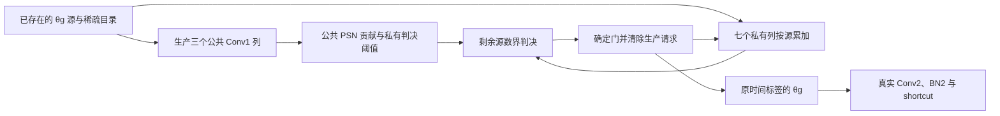
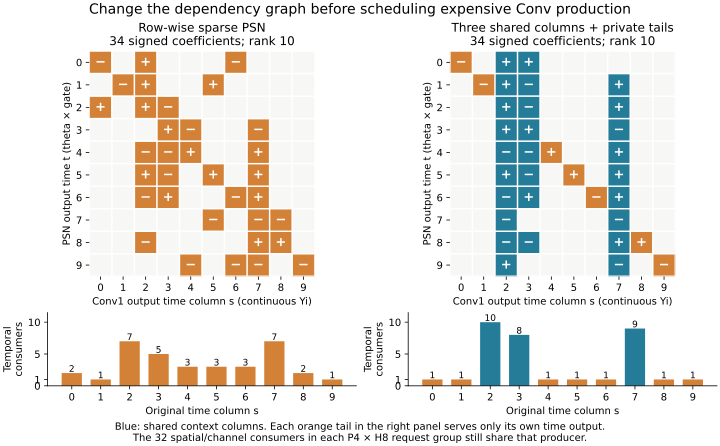

# patch 条件生产：保留结构证据，停止逐源检查版本扩展

**2026-09-09最新结论。** 在同一声明资源点，持续检查没有超过更简单的“一次严格生产许可”。双方都给时间优先调度、普通零源/零权控制和合法状态编译；不是用共享前缀方案对一个故意反复搬Y的普通控制。下面是相同192个独立P4/H8切片的串行聚合，包含源目录构建，工作MAC仍为INT48；每轴61,440个完整T10门均0差。它们是CPU有限服务模型，不是RTL周期或整层结果。

| 同资源执行 | 完成模型步 | 相对普通完整执行 |
|---|---:|---:|
| 普通完整执行，time-major |1,803,495|基线|
| 一次严格许可，INT32保存公共项减阈值C |**1,668,725**|**−7.4727%**|
| 持续检查，time-major |1,679,195|−6.8922%|

一次许可在公共三列后用严格范围作决定；失败者完整生产私有列，不再维护逐源证书或生成η。其`C=Ucore−τ`的全合法源域绝对界为788,841,140，INT32保存并符号扩展与宽值一致，状态1384B满足相同2KiB预算；不是根据几个样本的观测缩位。持续检查反而比它多10,470步（+0.6274%）。因此停止当前持续检查/η控制的主创新与继续优化主张。保留公共列结构的算法可用性和因果观察，但它的新增价值还需与普通结构共设比较；独立概念分约5.5/10，不是录用概率。

[时间线](finite_service.json)、[一次许可与32bit编译](one_shot_service.json)、[完整成本说明](../../../psn/patch_completion_service_bounds.md)。此前只对普通完整执行得到的6.89%正信号，不能替代上表更强分母。原K优先候选的失败也只属于其调度，不曾证伪整个结构。

**本轮另外三种改造为何不晋级。** 这些判断针对各自已测版本，并非给整类思想判死刑。

| 改造与完整借鉴边界 | 实际新增证据 | 当前处理 |
|---|---|---|
| 一次K扫描＋独立时间范围界 |四帧门0差；Conv项少6.08%、逻辑W少1.47%，却需69.85M端点乘积，普通完整PSN仅2.73M非零项|控制费用过高，停止这份检查方式；[结果](single_scan_reference.json)|
| 保留真实T10模式相关性 |相同源进度/更强suffix-W界下，k=432多证33,531门只多取消3,565个后续Conv项；k=648增加约92,031项取消，仍需4.00M模式端点产品，且与普通界取交另付其费用|相关性存在，但新增证书没有足够释放生产；检查点机会不累加成整条时间线；[结果](correlated_bound_probe.json)|
| 邻父严格界、源域半径、ConvReLU++ E6修正 |普通相同源/空产品已扣除：严格差分多取消0.3076% Conv项，5bit加权半径0.1330%；E6仅比L2再取消576项；父后失败子两阶段增加约42%逻辑W使用|固定p0版本停止。已迁移L2和E6核心界，未实现论文的hash参考选择、跨帧缓存链；不把固定参考失败扩大成整个原方法失败；[半径](margin_reuse_probe.json)、[E6](convrelu6_reference.json)|

范围接口也实际比较了逐通道精确INT16、逐通道幂次、H8共享精确、H8共享幂次及普通`源数×最大权值`。共享表能从4608B降为576B或180B有效位，但界变松、更多尾部继续执行；在同一有限服务点，最好的紧凑版本仍比逐通道精确界慢3.91%，未超过一次许可。[四帧严格回放](compact_bound_probe.json)、[有限服务](compact_bound_service.json)。紧凑版的寄存器重解释/译码是明确模型假设，不是同面积结论。

直接先验已补到[原文对照](../../../literature/patch_conditional_fusion_followup_20260908.md)：TermiNETor已有多通道共同终止训练，DynConv已有从后继需求生成前驱生产mask并计入训练费用，MLSys2021/ConvReLU++已有严格参考证书。普通共同完成、反推需求、范围缓存均不能另立标题。后续不继续堆检查器或扫γ；当前转查已有支持码LUT底座的宽系数搬运缺口，见[其完整费用](../../../bn_state/support_service_notes.md)。生产nts07和主稿未改。

以下保留结构形成及数值实验记录；执行结论以上述最强分母为准。

形成并检验的结构是：**三个公共时间列＋七个私有尾列，使已确定的门能够取消尚未完成的昂贵卷积。** 保留34项、rank10和十个原时间输出。共同整数完整825已完成：普通row34完整执行AEE为 **1.207365**，新结构为 **1.205931**；有损γ3另列，不借其误差换取严格取消结果。新图在四帧逐源回放中，含公共前缀的有效卷积项相对同前缀完整尾少 **26.51%**，三个执行控制各983,040个门均与本学生完整函数一致。

前期逻辑计数尚未证明净硬件收益：相对一次完整T10取权控制，前缀加尾部的逻辑W使用反而 **＋42.42%**。其后已补上顶部的有限端口及更强一次许可对照，不能继续把该费用检查写成待办。承接稀疏PSN、CGNet、CompRRAE/SnaPEA及Gustav式供数，已有矩阵形式、普通短路与范围判决均不冒作首创；完整Gustav物理供数尚未实现。生产nts07、旧C1/C2与主稿未改。

最新完整精度见[整数四轴](integer_exact_valid825/comparison_2x2.json)，严格执行见[逐源回放](private_tail_replay.json)，资源与更强对照见[费用说明](../../../psn/patch_completion_service_bounds.md)。下文保留前期浮点/统计型探索，分别标明数值身份与分母。

**挂点与问题。** 较贵的 patch 中选不可廉价整支删除的 r1：`sn1 → Conv1 → 固定BN → T10 PSN → θg → Conv2 → 固定BN + shortcut`。四处 patch BN 已固定，row34 PSN 保留十个原时间输出、34个系数；此前 FP32 目标的完整825 AEE为1.203511。这里使用这份新学生，不把结果当原冻结 ep34 的同函数结果。[旧40帧粗头后点积代理](../../../decoder/coarse_remaining_workload.md)中，r1.Conv1是最大的单算子，约3.211G/帧、占6.71%；加相邻Conv2合计约11.07%。这份代理不含PSN等连续算术，也不是当前学生的新周期份额；整个patch的34.8%不能都归给本机制。

若门 t 仍依赖尚未产生的时间列 s，Conv1 需要生产 s；若它的所有消费者已经完成，s 即便有非零输入也可取消。已确定的0和θ均登记完成，未确定者继续计算。

对每个真实P4×H8组，时间列需求仍可写为 `need[s] = OR_(p,h,t) (unresolved[p,h,t] AND E[t,s])`。普通源零跳过、逐门短路和融合均给对照；不能把这个OR公式或换名算新代数。早期统计型版本使用五Y加一U；上图对应当前严格版本，前缀阶段928B、尾阶段1120B，不能沿用“只用五Y”的资源说法。

**完整借鉴，以及剩余贡献问题。**

- [GustavSNN](https://doi.org/10.1109/HPCA68181.2026.11408587)：应完整继承 GP/CPTB/NRV、共享请求、局部状态及稀疏供数成本。当前探针只测其中的活项、共享逻辑W使用与局部状态策略，尚未接完整物理供数，不称已完整实现 Gustav，也不把它说成 Prosperity 的升级。
- [CGNet](https://zhouyuan1119.github.io/papers/cgnet-micro2019.pdf) 与 [BitFair](https://arxiv.org/html/2607.05445v1)：部分计算、训练停止、非零近似结果、普通任务完成及其控制都是先验。本地问题是十个非因果门与昂贵卷积时间列的多对多依赖，哪些未来生产任务能随完成而被取消。
- [ISSCC 2025 CFMP](https://arxiv.org/pdf/2512.17555)：双级计算、共享掩码与生产/消费索引转换已有芯片实例。普通跨层融合和 SCNN 的 halo 也已充分存在，不能拿省去整幅 Y 的弱对照撑标题。
- [PACT](https://arxiv.org/pdf/1805.06085)、[CompRRAE](https://arxiv.org/html/1906.03180)、PSN 原作均需保留。裁剪与严格剩余界本身属于已有方法；若训练有增量，应体现相同精度下共同取消了更昂贵的生产，而非只学小一个范围。CompRRAE的LUT、比较、共享总线和供数带宽开销也属于完整方法；这里只借其判决方法，不迁RRAM电路或数值。详细独立评审在[条件执行报告](../../../literature/patch_conditional_fusion_followup_20260908.md)、[有界输入报告](../../../literature/patch_trainable_fusion_followup_20260908.md)、[跨层融合报告](../../../literature/patch_crosslayer_fusion_followup_20260908.md)。

**前期两种判决方式，保持同一条硬件问题。** 当前严格路线改用真实源数和INT8权重的合法界，不依赖以下clip学生；其执行在后文单列。

1. 统计型：原 row34 系数计算已生产部分，用 train32 的剩余均值与标准差判断门。接受可能有误；未接受者继续完整计算，不把它说成无损。
2. 有界学生：在固定 BN 后加入由训练数据确定的 clip 范围。未生产列具有该学生合法的有限范围，可以确定不会翻转的门。这改变了模型；严格完成只对该 clipped 函数成立。当前浮点参考不是定点范围证明，clip(BN(0))也须真实保留。

**已经完成的测量。** [capture.py](capture.py) 捕获 train前16和固定valid前4，每帧64个原生水平P4组、全部C96/T10，以及3×3×C96的真实源模式。[probe.py](probe.py) 在相同五Y加一U策略上执行。均值与方差来自既有train32；训练捕获并非crossfit。γ是逐阶段验证筛选，所有已试轴保存在[原始结果](probe_results.json)，不是只报赢的阈值。

下表只对应四帧的983,040个采样门，分母均是同一完整row34控制；这些是计数，不能叫RTL加速或SRAM总访存。Conv1两列分别给整P4×H8生产，以及各方案都获得普通lane enable时的算术需求。

| 路径 | Conv1整组活项剩余 | Conv1 lane活项剩余 | 逻辑W向量剩余 | PSN非零列系数计算剩余 | 漏掉的原非零门 |
|---|---:|---:|---:|---:|---:|
| 完整执行 |100%|100%|100%|100%|0%|
| 普通整门字，γ2 |94.44%|78.72%|89.90%|105.55%|3.64%|
| 普通整门字，γ1.5 |92.87%|76.84%|87.97%|94.67%|5.70%|
| 逐门，γ4 |93.59%|83.72%|87.74%|87.30%|1.40%|
| 逐门，γ3 |90.78%|79.56%|83.48%|60.69%|3.96%|
| 逐门，γ2 |70.41%|65.61%|62.54%|31.23%|24.42%|

γ3还需2,669,380次置信比较。PSN非零列计数给予普通固定BN折偏置/零列控制；其额外常量表或补偿算术尚未闭合。来源目录、重读、bank/cache、比较器/PSN吞吐和真实Conv2服务均不能凭上表免单。尤其 γ3 对普通整门字γ2的lane算术还略多，不能只选某一列宣布全面更快。

动态扩批相对相同逐门但后续单列补给，没有实质额外收益，已撤销这一独立贡献设想。普通融合的另一项有限图检查也显示廉价门位图可保留halo；无需为了“提前扔中间结果”强上更大的Conv2散射状态。

**共享费用校准是否超出普通逐门短路。** [calibrate_controller.py](calibrate_controller.py)在相同16个训练帧、固定A/b/θ、五Y加一U和误门预算下，比较按普通PSN计算量校准十个γ，与按共享逻辑W使用校准。两条有限坐标下降分别接受13、15步后，下一轮均无可行严格改善；共286个不同训练配置，保留统一γ3普通控制。这是有限局部搜索，不是全局最优或网络梯度训练。四验证帧结果如下；验证集未参与参数拟合。

| 校准目标 | 逻辑W向量使用 | PSN非零列系数计算 | 错门 / 漏发 |
|---|---:|---:|---:|
| 普通独立PSN费用 |1,533,313|1,583,909|1,183 / 1,084|
| 共享生产W费用 |1,522,428|1,596,989|1,179 / 1,045|

共享目标仅少 **0.710%** 逻辑W使用，同时PSN计算 **+0.826%**、lane Conv活项 **+0.692%**、比较 **+0.228%**。先前八轮未收敛的普通对照已由这一充分搜索版本取代，不能继续报其较弱的差额。[完整结果](controller_calibration.json)。这说明目标会改变选择，但没有证实净服务优势；停止该固定A的γ校准路线扩展。普通逐门预测＋依赖短路仍是完全同语义的强控制。

**硬件开销与更强的存储对照。** [一页费用判断](../../../psn/patch_completion_service_bounds.md)同时计lane活项、PSN、比较和逻辑W，并列出参数表的两种实现。完整T10一次取权的普通10Y控制，在同四帧上为1,210,788次W使用；γ3反而更多，γ2也只比它少5.14%。是否能在同总资源下留10Y，必须与预测表、并发上下文和真实端口一起比较。

按32bit仅作尺寸示例，五Y加一U为768B/上下文，多五Y仅增640B。包含raw-zero所需BN补偿的完整偏移表相对普通阈值多39,616B；因子共享方案只多1,728B，但每个h需生成补偿、P4可以共享，不能免费。源码目录、读写冲突与比较波次尚未闭合，未准入32bit或更窄的物理格式。当前共享校准省10,885次逻辑W，却增加215,449个lane项、13,080个PSN项、6,082次比较；这些具体费用不足以支持扩RTL。

**从固定阈值改进到时间依赖结构。** 固定A的增量过薄后，新增一个有界结构探针：[shared_column_probe.py](shared_column_probe.py)、[结果](shared_column_result.json)。参考既有稀疏PSN和CGNet公共计算/条件尾部，让三个公共时间列提供上下文，其余每个时间列只连接自己的输出行。重排仅为展示时，其矩阵为`[[C,0],[R,diag(d)]]`；这是列稀疏低秩加对角的已有代数，所测试的针对性改变是将七个尾列的跨时间扇出降为1，从而更容易取消尚未生产的卷积列。32个p/h共享消费者仍存在。

训练集235,929,600个T10向量的既有矩只用于拟合；遍历120组三列公共集，并用逐行DP在37项中删3项到34项，保留对角及实际数值rank10。最终公共列为原t的`[2,3,7]`。系数与偏置仍按原t存储，输出保留全部十个原标签及θg。未做渐进mask训练或flow梯度恢复。完整函数的train膜MSE为0.123101，row34为0.068887；结构损伤必须另看真实AEE，不能只看它相对自身的预测误门。

所有结构同样获得首批3/5列、五Y加一U、零源列和普通lane enable。下表选择首批5列；新结构在train16的γ3取权为5,416,972次，首批3列为7,469,786次，故先测五列策略。三列更省lane算术，未被包装成所有资源都更好；原row34五列强控制的五项关键计数已逐项复现。

| 四帧计数；γ3、首批5列 | row34 | 三公共列＋独立尾，34项 |
|---|---:|---:|
| 逻辑W向量 |1,533,078|1,247,232|
| Conv1 lane活项 |31,144,260|29,612,785|
| PSN非零列系数计算 |1,587,278|1,661,544|
| 置信比较 |2,669,380|2,211,840|

W减少18.65%、lane活项减少4.92%，PSN项增加4.68%。两者是不同学生，必须结合各自真实AEE；不能把这些计数变成周期。新结构的完整函数已通过十帧预算，再完成同结构γ3的825帧，见下表。相同结构配普通逐门短路也具有同样功能，潜在贡献是可执行时间图与供数组织的共设，不是依赖OR。先验的普通masked PSN、分组和2:4仍需要同训练预算的强控制。

| 同γ3、共同Float64判决 | row34 | 三公共列＋独立尾，34项 |
|---|---:|---:|
| 完整825帧均AEE |1.212498219|1.209734159|
| Conv2活跃贡献/G每帧 |1.774751824|1.703702269|

两轴均825帧、18序列、48,152,523有效像素。新结构12/18序列改善，Conv2活项减少4.00%；也有6个序列变差，最大AEE增量约0.02889。新结构Float64完整函数十帧AEE为1.156677，γ3为1.150568；未跑该Float64完整函数的825，后文已补齐的是共同整数四轴。上述精度来自真实后继，不由局部误门率推算；数据见[完整825](shared_column_valid825/stats_individual_g3_summary.json)。这支持继续验证结构共设，不构成周期或能量收益。

**共同整数部署。** [compile_integer.py](compile_integer.py)把源θ和固定BN增益折入双方相同的逐通道dyadic INT8权重，以INT24保留卷积Yi；时间系数均为INT16 Q14，U与判决用INT48。BN偏置、时间偏置、判决θ和剩余统计采用同一Q16常量格式，半径向外取整；发出的连续θ幅值保留。两种结构均实有34项、rank10。统计均值/协方差仍来自train32，按量化A重算，尚未重新校准量化Conv的分布。这定义新的整数学生，不承接Float64的AEE。

已由另一agent独立复算全部权重、43,776个阈值和20,480个状态地址，均一致；完整剩余集为空时没有判决缺口。实际Yi界31,271、Ui界868,489,483，宽算术容量满足约定。BN基阈值和移位后半径超过signed32，偏置超过signed16，不能省掉必要位宽。row34/新结构分别112/116个剩余子集条目；直接双阈值表为129,024/133,632B，因子化裸参数为7,584/7,632B，后者仍需计算补偿、端口和调度。这些是数值与裸容量检查，不是RTL或PPA。

[replay_integer.py](replay_integer.py)已完成真实整数捕获：从实际源门和W独立重建四帧采样的983,040个Yi，逐值一致；四种整数网络门（两结构各完整/γ3）与CPU回放的3,932,160个门位一致。完整五Y和十Y的依赖执行也各自保持完整函数。使用实际`source ∩ W非零 ∩ 尚需lane`后才计逻辑W向量，双方同样得到普通跳过；真实Yi等于零的PSN项也给双方跳过。

| 整数四帧，γ3，同五Y＋一U | row34 | 公共列＋独立尾 | 新结构变化 |
|---|---:|---:|---:|
| 产品交集后的逻辑W向量使用 |1,471,968|1,177,896|−19.98%|
| Conv1非零W×源×所需lane项 |30,619,682|29,109,732|−4.93%|
| P4×H8的Conv1 `k,t`访问 |2,674,263|2,388,109|−10.70%|
| PSN非零Yi系数项 |1,584,936|1,658,716|＋4.66%|
| P4×H8的PSN `t,s`访问 |87,859|61,536|−29.96%|
| 置信比较 |2,669,408|2,211,840|−17.14%|
| P4共享后的补偿乘积 |343,705|276,480|−19.56%|

固定P4/H8访问是最多32个lane共享一次工作的计数，不是周期；系数项增多而向量访问减少，说明算术数量与编组利用率需要分开看。完整六轴、逐帧结果见[整数费用](integer_deployment/opportunity_result.json)。相对各自完整五Y也有下降，但不同学生误门分别参照自身完整函数，不能据此替代任务精度。

**更强普通控制的结果保留。** 完整十Y一次取权为1,210,788个逻辑W向量；新结构γ3只再少 **2.72%**，同时增加置信比较和常量生成。其Conv有效项少24.35%、固定P4/H8 Conv访问少21.39%，仍是有精度变化的计算交换，尚不是同面积或时延结论。目标W总量82,944B，可放入128KiB系数池；这些逻辑使用并非片外重读。预请求W零过滤还需要可用的静态mask/索引，完整位图10,368B，不能免单。

按当前24bit Y、48bit U，五Y＋U为672B/上下文，十Y＋U为1,152B。普通完整判决还能把阈值编成32bit Ui域表，只需3,840B；不能强迫它也用较大的48bit因子接口。计入双方40B输出及预测额外40B未定门，预测row34/新结构为`7,584/7,632＋752N B`，普通十Y为`3,840＋1,192N B`，约九个并发上下文才接近裸容量平衡。slot、源缓存、表端口、寄存器映射和宏粒度尚未计入；这不是SRAM面积结论。

共同整数diverse10已经全部完成：row34完整/γ3 AEE为 **1.161446 / 1.162186**，新结构为 **1.138670 / 1.154636**；每轴10帧、516,735有效像素。[十帧结果](integer_valid10/)。完整825的四轴也全部完成，同一825帧顺序、18序列、48,152,523有效像素，真实Conv2、BN2、shortcut和粗头后继保留。AEE为帧等权均值；这是经过前期筛选的探索性验证，不是未使用过的独立测试集。

| 共同整数学生 | 完整825 AEE | Conv2活项/G每帧 |
|---|---:|---:|
| row34，完整执行 |1.207365135|1.832865640|
| row34，γ3预测 |1.212367730|1.774959666|
| 公共列＋私有尾，完整执行 |1.205931251|1.722614912|
| 公共列＋私有尾，γ3预测 |1.208811947|1.703914929|

[四轴与18序列对照](integer_exact_valid825/comparison_2x2.json)。结构改变在完整执行下AEE差为−0.001434；同γ3为−0.003556，但新结构γ3比普通row34完整执行仍高0.001447。γ3相对各自完整函数，row34的AEE增加0.005003、14序列退步；新结构增加0.002881、10序列退步。新结构预测只再减少自身完整函数约1.09%的Conv2活项。因此停止扩展γ扫描，优先下面**对新整数学生精确**的执行路径；这不等于新学生与原冻结ep34等价。严格取消只改变该学生的求值过程，四帧控制已逐门验证，尚非全层稀疏RTL运行。

**同一结构上的严格取消。** 上面的γ3路线允许错判。新增[源计数界探针](source_count_bound_probe.json)测试另一种已有方法的针对性组合：从每个原生`(p,t)`的真实非零源数n出发，在INT8 W中预编译12档“至多n_up项最负/最正贡献”的和。它给未生产Yi一个严格范围；按A符号传播后，只有整个范围都落在同一判决侧才取消生产。这承接CompRRAE/SnaPEA的范围判决，界公式与普通融合不是新贡献。

两结构在同样三个列`[2,3,7]`已知时比较，源/W交为空的普通控制均已扣除。四帧结果如下；没有将相消为零但尚未生产的Yi偷偷视为已知。

| 同一已知状态的严格判决 | row34 | 公共列＋独立尾 |
|---|---:|---:|
| 新确定的门 |240,219|237,294|
| 因此取消的非空尾lane |40,349|237,294|
| 整个P4/H8非空尾列取消 |747 / 14,952|4,643 / 14,952|
| 含已生产前缀的Conv活项减少 |0.69%|14.92%|

关键因果差异是：**普通图即使证出更多门，其他未定门仍会要求同一尾列；新图把这部分依赖解开。** 每图983,040个完整整数门、所有Yi/Ui范围和提前证书都与自身完整函数一致。这里的“严格”针对当前整数学生的执行，不是与原冻结模型等价；完整函数AEE已在上表单列。

该状态下新图的纯尾独立取权机会为12.14%；即使允许所有尾时间理想共享W，唯一使用机会仍有7.38%。这只是给定前缀状态的机会，没有建立后续五Y合法排程。边界表6,912B，完整阈值3,840B，源组另需50B计数器且目录必须真实生成；P4同档位共享后仍有217,486次L/U表对使用、434,972次端点乘法、902,822次比较。不能拿14.92%直接作性能比。

**严格判决已进入私有尾卷积的逐源整数原型。** 三个公共列齐后，每个私有t满足`Ucore + d·Yi >= TUi`，d是其保留的对角系数。可把它编成rawYi阈值，直接在卷积累加器旁判决；d为负时反转不等式。普通融合也有这一代数；所检验的是随着源目录消耗，剩余非零数的档位下降，能否精确退休更多非零尾部，减少后续取权和累加。

[阈值编译](compile_tail_division.py)已将该除常数映成三次signed24×16产品、固定移位加减和一次商校正，可复用约定PSN乘法规格；三次产品不是三个物理周期，端口与流水仍未排程。1,313,487个合法阈值跃迁边界及四帧688,128个实际查询与精确除法一致。最终阈值可饱和到合法Yi域之外的等价哨兵，signed16足够；Yi/U仍按24/48保留。普通静态越界、源/W空项和跨尾时间的W共享必须给所有控制。

不能把这一融合简单写成省掉全部Y：三公共列、工作U和七组16bit动态阈值共928B/上下文；尾阶段七个24bit累加列加阈值为1,120B，另有源计数、输出、有效位和目录。普通十Y＋U裸状态1,152B，且可以免去动态阈值生成，最后直接消费时间系数；32B裸差额不足以声称存储优势。50B源计数只在同一P4的十二个H8组共享K游标时可共享，独立背压需私人计数、快照或同步。

[private_tail_replay.py](private_tail_replay.py)按原生`k=((c×3)+kh)×3+kw`顺序执行全部864个源位置，对三种控制使用相同学生、公共前缀、源/W空交跳过、静态越界折叠和跨私有时间的W共享。检查时仅看已累加的Yi和真实剩余源数；不查看未来权重贡献答案。档位只在剩余数的向上二次幂类别改变时触发，包含零计数。四帧每种控制的983,040个完整门、提前证书和完成Yi均0差异。

| 同公共前缀的四帧尾执行 | 完整尾 | 只做初始源数界 | 源数降档时继续检查 |
|---|---:|---:|---:|
| 尾部有效卷积项 |21,470,396|15,788,697|11,283,825|
| 尾部逻辑W向量使用 |924,552|856,332|765,348|
| 尾部P4/H8卷积`k,t`访问 |1,711,176|1,503,518|1,282,007|
| 非空私有源描述符 |77,046|76,727|76,380|
| P4/H8/t检查波次 |47,916|44,531|141,028|
| P/T同档共享后的L/U表对使用 |0|111,903|655,514|
| 非零剩余界比较 |0|897,772|2,085,806|

共同前缀另有16,949,508个Conv活项。继续检查相对完整尾减少47.44%尾部活项，**含前缀减少26.51%**；相对仅初始检查，尾部活项再少28.53%、尾部W使用再少10.62%。但普通NRV已跳过空描述符，强源目录分母只减少 **0.86%**，不能用原864位置扫描减少11.31%宣传源流量。

**完整T10取权仍是更强分母。** 当前候选前缀959,016次加尾部765,348次，共 **1,724,364** 次逻辑W使用；普通完整十Y为 **1,210,788**，故候选 **＋42.42%**。与同前缀完整尾的1,883,568比较才是−8.45%。目标W82,944B可驻128KiB池，这些是向量使用，不能直接称片外流量或物理SRAM读数。该差异说明分两阶段生产损失了跨时间取权复用，必须与算术取消收益一起排程，不能挑弱分母。

阈值头另有1,346,658次signed24×16产品，公共Ucore按零Yi跳过后为2,275,649项；动态检查还有655,514个界表对、零partial旁路后1,185,262次端点加法和2,085,806次界比较。普通完整执行可保留三core列并在末尾直接计算A，不必承担相同的三产品阈值头；同函数强对照必须允许这个选择。反馈延迟暂为零，界表和W尚无有限端口，源计数与非空目录生成也需付费。因此当前交付是**精确取消机会及其控制税**，不是净周期、面积或能量胜出。

独立agent对当前版本的[复审](../../../literature/patch_conditional_fusion_followup_20260908.md)将概念新颖性评为 **5.5/10**、本地适配证据 **7/10**、性能证据 **3/10**。新颖性依据是“相近的可证门数量，因消费者图不同而产生截然不同的卷积取消”，不是因完整825通过而加分；性能分低来自上述强分母和未完成时间线。这些是内部研究判断，不是录用概率。

**真实网络验证。** [evaluate_partial_completion.py](../evaluate_partial_completion.py) 在A800上跑完整后继、真实Conv2/BN2/shortcut与粗头；稠密Conv1只用来实现新函数的参考，GPU秒数不作硬件速度。以下四轴均完整825帧、18序列、48,152,523有效像素，全部通过本轮1.259预算；相同Float64判决口径，输出θg回到原FP32后继。[完整结果](network_valid825/)。

| row34判决方式 | valid825帧均AEE | Conv2活跃贡献/G每帧 |
|---|---:|---:|
| 普通整门字γ2 |1.202970|1.774092|
| 普通整门字γ1.5 |1.209251|1.741726|
| 逐门γ3 |1.212498|1.774752|
| 逐门γ2 |1.243980|1.402404|

逐门γ2以精度代价减少更多生产，未达到与普通控制相同AEE的最优比较。逐门γ3相对普通整门字γ2，各序列AEE差从−0.00787到＋0.03917，不是所有序列同向获益。[18序列配对表](../../../literature/patch_trainable_fusion_followup_20260908.md)。μ/σ和结构拟合只用训练数据；γ经过分阶段验证筛选，因此825是探索性验证，不是独立未使用过的测试集。

十帧每轴516,735有效像素，共同Float64完整row34 AEE为1.148519，与原FP32 row34同十帧相同；这不证明完整825的FP32/Float64逐门等价，历史完整FP32的1.203511只作已标明身份的参考。其他[十帧结果](network_valid10/)包含逐门γ4=1.167709、γ3=1.147216、γ2=1.188207，普通整门字γ2=1.157108、γ1.5=1.150081、γ1=1.891797。γ1使该层发放全零，停止。极值clip=1.161409，99%clip=1.183679；二者提前完成均与各自完整clipped Float64函数门差0，不能推为与未裁剪模型等价，也没有新clip完整825。

**下一阶段只闭合这条执行路径。** 共同整数四轴、实际源/W交和严格逐源判决已完成。固定A的γ费用校准与新增γ扫描停止；不用更多近似精度轴掩盖当前执行瓶颈。先在同总存储和计算资源下比较三种实现：普通完整10Y且最优跨T取权；相同公共列学生的普通融合完整尾；相同学生的严格源数退休。允许普通方案重用热W、选择空间P并避免阈值除法，计入源/非空目录生成、W与界表端口、阈值与比较服务、在途请求取消延迟、状态读写以及真实Conv2/BN2/shortcut的完成边界。50B计数共享与H8独立背压之间的取舍须实际落地。

若同资源时间线被增加的W使用或检查税抵消，停止当前执行器的主创新主张；不重复扫槽数或只报算术减量。若有净服务空间，再做同预算普通masked PSN、分组/2:4与结构恢复训练，最后推进隔离RTL。贡献目标是**为取消昂贵卷积生产而约束时间依赖，并通过可支付的停止判决兑现收益**；现阶段尚无生产RTL重构、DC/PT/PPA或强接收证据。
