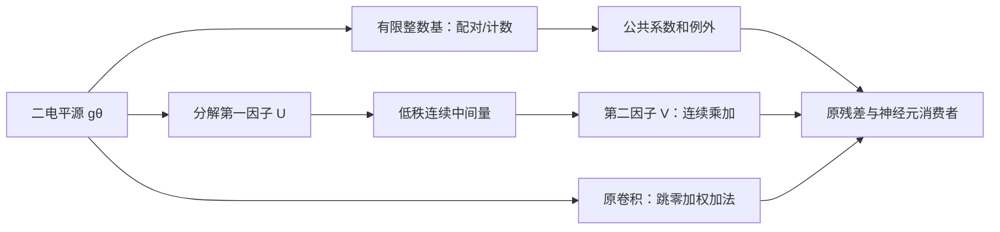

# 大算子分解、Prosperity 重开与真实稀疏融合

2026-09-13。本阶段把工作从旧 r1 小叶的边际打磨移向完整 Prosperity 和尚未改造的 patch r0 大卷积。已执行 **32 个完整 diverse10 运行、320 次帧前向**，包括分解、结构剪枝、非零默认值、整数基底，以及这些表示同 r1 或 lifting 时间结构的实际组合。所有运行都通过用户当前 NB0 质量门；没有新增训练、valid825 或 ASIC PPA。**这形成了更宽的可执行候选集合，尚未形成强接收证据。**

## 为什么继续 Prosperity，究竟借了多少

完整 Prosperity 保留为强 A。此前 APEC 融合或单个 K16 布局失败，不足以结束这条线。本轮原样运行官方完整 FC，又把原 M/N/K 外层用于本网完整 **3000×6912×768** 算子：两帧×四种布局；四种父林各核对230.4万个真实 W 输出，均零错。不是拿分片 K 小调用代替整层。

两项新接口实际做了：校准共支持分组/完整时间字编码、同 t 空间批。它们尚未胜过原 A。继续追到部分和后发现官方本就有 output stationary；约995 MB是片上逻辑访问计数，不能改名成可省掉的DRAM流量。补同总容量/端口时间线后，8-bit容量点三臂同价；INT64精确参考点普通 resident-set 比普通 LRU 少8.24%，再加T10群组反而慢2.03%。**普通状态优化可以借入 A，T10 尚未贡献新的净收益。**

公开工件没有完整 ASIC RTL/DC，因此这里的“完整”限公开模拟器完整算子与数值关系，不声称搬完原芯片。[完整借用与新接口](prosperity_owned/README.md) · [有限状态/端口试验](prosperity_owned/psum_probe/README.md)。

## 从本网计算路径找到了什么

本轮重新测当前实际前向。尚未改造的 patch r0.conv1、r0.conv2 各有63.701 G名义稠密MAC，分别占本次所观测矩阵/卷积算术的10.678%；输入发放率约4.36%、3.61%。这些是计算形状，不是硬件时延占比。旧patch≈35%/FFN≈26%不能直接用于当前改造后的网络。[当前算子表](root_owned/current_bottlenecks.md)。

本网络特有的障碍是：**普通分解会把稀疏发放变成稠密连续中间量**。所以同时走两条接口：一条让真正小秩的连续后段有机会赢；另一条限制第一基为小整数和/差，尝试保住廉价加法。两者都需要计系数取数、状态、选择和完整消费者。

## 真正试了哪些融合

| 家族 | 已执行的不同接口 | 当前去留 |
|---|---|---|
| 多轴分解 | flat/激活加权SVD、空间3×1→1×3、Tucker；flat/spatial＋2:4残差；共同FP32/W8控制 | 41个结构配置不是41个idea。四个无残差小秩方案实际AEE全过NB0，进入完整执行候选；TT/Kronecker/Winograd本轮未执行。 |
| 有限整数基＋例外 | unsigned/signed成对基、先删例外再计数、计数共享、H8共同pair-ID及同H8普通3:4 | 小整数状态和权重压缩已真实实现；共享布局须按最终RF/SIMD费用评价，不能拿加法数代替周期。 |
| 非零默认值＋结构稀疏 | r1真实K864打包/解码/后继；再迁入完整r0 W；幅值、Gram、请求感知选择三控制 | r1完整后段仅省约0.94%；r0请求选择比Gram少3.06%所计服务项，但仍比普通2:4多23.02%。保留编译选择部件，不能当性能主张。 |
| 跨挂点融合 | r0分解＋r1剪枝；r0稀疏/计数＋已有lifting40结构 | 实际重新运行网络；全部过NB0。组合不总比单项好，没有乘倍率或继承单项精度。 |

普通2:4/3:4也获得相同Gram拟合、合法支持选择和请求优化。元数据分别使用六选二3-bit、omitted-index2-bit的实际编码，非零默认值有Gram-only因果消融。借入程度和碰撞详见[文献/决策表](root_owned/literature_and_decisions.md)、[分解](decomposition_owned/README.md)、[稀疏与打包](sparse_owned/README.md)。

H8计数最终有限服务表补入了实际RF争用、公共slot×time事件遍历与共同清零：dense **713,544**、H8-pair **890,128**（多24.75%）、H8普通3:4索引 **729,862**；同一个H8普通3:4函数若按dense-zero方式执行只需 **617,255**。因此共享选择确实大幅削减私有选择负担，但当前表示仍未胜强控制。这里没有逐地址byte响应、producer gather、固定点RNE或全层执行闭合；只停止该放置，不宣布小整数基家族失败。

## 值得继续的质量点

同一十帧上，NB0帧均AEE为1.4546028611，共同dense父为1.1597366283。下表是实际运行结果，不是重构误差推测。

| 方案 | AEE | 含义 |
|---|---:|---|
| 空间分解R16，无残差 | 1.2691297866 | 可以直接测空间流式后因子，不必先加回50%稀疏残差 |
| 普通flat SVD R8，无残差 | 1.3479650409 | 极小秩已通过当前质量门；重点补低位整数执行 |
| Tucker R8，无残差 | 1.4170152223 | 精度余量较小但仍可考虑；须付连续core费用 |
| H8共享pair | 1.1966744037 | 比本轮同H8普通3:4的1.2144504382更低；不是显著性结论 |
| lifting＋r0普通2:4 | 1.2099646387 | 已有时间结构可以和大卷积剪枝共同运行 |
| lifting＋r0 unsigned pair | 1.1820587633 | 保留为有真实质量结果的融合端点 |

[全部32臂及逐帧重算](root_owned/aee_all.md)。第一帧参与部分源统计校准，CSV另列剔除它的九帧均值；这些验证帧都曾用于项目探索，不能称独立测试泛化。所有新臂用同一粗头preds.2；NB0是上游完整模型的原最终头，比较的是同帧/GT/指标的任务质量，并非相同网络执行或逐位相同归约。

## 下一阶段

1. **小秩卷积的完整整数执行优先。** 将U逐rank量化到INT8，把其静态scale吸入V再按输出量化；第一段只吃g、第二段吃有界整数中间量。先补实际AEE和同位宽普通2:4强控制，再计完整K/T/N、端口和中间状态。小秩/量化本身是A；不能靠换名字当X。
2. **同源残差/PSN接口从真实图出发。** 核对低秩状态到后继T10的两消费者，先确定普通融合能做什么。当前I24 RNE/sat不能被时间矩阵免费越过，全宽identity残差仍需收费；允许改变部署函数的实验另测AEE，不混为无损交换。[源码核对与单一规格](sparse_owned/LOW_RANK_PSN_INTERFACE.md)。
3. **Prosperity继续作完整对照底座。** 普通stationarity/last-use回收纳入A；本次编码、T10准入未胜不再反复扫参。以后若改变低位权重/源格式，优先在同完整算子重测A与新接口。

生产 nts07、主稿与冻结文档未修改。本轮评价为CPU原型、有限调度及GPU任务质量；上一阶段源核VCS证据保持原范围，不转借给这些新表示。独立审阅见[新融合审阅](root_owned/independent_new_fusions.md)。
