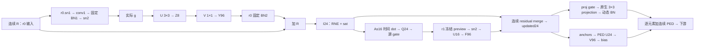

# r0 低秩卷积 → PSN：真实接口核对与下一实验规格

本文件仅做源码／现有参数核对，未训练、未新增前向或硬件实验。结论是：**先把已经过 NB0 的 flat-SVD8 做成普通整数两级卷积并完成消费者，再试低秩 PSN 调度。** 时间轴与通道／空间轴上的线性映射可交换属于普通编译器 A；当前部署的 I24 舍入／饱和、全宽连续残差 R 和 PED 消费者，均不允许把这条交换律直接写成免费省掉 96 维执行。用户允许重新定位 RNE 的新部署函数，这条路线应单独保留和评质量，而非因不等价于旧函数而封死。

## 1. 真正运行的图

设 R 为 **r0 block 的输入连续张量**，g 为真实 r0.sn2 的输出；本轮 θ=1。使用 `flat_svd_r8_w32.npz` 时，U 为 8×96×3×3，V 为 96×8×1×1，且没有稀疏残差项。spatial16 的后级是 1×3 空间卷积，不能把它误记成 1×1；Tucker8 还多一个 8×8×3×3 core。三者都可在纯线性实数计算中与时间矩阵交换，但本规格只选 flat-SVD8 一点，不再扫描格式。



- 原生 `MS_ResBlock.forward` 在 `conv2 → norm2` 后加完整 identity：[Spiking_modules.py:907](../../../../../../SDformer/third_party/SDformerFlow/models/STSwinNet_SNN/Spiking_modules.py)。`patch_train_calibration.pt` 的四个键确实是 r0/r1 的 norm1、norm2；[ParentNetwork:32–36](../../breadth_20260912/algorithm/parent_network.py) 将这些 BN 改为固定 eval running statistics。因此 r0 BN2 是静态逐通道仿射，不是动态 BN 障碍。
- 当前 AEE 安装的是 [LiteralForward](../../breadth_20260912/algorithm/fixed_structure.py)，不是未覆写的 PSN。其 `source_forward` 先把 **r0 BN2+residual 的结果** 写成 signed24/f14 的 I24，再做 As16 时间 dot、RNE/sat 到 Q24、比较并输出真实 θ。I24 保留为 `self.i`；当前 dense 结构把 Q24 丢弃。`As` 是 stage320 导出的矩阵，不能拿 checkpoint 原始 PSN A 代替。
- [FixedTemporalForward:285 起](../../../algorithm/patch_probe/residual_consumer_probe/projection_chain/fixed_temporal_coordinates.py) 的 r1 `conv_forward` 用真实 gate 计算 U16/Z24；`finish` 更新 anchors，随后以 updated24 计算 PED U24/V96，proj neuron 也从 updated24 生成 gate。r1 原始 FP conv2／BN2／add 在软件中仍被调用，但属于明确无消费者读取的 shadow；它们可以 DCE，**r0 的 FP BN2／add 是 I24 的真实生产者，不能照搬删除**。
- `SpikingPEDLayer.forward` 的动态 BN 只在 **spiking projection convolution 分支**，连续 `conv_res`／PED 在其后相加。ParentNetwork 又把该 BN 替换成 `Arithmetic.statistics` 的整帧 onepass 统计。连续 PED 不经过这个 BN，也不能被 threshold 替代。

## 2. 可以交换的代数，以及阻止免费交换的具体边界

在不含有限精度完成操作的理想式中，固定 BN 可写成 D、c：

`S = R + D·V·Z + c`，`A·S = A·R + D·V·(A·Z) + (A·1)c`。

这支持常规 BN 系数折叠、时间／通道轴交换及 bias 常量预计算。它**没有**把全宽 `A·R` 变成 rank8；若原方案只做一次 A·S，改写后反而增加 A·Z 与第二个 V 展开。R 的连续 96 维不是 U 的输出，不能凭卷积权重低秩就压到相同 8 维。

| 边界 | 当前同函数的权限 | 新函数可以做什么及必须付的代价 |
|---|---|---|
| U/V FP32 运算与静态 BN | 可以流式供数、减少物化；保持实际完成／舍入顺序。把 BN 折进 V 不保证逐 bit 等价于分开的 FP32 操作 | 可折权并重定量，但需真实 AEE；不能把 dequantized FP32 前向称为整数核验证 |
| `I24=RNE/sat(S)` | A 必须读取这个完成后的 I24。一般 `A·Q(S) ≠ Q(A·S)`，包括无饱和但有舍入的情形 | 可以重定位 RNE，明确命名为另一部署函数；不能复用旧 AEE 充当新函数质量 |
| `As dot48 → Q24 → threshold` | 不能把 threshold 搬进 rank8，亦不能随意取消 Q24。阈值、方向、constant 行和 θ 全保持 | 可定义新完成序列并重新评估；各臂阈值／训练恢复权限相同 |
| r1 residual／PED 连续路径 | I24／updated24 必须对连续消费者可用。anchors 需 residual merge 与 PED；nonanchors 仍需真实 proj gate | 可以流式展开，或对已证明不需保留的 nonanchor 值提前消费，但不能把连续输出删除 |
| projection 动态 BN | 均值、二阶矩／方差、invstd 来自本候选整帧真实 projection 输出；有全域 reduction barrier | 不能使用旧候选／gold 统计，也不能按窗口零成本赠送统计。静态 D·V 折叠不穿过此处 |

所以 V 至少要在连续／阈值需求的地方展开；是否写成完整 SRAM 张量是调度问题。普通编译器可将 `V output → BN affine → residual add → I24` 接在同一完成口，I24 同时送给 As collector 与连续保留／消费者。它也可在已有 anchor 删除规则下提前形成 nonanchor proj gate，并 DCE 真正的 r1 shadow。这些应是强 A 对照，而非 X。

## 3. 现有 tap 能否复用 R／AsR

| tap | 可取得什么 | 不能据此免费取得什么 |
|---|---|---|
| r0 block pre-hook／r0.sn1 input | 权威 R，跨 T10 的全宽连续 identity；这是下一捕获应增加的 tap | 现有 conv2 input capture 只有 g 的 im2col 与 Y，未保存 R |
| r0.sn1 内部 membrane（若新增只读 hook） | 原生 A0·R+b0−center，且可能有模块内部有限精度 | 尚未证明 A0 与 stage320 As 相同；r0 输出 gate 丢失 membrane，不能从 gate 重建 AsR。不能默认更换／绑定两者 |
| 当前 r1.sn1 `source_forward` | I24、刚计算出的 As·I24/Q24 | I24 是 r0 完成后 S，不是 R；Q24 已舍入，不是 AsR。现有旧 capture 的 raw I24 也属于这里 |
| r1 冻结 preview latent/sn2 | 本次 source gate 的卷积／时间特征 | 其输入已 threshold，矩阵也属于 preview；不等于 R 或 AsR |
| r0 固定 BN2 | D、c 可编译；不同消费者可以共享同一 V 系数缓存 | 只能共享静态系数／已生产响应，不能伪造一个免费全宽 AsR 缓存 |

若未来明确训练／约束 A0=As 并保留完整未丢精度的 membrane，才出现复用 A0R 的候选；它改变了当前模型／状态寿命，需同等训练控制、中心／bias 还原、量化误差审计及真实存取计费。本轮无这项证据，不把它写进默认收益。

## 4. 下一步先做普通整数低秩链，不先做 PSN 重排

固定使用已存 `flat_svd_r8_w32.npz`，第一步做以下单一整数表示：

1. 每个 rank 的 `s1[r]=maxabs(U[r])/127`，`Q1=clip(RNE(U/s1),−127,127)`；全零行显式处理。
2. 静态合并 `Vtilde[o,r]=V[o,r]·s1[r]`，然后每输出 `s2[o]=maxabs(Vtilde[o])/127`，`Q2=clip(RNE(Vtilde/s2),−127,127)`。
3. 真实 g∈{0,1} 上计算 `z[r]=Σ_k Q1[r,k]g[k]`，再 `p[o]=Σ_r Q2[o,r]z[r]`。两级都没有运行时浮点乘法。s1 不再作为运行时缩放存在；s2 在最终静态 BN 仿射或数值还原处处理，**这个完成阶段仍须收费**。
4. 最大绝对界为 `|z|≤864×127=109728`（signed18），`|p|≤8×127×109728=111483648`（signed28，Acc32 足够）。现有 16×24→48 MAC 能容纳这些输入与累加；不能因只需 Acc32 就免费扩大 RF 容量／端口。若按 24-bit 槽存 z，实际按 3 B/值收费，不能用 18-bit 信息量冒充自然端口流量。

Q1/Q2 系数共 6,912+768=7,680 B，另收取 96 个输出尺度／最终仿射常量的实际编码。最终 rescale 不是免费：若把 BN gain 编成 signed16 并乘 p28，现有 16×24 乘口需低24／高4位拆分、对齐与累加；不能偷偷增加 28-bit 乘法输入。也可在另行声明的新数值函数中先完成到24，但要单独检验其误差。普通24获得同样完成优化，且其较窄 accumulator 确实可能更省。AEE bridge 必须执行与声明一致的整数累加和最终 rescale；Float64 可作这些有界整数的精确模拟，不能直接以 TF32／普通 FP32 分解 GEMM 代替 Acc32 金标。本轮无残差 FP32 SVD8／spatial16／Tucker8 过 NB0，只证明这些已有 FP32 函数的质量，尚未证明这条 INT8 链。

独立评审给出的真实 flat8 约 222 个选权加法 + 768 个连续 MAC／位置、`MAC/AAC < 1.5227` 的机会窗，只是未含端口的前置算术条件。下一执行必须计入 8 维连续 z 的读写、Q2 广播、48/32 位 accumulator、source gather、完成／rescale、系数与元数据 CR32、SR64、SW 和背压。它是普通低秩强 A，不是创新点。

**本步骤的固定对照：** 同位宽、同原始 natural K4、同校准数据的普通 2:4 INT8（3-bit 六选二 metadata，相同恢复训练额度），以及上述 flat8 的“完整物化”和“普通流式融合”两种执行。后两者必须逐消费者同函数，只改驻留／供数；普通24同样享有源 collector、系数缓存、producer/consumer forwarding 和最终 BN/residual 融合。先做未恢复的新 INT8 AEE；需要恢复时按用户已有授权，给所有臂相同的 train16／步数／优化器／可训练范围，禁止只给低秩额外恢复或按 diverse10 选权。

## 5. 随后才考察两种 PSN 函数身份

**E：当前同函数。** 输入接口为同一真实 g、R、U/V/BN 常量和当前部署常量 q；输出为相同 I24 与 r1 source gate，随后相同的 updated24、proj gate、连续 PED、projection 动态 BN 和加法输出。E0 物化完整 r0 中间结果，E1 采用普通 `V→BN→add→I24` 完成口融合并双送 As／连续消费者。I24 的 RNE/sat 和所有后继完成点保持原位，结果要求逐 bit 相同；FP32 上游若采用融合 FMA 改变舍入，则不能算 E1 已通过。E1 能改善存取不等于 As 已在低秩域执行。

**N：用户允许的新部署函数。** 保留明确新完成点，例如：J 为 R 的 Q24；Z 为普通整数低秩中间量；C 为 Q2 加最终静态 BN gain 的、明确完成到 f14 的展开算子；c 为其静态偏置。定义：

```
I_N = write24(J + C(Z) + c)                 # 连续路径仍完整交付
K   = write24(As · J)                       # 全宽 96，不能免计
L   = complete_Z_units_24(As · Z)            # rank8，明确其尺度/剪裁
H_N = write24(K + C(L) + complete24(As · c))
g_N = compare_current_threshold(H_N) * theta
```

所有 `As` 的整数指数移位必须写入接口；Z 的完成单位与 f14 的 J 不能混用。矩阵输出先完成再合并，不偷偷引入 16×48 宽乘、无限 guard bits 或无穷精度重排。`I_N,g_N` 定义了一对新的部署输出，g_N 一般不等于 `compare(write24(As·I_N))`；之后 r1 preview／残差／PED／动态 BN 都读取本臂真实输出。

N0 普通物化按这张新 DAG 逐算子运行；N1 普通编译器已可将 As 放在 Z 上并消去多余中间写回；候选若进一步将同一个 Z／V 响应服务 C(Z) 与 C(L)，必须和具有同样缓存／双消费者融合权限的 N1 比较。**A·Z 的跨轴交换本身不算 X。** 此处全宽 K、额外 L、连续 C(Z) 和 gate C(L) 全部收费；在没有已有 AsR 的情况下，MAC 数甚至可能上升。只有实际端口／状态驻留收益覆盖它们，才有继续理由。

N 与 E 不能按 bit-equality 混称同函数：各自物化／融合臂内部必须同函数，跨函数另做真实 AEE；N、相同位宽普通24、未重排低秩均给同等恢复训练权限。不能用“破坏 E 的等价性”否决 N，也不能用旧 SVD8 AEE 替 N 背书。

## 6. 统一执行／验证口及去留条件

- 起点固定为实际 r0.sn2 gate 与同帧 R；完整 K864、T10、所需 3×3 halo 及输出 H96。现有 conv2 采样可做校准，但下一质量／执行捕获必须补 R 和候选真实 I24／source gate。首先固定一帧和 interior/border 两个窗口，避免换 rank／块尺寸寻优。
- 所有调度使用同一 Machine、96 RF、原单 issue／端口、SR64/CR32、ready／背压协议；两个消费者的 accumulator 不能各自享用一份未计费 RF。输出不仅是低秩 z；至少交付 source gate 和连续 I24，并在共同后继中实际完成 anchors residual、nonanchor gate、PED U/V 和 egress。
- 全网 AEE 必须重新执行整帧 projection 动态 BN。局部硬件窗口可报告本窗口统计贡献／服务，但不得把外部金标 BN 统计当免费输入并称完整链延迟。完整帧延迟主张需付整帧 reduction、barrier、normalization 与连续 PED 加法；只做窗口时明确限制范围。
- 数值检查分别比较 z18、p32／完成值、I24、source gate、updated24、proj gate、连续 PED、动态 BN 输出／最终加法；记录饱和、阈值翻转以及每种真实请求和 stall。系数／状态单位、冷启动、元数据、packet 生成与输出物化必须一致。
- 首个去留门是 **INT8 flat8 同位宽普通24对照的质量与完整服务**，不是 latent PSN 操作数。过门后，E1 给出当前函数的普通融合上限；N 只有在独立质量合格、同函数 N0/N1 核验完整、且胜过同权限普通融合后才进入下一阶段。本轮在规格处结束。

源码依据： [ParentNetwork](../../breadth_20260912/algorithm/parent_network.py)、[当前 AEE 安装流程](../root_owned/evaluate_fusions.py)、[LiteralForward](../../breadth_20260912/algorithm/fixed_structure.py)、[分解 adapter](../decomposition_owned/adapter.py)、[control AEE](../root_owned/control_aee/summary.json)。这里没有重述旧 r1 lifting 方案；挂点是新得到质量证据的 **r0 原生大卷积输出接口**。
