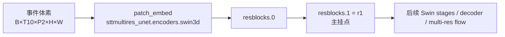
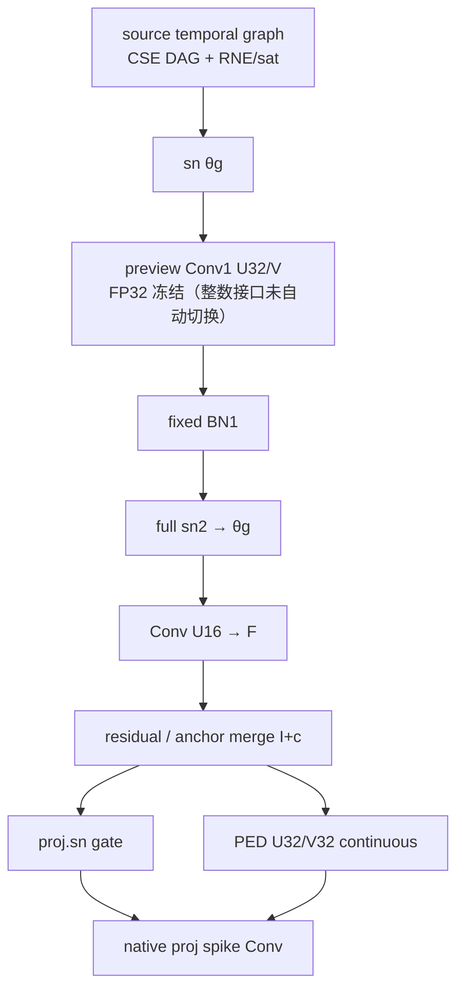

# 光流 SNN Transformer 软硬件协同：软件算法与硬件加速器技术架构详稿

> **受众：** 网页版 ChatGPT / 无仓库访问的外部协作者  
> **生成：** 2026-09-11（Asia/Shanghai，CST=UTC+8）  
> **规范根：** `/home/zhumd/work/sdformer_codex/ideafromai`（`/home/zhumd/work/ideafromai` 为软链）  
> **主实验挂点：** `research/hardware_innovation_20260908/algorithm/patch_probe/residual_consumer_probe/projection_chain/fast_temporal_recovery_lifting40/`  
> **纪律：** 禁止编造 PPA / 时钟 / 全链 PASS / 相对 AEE PASS；未知处标 **UNKNOWN**；Stage B 数字以 `CURRENT_LINES_AND_PLAN_20260910.md` 与 `schedule_compare_same_port/` 为准；`grok_review_20260911` 仅为第二队列对照，不当标题 X。  
> **材料合并：** 已吸收 `survey_ab_fusion_20260910/tech_arch_snippets_from_survey.md` 的算法栈摘要、F1–F7 融合边界与 idea 候选边界（按章节吸收，非附录堆砌）。

---

## 1. 问题与系统目标

### 1.1 任务与 venue

本课题做 **事件相机 / 视频光流** 上的 **SNN Transformer**，并把算法结构与硬件执行合同一起设计，目标 venue 是 **IEEE TCAS-II Express Brief（约 5 页）**。生产树 `SDformer/hw_autoresearch_nts07` 与论文主稿 `main.tex` 在过门前 **只读**；性能 RTL / 生产 EDA 在门闩通过前 **禁止**。

基线网络族来自 SDformerFlow：`MS_SpikingformerFlowNet_en4`（`MS_Spikingformer_MultiResUNet`），配置要点（基线 walkthrough）：

| 项 | 值 |
|---|---|
| 基线类 | `MS_SpikingformerFlowNet_en4` |
| `base_num_channels` | **96**（C96） |
| `swin_depths` | `[2,2,6,2]`（四 encoder stage） |
| `swin_num_heads` | `[3,6,12,24]` |
| `window_size` | `[2,9,9]` |
| 默认神经元族（基线配置） | `spiking_neuron.neuron_type = psn` |
| 训练输入（极性展开后） | `B, 10, 2, H, W`（T10 × 正负极性） |
| 张量布局习惯 | `T,B,C,H,W` 与 `B,D,H,W,C` 交错 |

顶层 forward：记输入 `H,W` → `sttmultires_unet` → 多尺度 flow → 时间维累加 → 插值回原图 → `{"flow","attn"}`。UNet 由 `encoders / resblocks / decoders / preds` 组成；当前主创新挂点 **不是**整网替换，而是 **patch 残差链 r1 上的源时间变换与消费者接口**。

### 1.2 系统级目标（一句话）

在敏感 **patch 残差链 r1** 上，用 **可学习 lifting 结构化 T10 PSN**（真实 θg + 双 PED 消费者），相对 **ordinary dense-source/raw**，在 **同端口 / 同状态 / 同背压** 合同下证明 **同资源净服务** 优势，并守住精度门；过门后再谈成对恢复与隔离 RTL。

### 1.3 为何挂 r1（历史代理 ≠ 新分母）

旧粗头后活动加权点积账本中：整个 patch 约 **34.83%**，r1 两卷积约 **11.07%**。这是 **历史工作量代理**，不是新学生周期份额，更不能全部归给 source PSN。当前结构已改变源活动与连续计算，执行账必须用 **新分母** 重记。

### 1.4 门闩（必须原样遵守）

| 门 | 门槛 | 现况（2026-09-11） |
|---|---|---|
| 绝对 valid825 AEE | ≤ **1.259** | **PASS**：lifting raw `fast_raw_diagonal` **1.232979368**；shared **1.247808610**；ordinary dense/raw **1.219801338** |
| 相对同预算强对照 ΔAEE | ≤ **+0.005** | **FAIL：+0.013178030**（相对上限对照 ≈ **1.224801338**） |
| 同资源净服务 | 整段潜力相关判据约 **≥10–15%**（**service 灰区语言**） | **完整链仍未 PASS**；不可用节点比或十帧代理冒充 |
| CSE 节点线索 | — | ordinary **260** 加减；lifting raw **159** + **35** 中间 RNE；shared **169** + **40** RNE；**≠ 周期** |
| 十帧代理 | 加权项/H8 相对旧 dense 约少 ~15% | **NOT schedule-closed** |

**CRITICAL：** 10–15% **绝不是** AEE 容差；相对精度门永远是 **+0.005**。绝对预算过 ≠ 晋级性能 RTL / 主贡献句。失败布局只 **stop layouts**，不杀整个 lifting **家族**。

### 1.5 TCAS-II 五页约束下的叙事边界

五页稿只应承载 **一条**经验证的主机制（执行对象 + 消费者接口差分），不必硬凑两贡献。CSE / PoT / shared-Q / 通用指令融合均可作对照或底座，**不能**单独当标题句。生产 C1/C2 尚未完成创新重构；**C2 目前没有通过创新门的新主机制**。

---

## 2. 软件 / 算法架构（深）

### 2.1 端到端数据流（概念 → 模块名）



**r1 子链（Stage B / fixed-coordinate 学生共同执行边界，来自 `implementation_inputs.md`）：**

```text
I24
 → source temporal graph          # ordinary As 或 lifting 半步图
 → sn1 θg
 → preview Conv1 U32/V            # 冻结 preview；32 有效 latent
 → fixed BN1
 → full sn2 → θg
 → Conv2 U16 → F                  # even/even anchor → 120×160；源仍 240×320
 → anchor merge(I+c)
 → { proj.sn gate , PED U32/V32 continuous }
 → native proj spike Conv/add
```

模块根：`sttmultires_unet.encoders.swin3d.patch_embed`，`r1 = residual_encoding.resblocks.1`。

### 2.2 关键形状与存储（已在文档钉死）

| 量 | 形状 / 规模 | 备注 |
|---|---|---|
| 源时间维 | **T10** | 与训练 `num_bins=10` 一致 |
| 通道 | **C96** | `base_num_channels` |
| 空间（本挂点） | **240×320** | sn2 / preview Conv1 需完整幅面 |
| Conv2 输出网格 | **120×160** | 只算 even/even anchor；3×3 邻域仍覆盖全空间 |
| 每空间点 raw I | **2880 B** | P2=**5760 B**；P4=**11520 B** |
| `As_q16`（ordinary） | `[10,10]`，指数 **15** | 完整 10×10 时间矩阵 |
| `lifting_q12` | `[4,5,2]`，指数 **12** | + `lifting_matchings[4,5,2]` |
| `U_conv2_theta_q16` | `[16,864]` | theta 已折入，勿再乘 |
| `F_q16` | `[96,16]` | 含固定 BN2 gain |
| `BN2_constant_q24` | `[96]` | 仅在 anchor 合并一次 |
| PED | `U_ped_q16[32,96]→V_ped_q16[96,32]` | `proj.conv_res` 1×1/stride2 连续支 |
| `proj.conv` | 96×96×3×3 / stride2 | 吃 `proj.sn` 的 θg |
| 后继指数 | U16=17，F=14，U_ped=16，V_ped=15 | 两轴一致 |
| 非零系数（U16/F/U_ped/V_ped） | ordinary 13824/1536/3072/3072；lifting 13824/1535/3071/3072 | 静态零双方同省略 |
| valid825 | 825 帧 / 18 序列 / **48,152,523** 有效像素 | 三学生同规模 |
| 一帧三 gate 位图（若扩全链） | `gate[T10,96,240,320]`×3 | 裸 packed ≈ **27,648,000 B**/帧 |

**k 顺序（Conv2）：** `(c*3+kh)*3+kw`。非 anchor 的整个 BN2 branch（含常量）已共同删除；只对 I 做 consumer permutation / 阈值判门。raw **不执行 inverse**。

### 2.3 尖峰神经元：ATLIF / θ–τ / θg

- **基线配置**常用 `PSN` 族；协同研究侧另有 **ATLIF** 合同草稿（`contracts/ATLIF_contract_r1_grokbot.md`）：包 `{g, p}`，默认 `amp` int8、硬门 `g=(|amp|>eps)`、**不把 amp 吸收进下一层 W**（否则 HBG-RP 类主张需降级）。Canonical NeurIPS’25 AT-LIF `{0,θ}` **不等于**该合同，差异必须写清。
- 主线上强调 **真实非单位 θ** 与 **判决阈值分离**：θ（含连续幅值通路）与门决策不是同一开关；**θg** 表示门控后的有效尖峰/幅值接口，供后续 Conv / PED 消费。
- 当前 fixed 学生在 source/consumer/sn2 上实测 θ 常为 **1**，但接口仍以 **导出 θ + 独立阈值** 为准，避免把“恰巧为单位”写进硬件假设。
- HBG / 幅度通路必须按 **真实 θ 变化 + 消费者算术** 证明费用，不能从“非单位 θ”口头推任意逐事件载荷。

### 2.4 时间 T10 结构：dense source vs lifting40 vs shared-Q

| 学生 | 身份文件（概念） | AEE（valid825） | source CSE | 中间 RNE |
|---|---|---:|---:|---:|
| ordinary dense-source/raw | `identity_permuted_base` / `FixedTemporalForward` | **1.219801338** | **260** | **0**（完整门前推） |
| lifting40 `fast_raw_diagonal` | `stage320/fast_raw_diagonal.npz` / `FixedLiftingForward` | **1.232979368** | **159** | **35**（末 5 门前推） |
| lifting40 shared-Q | 同族共享坐标 | **1.247808610** | **169** | **40** |

**ordinary：** 官方 da4ml 整图 CSE 后仍需 260 次加减/T10 向量；66 个直接共享节点；结果位宽总和 8606，最大 41 位。出口 `As`；RNE/sat 可折入 `postprocess.rows` exact cutoff。

**lifting40：** 40 个可学习提升系数（历史：硬符号配对失败十帧 AEE≈1.59/1.62 → 扩展为可学习后恢复）。执行图来自 `whole_halfstage_graphs['fast_raw_diagonal/forward/0'..'7']`；输入 `source=0..9`，输出 `t=0..4` 映射到 `write_time_indices`，经 **RNE/sat → signed24** 后再进后续半步。总 **159** 加减（已含恒等，不可再加 40）；结果位宽总和 5143，carry 5234，最大节点/分子 38/39 位。半步式：`N=(old<<12)+q12*other`。**35** 个中间 RNE/sat 必须保留（含 guard/sticky/parity、条件加一、饱和）；末层 5 个可并分子 cutoff，对应时间坐标 `[6,7,8,9,5]`、源门 `[0,7,8,1,9]`。`source_A/basis_B` 实矩阵说明 **不可替代执行图**。`gate_collapse_probe` 全合并（241 加减 ≥ 159+35 有效）**已停布局**。

**shared-Q：** 同一可逆时间坐标跨残差，分别供门与降维后连续恢复。相对 lifting raw：加权项再少约 **1.130%**、H8 需求少约 **4.442%**，但 NRV 行 **+0.166%**，并增加 BZ/逆变换与状态；全存 BN 残差常量 288→**2880** B。**仅消融 / 条件支线**，无净硬件收益则不强留共享标题。普通与共享各保留一个 **960×24 bit** 完成向量——**不存在**裸持久状态减半。

### 2.5 双消费者：门 / PED 连续路径 / Conv2 锚 / 投影

残差后 **两条强消费者**同时存在：

1. **门消费者：** `proj.sn` → θg → `proj.conv`（96×96×3×3 stride2）。  
2. **连续 PED：** `U_ped → V_ped`（低秩连续投影）+ bias merge；与门支在末端相加。

另有：

- **preview 路径：** 冻结 `shared48_u8_vq5.npz`（`u[864,48]/v[48,96]` 中 32 行有效）；`TrainableLatentPair` 现以 **FP32** 跑两因子+sn2；已有 signed24 V 图编译（`preview_gate_cmvm`）但 **frozen FP32 preview 并未自动变成该整数接口**——全链排程不得偷换。  
- **Conv2 锚：** 只在 even/even 上产生 U16/F 并与 I 合并；非锚空间仍靠 I + 门阈值。  
- 删除整个 PED 脉冲支路会使十帧 AEE 显著变差（历史控制），**低发放率 ≠ 可免费删支路**。

### 2.6 训练 / 评估 / 冻结 vs Stage B 学生

| 角色 | 含义 |
|---|---|
| 整数 S2 / 真实粗头 **父模型** | 新 fixed-coordinate 学生挂在其上；**不是**冻结 Motion C12 ep34 整网身份 |
| Motion C12 ep34 | 历史冻结参考（文档中出现）；本 Stage B 学生 **不宣称**等同 ep34 全定点 |
| valid825 | 全量验证：825 帧 / 18 seq / 48,152,523 px；指标 **AEE**（Average Endpoint Error） |
| fixed-BN 学生 | BN 统计/缩放冻结进常量（如 BN2 gain 折入 F）；减少动态 BN 服务 |
| Stage B 可变对象 | 源时间图（ordinary vs lifting）、同资源调度、写回融合；**本轮未开新训练/量化** |
| 冻结对象（本轮） | preview 权重包、父粗头、valid825 收据、CSE 图；`nts07`/`main.tex` |

AEE 评价的是 **整条实际粗头函数**；运算/供数账只覆盖指定子链，**不是整网成本**。lifting 全量写回在 `zurich_city_05_a_0191` 有 13（raw）/21（shared）次合同饱和，AEE 已计入——不能声称全量零饱和。

### 2.7 十帧费用线索（代理账，非闭环）

同十帧有序文件上（单位 M/帧）：

| 量 | ordinary | lifting raw | shared |
|---|---:|---:|---:|
| θ 加权项 | 1217.950 | 1034.896 | 1020.243 |
| H8 逻辑系数组 | 66.422 | 56.380 | 53.855 |
| 非空 NRV 行 | 15.529 | 12.861 | 12.860 |
| source 编译加减 | 1916.928 | 1172.275 | 1246.003 |
| 额外 BZ+逆 | 0 | 0 | 155.750 |
| 中间 RNE | 0 | 258.048 | 331.776 |
| F/PED U/V 连续产品 | 1474.560 | 1474.176 | 1474.560 |
| BN 残差常量 (B) | 288 | 288 | 2880 |

相对旧 dense，lifting 十帧加权项与 H8 约少 **~15%**——**仅代理，不可当 service%**。

### 2.8 主候选 / 支线 / 底座（算法地位表）

| 地位 | 对象 | 含义 |
|---|---|---|
| **第一主候选** | patch r1 结构化 T10 PSN（lifting） | 待证 X：执行对象+消费者接口差分；非“已替换完整 C1” |
| **条件支线** | shared-Q | 仅消融 |
| **条件支线** | 纯门出口 / 部分跨 RNE 合并 | 全合并已负；仅允许有证书/回退的新差分 |
| **共同底座** | Gustav NRV/供数、da4ml CSE、普通低秩/量化/剪枝、fixed-BN、DeepShift 对照 | 借入 ≠ X |
| **第二队列** | 敏感 patch 结构剪枝（F1）、半步组接受（F2）、Prosperity 联合图等 | 见 §4.3 / §6 |
| **旁路** | motion / 注意力 K=0 | 有限份额，不排主岛 |


---

## 3. 硬件 / 加速器架构（深）

### 3.1 逻辑流水线（与软件 r1 对齐）



有限服务模型必须同时给齐：**算术单元、合法位宽、总存储、端口、输出背压**；CSE、门前推、静态零、配对/寄存驻留与时间重叠 **同权限** 给 ordinary 与 lifting。不锁死 1RW，也不让某轴白拿更多 bank/状态。

### 3.2 Gustav 式供数（底座语言，非标题）

本地可复用概念（`psn/gustavsnn_*`、prosperity_gustav reopen 一页等）：

- **NRV**：非空行 / 有效源行视图，用于供数与计费（十帧表中的 NRV 行）。  
- **source ∩ W**：源活动与权重支撑的交集，决定真实 MAC/读字。  
- **banks / 广播域 / 有限收件人**：共享源 bank 读口、有限广播、W 仲裁与背压。  
- **F_cache vs F_live**：驻留与在途分离。  
- **背压：** 出口阻塞时 terminal 与共享父节点必须保活到真实最后消费者；禁止“出口永远可接受”的虚假峰值。

**明确：** 当前 NRV 等多是 **逻辑计费**；**不能**称完整 Gustav 物理链 / 64PE 条带 RTL 已闭合。Gustav/LoAS 完整执行（压缩布局、交集供数、FC2/BN2/shortcut、物理背压）仍 **未完成**。局部“时间类别”命名在强对照后优势变薄甚至反慢——**类别名本身不晋级**。

### 3.3 da4ml / CMVM 常量矩阵编译

- 工具链：`psn/cmvm_20260909` + 官方 **da4ml**；对固定系数做整图 CSE / 整数 DAG。  
- **ordinary source：** 260 加减/T10；`ordinary_source_cmvm.integer_dag.json`。  
- **lifting：** `constant_compilation_graphs.json` / half-stage bundle；**159** 加减 + **35** RNE。  
- **preview V：** 真实 Q5 系数一次编译约 1711 加减节点、深 6（历史探针）；与当前 FP32 preview **接口未自动对齐**。  
- **PED/连续投影：** 96×96 整图/H8 编译、BBS 位列变换等已作 **强对照与费用改善**，本身不是 X。  
- 编译 JSON 中的位宽和与静态寄存压力 **不是** 面积/周期/功耗；尚无新 RTL 加速比或 PPA。

### 3.4 有限资源服务合同：端口 / RF / FIFO / 同端口·同状态·同背压

Stage B 对照公理：

1. **same-port** — 相同读写端口与发射宽度；  
2. **same-state** — 相同 RF/ROM/持久 I/流水态预算；  
3. **same-backpressure** — 相同出口阻塞与 FIFO 行为。

**两级写回资源点（2026-09-11，与单槽不同）：**

| 资源 | 配置 |
|---|---|
| SIMD | **8 lane** |
| RF | 每 lane **96×48-bit**，**2R1W** |
| ROM | **512×128-bit** 组合指令 ROM |
| 持久 I | **5760 B**（P2） |
| FIFO | **16** 项有限深度 |
| 流水 | A：加减/RNE/比较/LOAD；B：signed24 sat 或 48-bit 直通 |
| 延迟 | 发射读旧 RF → t 末进 A/B → t+1 末写回 → **t+2** 才可读；LOAD/gate 同两槽；无旁路 |
| 新增流水态 | 8×48b 载荷 + valid/类型/目的/时间下标 ≈ **399 bit → 按 50B 共同分配** |
| 每槽 | 最多 1 条 SIMD；每 lane 最多 1 次 RF 写；gate-valid 仅 B 写回时出现 |

可复用软件服务骨架：`finite_frame_service.py`（有限上下文/依赖/互斥/PACK 顺序）、`finite_service.py:Engine`（issue 与 latency 分离）、Gustav resident core（NR4/bank/背压）——均须 **重接** 当前源 DAG / PED，不能照搬旧步数或旧百分比。`preview_gate_cmvm/service_roofline.py` 只是 roofline 下界，**不能**称已闭周期。

### 3.5 Stage B schedule_compare 数字（权威：CURRENT_LINES / two_stage）

#### 3.5.1 2026-09-10 单槽源核

| 量 | ordinary | lifting | 结论 |
|---|---:|---:|---|
| always-ready 服务槽 | **6914** | **6170** | **−10.7608%** → **service 灰区** |
| 固定长背压槽 | **8088** | **8088** | 优势被吃掉 |
| RF 存活峰值 / lane | **72** | **12** | 分配仍同为 **96×48b**（峰值≠面积结论） |
| 后端 K864（独立资源点） | **758777** | **714889** | **−5.784%**；**不可与源核相加** |

每轴 192 门字零差；原 I 保留。后端含 INT16×24 MAC 等，与源核 SIMD 模型 **不同质**。服务 Engine 尚未逐指令执行 SRAM 载荷，也未迁完整常矩阵 CSE/最强 Gustav。

#### 3.5.2 2026-09-11 两级写回（不同资源点）

| 臂 | always-ready | vs ordinary | 长背压 | FIFO 满等待 | 指令数 | add/round/sat/norm24/gate | RF 峰值 |
|---|---:|---:|---:|---:|---:|---|---:|
| ordinary | **6938** | — | 8088 | 1135 | 282 | 260/0/0/0/10 | 72 |
| lifting 不融合 | **6194** | **−10.724%** | 8088 | 1879 | 251 | 159/35/35/0/10 | 15 |
| lifting 融合 | **5354** | **−22.831%** | 8088 | 2719 | 216 | 159/0/0/35/10 | 15 |

派生与纪律：

- 融合使 lifting **6194→5354（−13.562%）**：24 个 SIMD 批各少 35 次发射 → **通用指令融合，≠ 标题 X**。  
- RF 读/写字节：ord 602496/311040；unfused 403200/275328；fused 362880/235008。  
- ROM 读：108288 / 96384 / 82944 B。  
- 门字匹配：**192 / 0 mismatch**（四臂）；捕获帧 `zurich_city_09_a_0001` 的 (0,0)/(0,1)。  
- 独立审阅：功能/公平性 **OK**；payload 零差。  
- 裁决：**SOURCE_INTERFACE_ONLY**；完整链 **未 PASS**；**禁止**据此开 paired recovery。  
- **方法论：** 单槽与两级写回 **不可横比冒充同一分母**（+50B 流水态、2-slot 延迟）。

#### 3.5.3 旧 CODEX_NEXT_PLAN 快照勘误

外部 `CODEX_NEXT_PLAN.md` 若仍写 “Stage B 未开工 / service% UNKNOWN / 把 10–15% 当 AEE 灰带”，以 **CURRENT_LINES / schedule_compare README / two_stage README** 为准覆盖：目录已存在；已有槽数字；10–15% **只指服务灰区**。

### 3.6 Box iverilog 微探针：MP1 / MP2 / half-step RNE

| 探针 | sim | synth cells | 它证明什么 | 它 **不是** |
|---|---|---|---|---|
| **MP1** same-port credit | PASS | **179**（MODE=2） | 同端口+信用背压可 RTL 表达（C0 svc 56/8；C1 32/32；C2 19/24 stall=29） | Stage B service%；PPA |
| **MP2** group accept/continue | PASS | **921**(W8)/**985**(W16) | F2 组级接受/重算控制通路可表达（接受≈1 拍；重算均值≈6–7 拍） | 净服务实验 |
| **half-step RNE** | PASS | **~76** | 半步 RNE 检查点可粗验 | 生产 QoR |

工具：iverilog **12.0**、yosys **0.52**；generic techmap，**无 liberty / 无 timing / 无 P&R**。与 Codex Stage B **隔离**；**不**触碰 ismd / nts07。

### 3.7 明确声明：尚无生产 RTL PPA

全部 Stage B 数字是 **CPU 模型服务槽**，未形成 VCS/DC/PT/Formality 闭环，**无** 时钟、面积、功耗、加速比或录用判断。模型时钟 **不得**标成 VCS 速度。

---

## 4. 新颖性边界（X vs 借入 A）

### 4.1 总表

| 标签 | 内容 | 可否当 TCAS-II 标题句 |
|---|---|---|
| **X（待证）** | 敏感残差链上 **可学习 lifting 结构化 T10 PSN**，带 **真实 θg** 与 **双 PED 消费者**；在公平 CSE/编译/**有限资源调度** 后仍留可辩护净服务与接口优势 | 仅当门闩全过 |
| **A：da4ml / CSE** | 260→159 节点、整图公共子表达式 | 否（底座） |
| **A：PoT / DeepShift** | 系数二次幂化、含零 PoT 训练（多未做） | 否 |
| **A：Gustav 供数** | NRV、bank、广播、背压组织 | 否（底座/分母） |
| **A：普通低秩/量化/剪枝/fixed-BN** | R32、U8/VQ5、2:4、hidden50 等 | 否 |
| **A：通用 round→sat / norm24 融合** | 6194→5354 的 −13.56% | 否 |
| **消融** | shared-Q | 否作标题 |
| **禁止误写** | −22.831% always-ready = “净全链 X” | 严禁 |

### 4.2 已停布局（只停布局，不杀家族）

| 家族/布局 | 要点 | 纪律 |
|---|---|---|
| Prosperity∪APEC-θ（G4） | 比 Prosperity 慢 16.44%；大缓存仍慢 | 停该融合布局 |
| LoAS 启发 C2 静态共享 | 加法少但周期略慢 | 停静态共享层 |
| Gustav 部分供数+时间类别 | 强对照后优势变薄/反慢 | 类别名不晋级；物理链未闭 |
| NR4 真实费用训练旧档 | 分组事务多 0.064% | 停该损失挂点 |
| s2b3 上 C16/Gram | 挂点不敏感 | 停该块；敏感 patch 仍可研究 |
| common3/row34 控制扩展 | 四帧仅少 ~1.41% | 停扩展，留一次许可底座 |
| CFMP 固定私有尾 | private56 请求几乎不降 | 停私有尾；留低秩底座 |
| 源前投影两种求界 | H8 仅省 ~0.11% | 停这两版求界 |
| 硬符号快变换 | 十帧失败 | **不杀** lifting 家族（反例） |
| 纯门 low8 粗细布局 | 条件资源下界比 f6 多 8.13% | 停该版 |
| lifting 全半步门图合并 | 241 ≥ 159+35 | 停全合并；部分合并+证书仍可议 |
| shared-Q 标题化 | 增量薄 | 仅消融 |

### 4.3 F1–F7 融合候选（第二队列；来自 survey snippets）

**性质：** 鼎汇式纸面候选；**不抢** Stage B；本文件内 **不做**新实验。优先 **F1 → F2**。

| ID | 一句话 B | 与 Stage B | 排队 |
|---|---|---|---|
| **F1** | 按 lifting 改变后的源活动 + 双 PED/门误差，在固定广播域内共同删除物理源字 | Stage B **后**可挂 | **优先 #1** |
| **F2** | 半步/RNE 检查点上，共享请求组「接受/继续」有损共同完成 | 第二队列；MP2 仅证控制可表达 | **优先 #2** |
| F3 | Prosperity 联合图/虚节点挂到 lifting **源 DAG** | 第二队列；旧 mask Δ≈**0.09045%** 不得抬标题 | 备选 |
| F4 | **仅末 5 门前推** 部分合并 + 轻量误差证书/回退 | 若 RNE/端口吃掉节点优势 | 备选 |
| F5 | 训练约束中间量/广播组生存期 → 有限 RF 周转 | 依赖 Stage B 结论 | 条件 |
| F6 | 有界 clip 严格门完成 × lifting 可取消时间列 | 与 F1 并行时优先 F1 | 备选 |
| F7 | Gustav 物理供数按 lifting 因子组对齐打包（Gustav 仍是 A） | Stage B 期间 Gustav 只作分母 | 条件 |

**F1 杀门（摘要）：** 不胜 HiNM/窄稠密；只降 W² 不降物理源字/门/流误差；破 AEE 1.259 或相对 +0.005；并集仍读满且无周期余量 → 只停该 r1 剪枝布局。  
**F2 杀门（摘要）：** 不胜窄层与「独立预测+同组关闭」；预测开销≈再做一次 PSN；接受后 AEE 爆；组尾被最慢消费者钉死。  
**明确不进主线：** shared-Q 标题化；Prosperity∪APEC / C2 静态共享 / gate 全合并；纯抄 Gustav / 纯 PoT；只在 s2b3 再磨 C16；注意力 K=0 当主岛。

### 4.4 Idea 候选边界（文献 → 卡 → 用法）

| 项 | 数（2026-09-11） |
|---|---:|
| 文献分层库存 | **732**（P0 246 / P1 198 / P2 130 / P3 158） |
| idea 卡 md | **245** |
| CSV unique uid | **≈252** |
| P0 uid 覆盖 | **246/246**（含别名） |
| gap excerpt 提卡 | 90 |

**覆盖 ≠ 全文精读。** 别名例：`MAIN-R276→ARX-012`；`MUSHA-SP001→MAIN-R002`（GustavSNN）。卡片提供 A 继承线索 / 对照轴 / 杀门措辞 / 旁路警告；**优先仍 F1→F2**；Transformer 注意力硬件旁路主岛。Gustav/FlexSpIM/LoopTree → **F5 底座语言**，不自动变 X。`grok_review_20260911`：**第二队列对照**；“没有标题级 X”可参考，**不得**替代 Stage B 接口工作。


---

## 5. 当前状态快照（短）

| 项 | 状态 |
|---|---|
| 绝对 AEE | PASS（lifting 1.233 ≤ 1.259） |
| 相对 AEE | **FAIL（+0.013178）** |
| Stage B 单槽 | 源核灰区 −10.76%；长背压持平；全链未过 |
| Stage B 两级写回 | 源接口正收益保留；fused −22.8% **非** X；**SOURCE_INTERFACE_ONLY** |
| 完整链净服务门 | **未 PASS** |
| 下一 sole interface | 同一合同接真实 **前驱/后继 completion/ready**：source + FP32 preview + sn2 + 整数 U16/F/BN2 + 双 PED + native proj spike |
| 明确不做 | 源槽+后端槽相加；扫流水参数；开 paired recovery；改 `nts07`/`main.tex`；性能 RTL |
| Codex `01a07507` | 用量上限 **2026-09-11 ≈14:24 CST**；建议重试 **2026-09-15 11:35 CST** |
| Grok Build 接手意图 | **`01a08b28`** 类交接：只钉上述 sole interface；强制 `python3.12`（ismd）；禁 `/resume-codex` 死循环与错 SDformer 根 |
| 调研/融合 | F1→F2 纸面排队；Prosperity reopen 第二队列；box 微探针 PASS 但非 service% |
| 论文标题贡献 | **未确定**；仅研究优先级确定 |

推进依赖（CURRENT_LINES §5 摘要）：先补全链分母与瓶颈表 → 有 ≥15% 净服务潜力才做成对表示/精度恢复 → 只对未被底座解决的 B 写 X → 机会与精度同时成立后才做隔离 RTL → 主候选不足再沿昂贵挂点重开融合。

---

## 6. 开放问题与可安全下一实验（给无代码 ChatGPT）

### 6.1 方法论批判（纸面即可）

1. 两级写回相对单槽多出的 **50B / 2-slot** 是否污染“同资源”叙事？如何在文中强制分表？  
2. 四臂长背压同为 **8088** 说明出口合同主导——源侧 always-ready 优势如何陈述才不 overclaim？  
3. fused −22.8% 与 unfused −10.7% 如何在贡献句中拆成「结构接口」vs「通用融合」？  
4. FP32 preview 与 signed24 V 图并存时，全链 ready 依赖应如何定义“完成”才不偷换数值函数？  
5. 159 节点优势被 35 次 RNE、读写与下游抵消时，停止的是哪一层执行布局——如何避免误杀 lifting 家族？

### 6.2 下一接口纸面设计清单

在同一 `resource_contract` 上规定：

- 每个阶段的 **ready / valid / credit**；  
- sn1 / sn2 / proj.sn 三门与双 PED 的 **消费者背压汇合**；  
- preview 完成与 source 完成的 **偏序**（谁可重叠、谁必须等待）；  
- 禁止用无限 ready 或固定长背压 **代替** 真实消费者；  
- 交付物：全链 scorecard（ordinary vs lifting **unfused** 主对照；fusion 仅旁注）+ PASS/FAIL/灰区判定。

### 6.3 安全下一实验（需 ismd / 配额；外部只规划）

| 实验 | 允许条件 | 禁止 |
|---|---|---|
| 全链 ready/completion 排程 | Codex 配额恢复或 Grok Build 钉主线 | 改对照端口/状态/背压 |
| ONE paired recovery | 仅当对照干净 + Abs OK + **明确授权**；全局一次 | 网格调参；单侧偏袒；当前默认 **禁止** |
| F1/F2 纸面 B/A/X/kill | 随时 | 伪造数字；抢 Stage B |
| PoT 同预算控制 | Stage B 显示 ≥15% 净服务潜力之后 | 把 PoT 写成 X |
| 隔离性能 RTL | 精度门+服务门均过之后 | 现在开 DC/PPA 叙事 |
| box 微探针扩展 | 表达力问题 | 写成 TCAS PPA |

### 6.4 外部模型使用本详稿时

1. 先读 §1.4 门闩与 §5 下一接口，**不要**改去逐卡长审或擅自开精度恢复。  
2. 任何“少 XX%”必须标明层级：**源核 / 长背压 / 完整链 / 十帧代理 / CSE 节点**。  
3. 未知写 **UNKNOWN**；需要细节时向用户索取仓内具体 md。  
4. `grok_review_20260911` 结论不作标题 X；融合设计写到对照清单+杀门即可。

---

## 附录 A. 术语表

| 术语 | 含义 |
|---|---|
| AEE | Average Endpoint Error；valid825 主精度 |
| T10 / C96 / H8 / P2/P4 | 时间 10；通道 96；头宽相关逻辑组；空间打包粒度 |
| θg | 门控后的尖峰/幅值接口 |
| ATLIF | 合同草稿 `{g,p}` 事件门+载荷；≠ 全文 NeurIPS AT-LIF |
| PED | 连续投影消费者（U/V 低秩支） |
| CSE | 公共子表达式消除（da4ml 整图） |
| RNE | round-to-nearest-even（半步写回） |
| NRV | 非空行视图 / 供数计费 |
| CMVM / da4ml | 常量矩阵向量乘编译工具链 |
| same-port/state/backpressure | Stage B 公平合同三公理 |
| service 灰区 | 约 10–15% 净服务潜力语言；≠ AEE |
| SOURCE_INTERFACE_ONLY | 保留源接口；不扩扫、不开恢复 |
| lifting40 | 40 可学习提升系数的结构化 T10 学生族 |
| fixed-coordinate 学生 | 冻结坐标/常量后的定点部署函数 |
| MP1/MP2 | box 同端口信用 / 组接受微探针 |
| F1–F7 | 调研侧第二队列融合候选编号 |

## 附录 B. 路径地图

```text
sdformer_codex/
  SDformer/                         # 基线与 nts07（生产只读）
    BASELINE_MODEL_WALKTHROUGH_ZH.md
    hw_autoresearch_nts07/          # 生产加速器故事树（只读）
  ideafromai/                       # canonical 想法根
    contracts/ATLIF_contract_r1_grokbot.md
    microarch/05_C1star_C2star_microarch_sketches.md
    research/hardware_innovation_20260908/
      CURRENT_LINES_AND_PLAN_20260910.md
      README.md
      psn/                          # Gustav / CMVM / 供数
      algorithm/patch_probe/residual_consumer_probe/
        projection_chain/
          README.md
          fast_temporal_recovery_lifting40/
            net_cost_one_page.md
            implementation_inputs.md
            constant_compilation.md
            ordinary_source_cmvm.md
            schedule_compare_same_port/
              README.md
              two_stage_writeback/README.md
      survey_ab_fusion_20260910/
        tech_arch_snippets_from_survey.md
        CHATGPT_WEB_HANDOFF_FULL.md
        CODEX_NEXT_PLAN.md
        ab_fusion_candidates.md / ab_fusion_priority.md
        idea_cards/  idea_synthesis.md
        box_overnight_sync/         # MP1/MP2 结果镜像
        grok_review_20260911/       # 第二队列对照 only
```

BOX 镜像：`/workspace/overnight_20260911/TECH_ARCH_SOFT_HARD_FULL.md`  
拟 sync：`…/sync_to_ismd/TECH_ARCH_SOFT_HARD_FULL.md`

## 附录 C. 可粘贴简报（外部）

### C.1 一分钟中文

光流 SNN Transformer → TCAS-II Express Brief。主候选 X=残差链可学习 lifting 结构化 T10 PSN（真实 θg+双 PED），在公平 CSE/调度后仍要有净服务。Abs AEE OK（lifting≈1.233≤1.259）；Rel +0.013 FAIL（门+0.005）。Stage B：单槽源核 −10.76% 灰区；两级写回 fused −22.8% 是通用融合不是 X；全链未过。下一步只接全链 ready/completion。禁止编造 PPA/全链 PASS；10–15% 是 service 不是 AEE。

### C.2 English title-X discipline

Title X (unproven): learnable lifting structured T10 PSN on residual r1 with real θg + dual PED after fair CSE/compile/finite-resource schedule. NOT CSE alone, NOT PoT alone, NOT shared-Q as title, NOT generic fusion −13.56%, NOT −22.831% always-ready as net full-chain X.

### C.3 数字速查

| ID | 值 |
|---|---|
| Abs gate | ≤1.259 |
| lifting / shared / ordinary AEE | 1.232979 / 1.247809 / 1.219801 |
| Rel Δ | +0.013178（FAIL vs +0.005） |
| CSE | 260 / 159+35 / 169+40 |
| 09-10 slots | 6914→6170（−10.7608%）；BP 8088 |
| 09-10 K864 | 758777→714889（−5.784%） |
| 09-11 | 6938 / 6194 / 5354；BP 8088；+50B；2-slot |
| MP1/MP2/RNE cells | 179 / 921–985 / ~76 |
| Codex retry | 2026-09-15 11:35 CST |
| Inventory/P0/cards | 732 / 246 / 245 |

### C.4 Grok Build 锁定主线（可粘贴摘要）

只做 Stage B sole interface：同一合同连接 source+FP32 preview+sn2+U16/F/BN2+dual PED+native proj 的真实 completion/ready。强制 python3.12。禁止 paired recovery、扫流水、Prosperity 长文、nts07/main.tex、错根。数字以上表为准；融合与 grok_review 第二队列。

---

## 附录 D. Gates / 进度（次要）

| Gate | 结果 |
|---|---|
| Abs AEE ≤1.259 | PASS |
| Rel ΔAEE ≤+0.005 | FAIL |
| 同资源净服务 ≥10–15%（全链） | NOT PASS（灰区信号仅在源核 always-ready） |
| 性能 RTL / PPA | 未启动 |
| paired recovery | 未授权 |
| 生产树/主稿修改 | 禁止中 |

---

*本稿综合 CURRENT_LINES、implementation_inputs、net_cost、schedule_compare（含 two_stage_writeback）、projection_chain README、survey `tech_arch_snippets_from_survey.md`（算法/F1–F7/idea 边界按章吸收）、CHATGPT_WEB_HANDOFF、box RTL 总结与基线 walkthrough 中的模块/形状事实。未声称生产 RTL PPA 或全链 PASS。*
