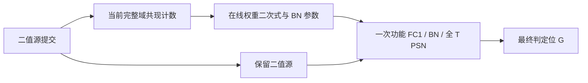

# C1/C2 创新重构：消费者恢复的实测改进、强基线反证与源矩数值闭合

2026-09-06。目标仅 TCAS-II。优先判断计算和存储机制是否真正改变；本轮不写投稿贡献、不启动 EDA、不增添协议防御代码。

**当前取舍。** C1 的旧父行复用、C2 的广播/调序仍只作实现基线。晚门限机制的消费者恢复确有改进，但普通通道分块已能在深层消除其声称要避免的宽张量外存，因此撤回“这条完整机制已经值得无条件主攻”的判断。二值源统计先行继续保留浅层研究价值；它是目录中已有 V2，本轮新增的是真实 checkpoint 的数值对照，不能另算一个新 idea。目前没有达到可以宣称“稳 accept”的新主机制。

**1. 本轮实际改变了哪项工作。**

旧 B32K4 包存预测位、四个边界位置的数值，以及未保留两侧的极值。过去恢复整个失败包，或过早将时间消费者合并成 `OR_t`。本轮利用这些已有字段，仅恢复失效一侧的未保留位置，并保留每个 `(p,h)` 的 10 位消费者掩码。

令 `a` 为未保留预测 0 的最大值，`b` 为未保留预测 1 的最小值，最终比较条件为 `v >= τ`。未知集合由包本身产生：

`unknown = valid & ~keep & ((~pred & τ <= a) | (pred & τ > b))`。

没有使用真实翻转位置作为调度提示。`τ=a` 时 0 侧未知，`τ=b` 时 1 侧仍正确。随后对同一 `(p,h)` 共享恢复十个稀疏 FC1 时间输出 Y，只执行掩码要求的 PSN 行；真实 A 是完整满秩时间矩阵，未改成递归 LIF 或低秩近似。

| sample0 / block0 | stage0 | stage3 |
|---|---:|---:|
| T / P / C / H | 10 / 19200 / 96 / 384 | 10 / 300 / 768 / 3072 |
| 失败包 | 6,204 | 3,588 |
| 未知判定位 | 91,471 | 68,871 |
| 未知位占输出比例 | 0.1241% | 0.7473% |
| 待恢复 `(p,h)` | 84,227 | 48,154 |
| 额外 FC1 二值加项 | 14,905,728 | 29,792,654 |
| 相对一次完整 FC1 的额外加项 | **1.1932%** | **5.6082%** |
| 额外 PSN 实值 MAC 项 | 914,710 | 688,710 |
| 此前 q4 整组恢复的额外 FC1 加项 | 8.6684% | 29.4383% |

这些是恢复运算量，不是周期比。方向性脚本验证的是**无需恢复的非保留位零错误**，没有执行完整序列化和全部共享 Y 修补，不能写“完整恢复电路零错”。预测、topK 产生、索引、源读取、bank 服务和提交仍未计入该表。[脚本](screen_directional_packet.py)、[原始结果](directional_r1/result.json)。

独立评审指出，这主要是对已有包的正确强化解码，单项概念新意约 3/10；不能把性能改进自动升格为第二条新原语。

**2. 不预测、不排序的前缀表示。**

另一路编码将 float64 代理值向下映射到 FP32 可表示集合，再生成单调整数排序键，保存高 8/12/16 位。最终门限到达后，前缀不同即可判断，只有前缀相同的消费者需要恢复。低位没有保存在另一份完整数值中，而由上游二值源恢复。

这个 FP32 格式用于单调分箱，**不意味着 FC1/PSN 改用 FP32 已等价**。实际数值参考仍为既有 float64 代理。高位谓词判断已有 [BitWeaving，SIGMOD 2013](https://pages.cs.wisc.edu/~jignesh/publ/BitWeaving.pdf) 和 [ByteSlice，SIGMOD 2015](https://www.cs.cmu.edu/~15721-f24/papers/ByteSlice.pdf)；这里的研究差别是舍弃后缀并按实际神经元消费者重算。

| 层 / 前缀位宽 | 未知输出比例 | 额外 FC1 加项 / 完整 FC1 | B32、128bit 对齐载荷 |
|---|---:|---:|---:|
| stage0 / 8 | 9.6813% | 58.3864% | 73,728,000 B |
| stage0 / 12 | 0.8538% | 8.6505% | 110,592,000 B |
| stage0 / 16 | 0.0532% | 0.5721% | 147,456,000 B |
| stage3 / 8 | 17.5702% | 67.2290% | 9,830,400 B |
| stage3 / 12 | 1.1899% | 11.2344% | 14,745,600 B |
| stage3 / 16 | 0.0757% | 0.7982% | 19,660,800 B |

在实际使用的 64 位点值代理格式下，B32K4 对齐包也分别为 147,456,000 B 和 19,660,800 B。因此 16 位前缀与该点值包等容量，恢复算术更少；12 位前缀少 25% 载荷，但恢复更多。不能拿名义 32 位点值包的容量和实际 64 位代理的数值表现拼接比较。上述数值载荷也不能借给另一目录已经做出的双端点区间接口 RTL。

两个层共 82,944,000 个参考判定位与捕获一致；无需恢复的前缀判位零错误。尝试的直接时间查表恢复也在观测点零判位错误，但浮点重排有约 1e-15 的数值差异，不能扩大为原 GPU 浮点逐位等价。[脚本](screen_prefix_recovery.py)、[原始结果](sample0_r1/result.json)。

**3. 时间模式查表退出默认结构。**

尝试把完整十步二值列编码为模式 m，预存 `L[t,m]=Σ_s A[t,s] θ_s bit_s(m)`，只计算未决 `U[t,p,h]=Σ_c W[h,c] L[t,m_pc]`。这确实避开若干不再需要的时间输出，但 `W×L` 是实值 MAC，原二值 FC1 只需权重加法。

在主观察 12 位前缀上，直接恢复需要 44,180,477 / 40,426,681 个实值 MAC。取一个实值 MAC 成本为二值加法 4 倍的假设后，stage0 只有 545 个 `(p,h)` 选择直接路径，stage3 为 0；8 倍、16 倍时全部选择共享 Y。尚未加入完整 80 KiB float64 表的读端口与容量，已经几乎无收益。

故不增加默认 LUT 引擎。二值索引、查部分和和时间轴组合也有直接先验：[T-MAC](https://arxiv.org/html/2407.00088v1)、[LUT-GEMM，ICLR 2024](https://proceedings.iclr.cc/paper_files/paper/2024/file/a4f98ce85f440ee269b0df57b4368719-Paper-Conference.pdf)、[H2Learn](https://arxiv.org/pdf/2107.11746)。保留失败数据，不换名字复活。

**4. 通道分块基线改变了选题判断。**

代码中 FC1 与 BN1 均按 hidden channel 独立；PSN 只混合同一 `(p,h)` 的时间列。因此可以：

1. 按预算选择 h 块，保存该块完整 T×P 的 Y，同时统计 BN。
2. 得到 BN 参数后原位归一化，按位置读取完整十步执行 PSN。
3. 将最终 G 按位打包，复用 Y 缓冲处理下一 h 块。
4. 所有 h 完成后，让 FC2 按正常组织消费 G。

这无需每个 h 块读写 FC2 的宽累加器，也不必同时保存全层宽 U。真实代码依据：[MLP 顺序](/home/zhumd/work/sdformer_codex/SDformer/third_party/SDformerFlow/models/STSwinNet_SNN/Spiking_swin_transformer3D.py:164)、[按通道 BN](/home/zhumd/work/sdformer_codex/SDformer/third_party/SDformerFlow/models/STSwinNet_SNN/Spiking_modules.py:118)、[ATLIF 时间混合](/home/zhumd/work/sdformer_codex/SDformer/neuron_experiments/H9_bipolar_self_attention/overlay/models/STSwinNet_SNN/atlif_ternary_psn/atlif_ternary_psn.py:344)。

stage3 的源 S 为 288,000 B，16h 的 float64 Y 为 384,000 B，合计 **672,000 B**；完整 G 仅 **1,152,000 B**。它能在 1 MiB 级预算中给权重与小工作区留出余量；实际分配还需逐项安排。相比之下，整层 12 位前缀是 13,824,000 B 裸载荷，B32 对齐后 14,745,600 B。前缀也可 h 分块，但不能再将全层 U 当成强基线必须发生的外存流量。

现有 m2018 固定 96 输出及六个 16lane slice，是实现控制约束，不能用来排除 16h 普通分块，同时允许候选重构执行组织。另一评审据此撤回之前对深层晚门限包的正面价值判断。这是计算依赖反证，不是因缺 PPA 扣分。

stage0 单 h 的 float64 Y 已为 1,536,000 B，情况不同。浅层仍需比较：宽值分块保存、统计后完整 FC1 重算、前缀/边界包恢复。压缩与重算组合已有 [Echo，ISCA 2020](https://www.cs.toronto.edu/~pekhimenko/Papers/Echo-ISCA_20.pdf)，不能仅凭组合行为主张新意。

**5. 旧 V2：本轮补出了完整源矩到判位的数值对照。**

重新核对目录后，源矩先行明确属于已有 [V2 卡](../innovation_first_audit_20260906/candidate_cards_v1.md) 和 [八 bank 组织评审](../mechanism_rebuild_gh_20260906/records/source_gram_circuit_review.json)。此前已完成 12 个 FC1 的发放/共现计数，本轮不把这些重新计数说成新发现。新增部分是把实际 checkpoint W、BN、完整 A 和门限接起来，比较输出矩与最终判位。

对二值 S 和模块标量 θ_s：

`n=diag(SᵀS), G=SᵀS, μ_h=θ_s W_h n/N`；

`E[Y_h²]=θ_s² W_h G W_hᵀ/N, σ_h²=E[Y_h²]−μ_h²`。

仍须收齐整个源域并完成二次式；**统计屏障迁到二值源侧，没有消失**。随后从二值 S 重放，完成唯一一次功能 FC1→BN→完整 PSN→G。它试图避免统计专用 FC1 或宽 Y 跨屏障保存。

| 数值/成本项目 | stage0 block0 | stage3 block0 |
|---|---:|---:|
| 检查判定位 | 73,728,000 | 9,216,000 |
| 对直接代理 / 捕获的判位差异 | 0 / 0 | 0 / 0 |
| 均值最大绝对差 | 3.46e-13 | 2.89e-15 |
| 方差最大绝对差 | 9.86e-14 | 6.77e-15 |
| 上三角计数器 | 4,656 × 18bit | 295,296 × 12bit |
| 计数裸载荷 | 10,476 B | 442,944 B |
| 稀疏非对角计数增量 | 35,101,829 | 8,724,834 |
| 在线 dense WG 与点积 MAC 项 | 3,575,808 | 1,814,298,624 |
| 若预存全部权重乘积，名义 FP32 表 | 7,151,616 B | 3,628,597,248 B |

默认不预存巨大权重外积表。将每个整数计数增量按 1 个加项、实值 MAC 按 4 个加项收费，计入均值收缩后，**额外统计算术 / 一次完整 FC1 二值加项**为 4.2271% / 1369.5585%。这是参数化算术账，计数器 RMW、端口、源重访、平方根和流水依赖尚未计入，绝不是延迟或能量结果。

复用旧 12 层计数、使用同一 dense WG 公式可推导：stage0 两块为 4.23% / 3.96%；stage1 为 34.93% / 26.87%；stage2 六块为 77.84%–156.20%；stage3 两块为 1189.71%–1369.56%。这些不是新增 12 层数值验证。浅层最多保留研究资格，深层不能靠避免物化掩盖二次式成本。[本轮数值脚本](screen_source_moments.py)、[结果](source_moments_r1/result.json)、[原有十二层统计](../innovation_first_audit_20260906/records/v2_sample0_moments.json)。

公式先验明确：[Analytic Variance Propagation](https://arxiv.org/pdf/1803.10560) 第 2 页已经给出输入协方差与实际 BN 样本方差的关系；其后采用对角近似不赋予完整公式新颖性。[BNFF，MLSys 2019](https://proceedings.mlsys.org/paper_files/paper/2019/file/9db64c20dee0011899dfdf200e61ef35-Paper.pdf) 已融合投影与统计、归一化与消费者。[Network Deconvolution，ICLR 2020](https://arxiv.org/pdf/1905.11926) 已有输入协方差先行及权重变换的近邻。全对单比特相关阵列也有 [JSSC 2014 电路](https://publications.lib.chalmers.se/records/fulltext/208323/local_208323.pdf)。

独立评审给当前完整执行重构约 5/10 的概念分。可争取的差异只能是：有限存储/端口下，以可跨输出通道共享的源统计服务，实质替代宽投影统计服务，并且完整成本优于通用 Gram 加在线收缩。不能把 AND-popcount、矩公式或普通阶段控制各算一个创新点。

**6. 新模型方向：法向可观测分量＋切向网络，当前版本淘汰。**

本轮另查了用当前已到达事件产生局部法向约束，解析求可观测分量、网络只预测空空间分量的共设计。独立评审概念分约 4.5/10，未立项。核心分解已有 [Deep Decomposition Learning，ECCV 2020](https://arxiv.org/html/1911.11028v3)。[Event-based Normal Flow，ECCV 2024](https://www.ecva.net/papers/eccv_2024/papers_ECCV/papers/07261.pdf) 的 full-flow 解析路径需要额外相机运动约束；[Learning Normal Flow Directly From Events，ICCV 2025](https://arxiv.org/html/2412.11284v1) 也表明法向估计本身有成本和不确定性。

致命问题是：把二维输出改成一维，并不删除宽隐藏网络的主要计算；两个物体的不同法向约束还可能组成满秩、零残差的错误局部解。若网络同时修正可观测方向，就回到已有分解方法；加一个秩门控器不足以构成新电路机制。该版本停止，不给它补队列、回退逻辑或新缩写。

**下一步只解决创新差额最大的部分。** 目前 C1 尚无值得投入生产 RTL 的新替代，不继续打磨 1.69×。C2 的恢复优化留作对照；V2 只保留浅层统计生产服务的竞争资格。后续研究应先提出能超越通用 Gram/分块/重算的具体计算组织，再做必要的测量；既有独立评审分数和当前零判位差异均不构成录用保证。Frozen ep34 不修改，任何定点部署需另作模型评价。
