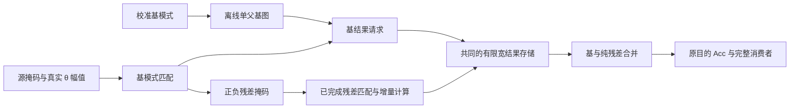

# C1：完整 Prosperity 底座上的融合重构；C2 独立继续

2026-09-06 至 09-07。按用户最新指示，恢复 C1 为重点。已有论文中的好机制可以完整继承、融合和替换；本轮的判断标准是融合后改变了什么计算与存储行为，以及是否胜过完整先验。唯一投稿目标仍为 TCAS-II。

**当前主候选是“静态基模式图＋动态纯残差图的有限状态执行”。独立概念新颖性评分7/10；这是研究排序，不是录用概率。** 第一版参考与预声明筛查已完成，验证了跨基共享，也发现两类对象争抢容量会吃掉收益。未改生产主树或投稿稿，没有新增 RTL 周期、PPA 或 AEE 声明。

## C1 的创新应落在哪里

原始 Prosperity 以真实输入行为父节点，选择子集、排序，再复用完整父结果。[Prosperity §III–VI](https://arxiv.org/html/2503.03379v2) 是完整强底座；本地 m935 已具备主要单父关系和流水，不能说它只抄了公式。[完整架构与官方工件差异](architecture_map.md)说明已继承部分及尚未闭合的完整层接口。

本轮借 [Phi](https://arxiv.org/html/2505.10909v1) 的模式分解，将一行变成：

\[
S_i=B_i+\delta_i,\qquad
Y_i=V(B_i)+R(\delta_i),\quad
R(\delta)=\sum_c\delta_c\theta_cW_c.
\]

模式、双向修正、预计算和并行归约都是继承部分。我们要研究的是：固定基模式和动态残差分别成为可复用的计算对象，用同一个有限宽结果预算执行，而不是保存两份无限大的结果表。

1. **基模式提前编译成窄图。** 只保存基掩码、父编号和增量源；权重块到达后按需生成少量基结果。静态父没有驻留时，直接构造所需基，实际收费，不递归展开长重放链。
2. **动态缓存保存纯残差。** 以 `(δ⁺,δ⁻)` 匹配已完成且驻留的节点，同号子集可以继承。键包含权重、K分区、输出通道及阈值身份，但不包含基编号；这才允许跨基共享。未命中就直接计算残差。
3. **每个原目的独立合并。** 基结果与纯残差就绪后完成 `B+R`，再进入原来的跨K部分和更新。两类对象共用容量和端口，额外合并寄存器也计入；不免费删除全局Acc、BN或满秩PSN。

一个具体例子：

| 行 | 基模式 | 原始支撑 | 纯残差 |
|---|---|---|---|
| 1 | `{a,d,e,f}` | `{b,c,d,e,f}` | `−a+b+c` |
| 2 | `{a,g,h}` | `{b,c,g,h}` | `−a+b+c` |
| 3 | `{a,g,h}` | `{b,c,g,h,k}` | `−a+b+c+k` |

前两行原始支撑互不包含，不能按原始行直接继承；分解后共享同一个纯残差。第三行还能从该残差补一个 `k`。保存完整 `Y₁` 会混入旧基，保存纯残差则可以服务不同基。这个例子证明表示的作用，不证明实际速度优势。

[Transitive Array](https://arxiv.org/html/2504.16339v1) 已有图、虚拟节点和复用调度，不能把这些各算一个新原语。[ExSpike](https://arxiv.org/html/2606.20414v1) 的组内共同贡献也应作为邻近机制。剩余创新应由“静态基图与动态纯残差图解耦后，在共同有限状态下保留多少有效共享”来体现。

最强对照链是：完整 Prosperity、完整 Phi、两者逐任务择优；然后对 Phi 依次加入同样的按需基图、精确残差缓存、同号子集复用。此外必须比较直接把 Phi 残差交给 TA 的方案。Phi 的八输入多行归约、冲突规避和PWP预取均应保留，不能在周期比较时降成逐项串行。

Comperity 的[出版方全文](https://dl.acm.org/doi/10.1145/3828526)仍未取到；本轮页面/PDF返回403。其邻行共同基和差分路线是必须补齐的覆盖核查，尚不能写“已排除”。

## 已完成的因果探针：只改父选择为什么不够

[预声明计划](screen_plan.json) · [参考脚本](screen_joint_residual.py) · [结果](joint_residual_r1.json)。选定ep34同账本3个样本、4个算子、4个K分区、4个空间块，共192 tiles、11,904行；末块为56行。研究问题是：在同样大的合法父之间联合选择，使其残差更易共享。

| 2项残差子集字典 | 局部二输入向量加法 |
|---|---:|
| 原Prosperity关系，官方较小index | 6,557 |
| 固定原父＋增强残差子集缓存 | 6,154 |
| 联合选父＋同容量残差子集缓存 | 6,082 |

相对增强缓存，联合选择只再减少 **1.1700%** 加法。论文较大index规则下为 **1.2181%**。同时父写、字典读写增加，贪心选择也有单tile退步，不能说逐tile支配或转成周期比。因此它作为因果探针保留，不单独承担主贡献。

计数包含残差构造与局部重建，首项装载不算加法；全局psum、物理端口与供数尚未建模。独立代理从所选支撑复算4,992个配置、309,504次行分解，10类计数一致。数值验证用非1有理数θ和有符号人工权重；真实ep34仅提供支撑，不是checkpoint浮点闭环。

## 主候选的首次验证边界

[基图与残差图计划](basis_residual_plan.json)固定以sample0/1/2校准、sample4/9评价，保持16源分块与M64，不扩大目的Acc。比较8/32/128个基模式及8/16个共同宽结果槽；动态残差只使用已完成节点，按原行顺序执行。

这是Phi Algorithm 1启发的独立校准和有界流式参考，没有重训。原Phi的完整并行服务和论文配置不是这份算术参考自动复现的；后续周期对照必须补上。不得根据少量支撑筛查直接给出RTL或TCAS-II性能结论。

[参考代码](screen_basis_residual.py) · [首次结果](basis_residual_r1.json)。实际校准144,000行，评价128 tiles、7,936行；48个校准模型全部收敛，1,523,712个有理数诊断lane值零不一致。两个合并/计算寄存器明确位于8/16槽预算之外，不能忽略其面积。

以8个请求基模式、16个共同槽为例：

| 方案 | 向量加法 | W源读取 | 外部PWP请求 | 缓存写 |
|---|---:|---:|---:|---:|
| 预计算PWP＋独立残差 | 5,358 | 7,793 | 315 | 315 |
| 按需基图＋独立残差 | 6,219 | 8,944 | 0 | 315 |
| 按需基图＋精确残差缓存 | 6,090 | 8,693 | 0 | 2,155 |
| 按需基图＋残差子集复用 | 5,788 | 8,145 | 0 | 2,158 |

子集复用比同样按需基图少6.93%加法、比精确残差缓存少4.96%；但比预计算PWP方案多8.03%加法。它替代了315次外部PWP请求，同时多352次W源读取和1,843次缓存写，不能据此直接判总能量或带宽有利。唯一W源行覆盖尚未记录，Phi可能需要较少权重供数，预取也可能覆盖请求代价。

此外，32/128个请求基模式、16槽时，残差子集版本比按需基图独立残差**反而多2.61%/3.22%加法**，基对象淘汰从14→358、383→704。这是第一版“所有多项残差都进入共同LRU”的具体问题。后续价值要来自共同预算下有效物化与消费，而不能把双图各自的理想收益相加。首轮不支持直接声称整体胜过完整Phi，也没有宣布整个Prosperity融合方向淘汰。

独立审阅还从第一份结果中提取了**完全相同128 tiles的原Prosperity关系**，不能遗漏这个更强分母：[同批对照](same_cohort_strong_baseline.json)。原关系为4,317次加法、5,684次源系数读；新q8/16版本为5,788/8,145，分别多34.07%/43.30%。两者构图、调序、活值管理不同；这不是等面积周期败胜，但说明目前不能只拿按需Phi底座作为获益分母。新方案减少全tile动态构图/排序的价值尚未用周期或面积测量证明。

独立代理核对48个基图父关系、1,080个汇总字段，并用非1θ的1,296个有理数重构关系检查代数。结果见[独立审阅记录](independent_reviews.json)，下一阶段的资源与接口边界见[执行合同](execution_contract.md)。

## C2：继续寻找跨算子的计算变化

ATLIF 始终保留 `z=θg`，θ 是真实连续值幅值。以下两次新筛查都没有把θ设为通用的1，也没有假定静态BN或低秩PSN。

**完整时间签名表示。** 借 [LoAS](https://arxiv.org/html/2407.14073v3) 的时间组织和 [RSR](https://arxiv.org/html/2411.06360v2) 的模式归约，提出每类签名保存一个 `Vσ`，跨BN后直接参与完整PSN。[首次结果](temporal_signatures_r1.json)显示，sample0浅/深两个FC1层的非空签名种类均值为30.3844/24.8867，所有位置均大于T=10。全保存V相对dense Y等宽容量为3.0384×/2.4887×，该版本不适合当前样本。R是签名种类数，不是矩阵秩；不能推广为全部时间分组无效。

**全域统计先行＋低维候选＋严格残差确认。** 先复用真实源Gram生产最终BN统计，再在低维通道上执行完整A，依据剩余范数确认哪些输出可以直接交付原θ幅值，失败项精确重算。低秩预测已有 [SparseNN](https://past.date-conference.com/proceedings-archive/2018/pdf/0645.pdf)，残差范数界已有 [ConvReLU++](https://yuanchun-li.github.io/static/files/MobiSys23_ConvReLU%2B%2B.pdf)；拟研究增量是动态统计与完整时间混合共同支撑确认。

[预声明计划](projection_certificate_plan.json) · [代码](screen_projection_certificate.py) · [结果](projection_certificate_r1.json)。固定sample0浅层64个空间位置、完整T10及384输出，共245,760判位。小秩4/8只能确认2.8711%/4.8149%的单独判位，没有一个完整T输出组全通过。秩64虽确认76.2614%判位，但完整T输出组仅10.5143%全通过；全部五种秩的96-lane组均需回退。高秩还引入更多实值重构乘法，不能用单bit确认率挽救该版本。

这次float64筛查与对应封存输出判位一致，另有1,200次有理数诊断验证抽象证书。实际所选stage0源/出口θ恰为1.0；非1θ验证来自人工诊断，不能混称真实负载。它不证明原始FP32或舍入后的电路严格无误。一般Q的双项界及范数收缩成本还见[独立成本勘误](projection_cost_errata.json)，不改变全部96-lane组需回退的结论。当前C2两版均未升为主机制，旧晚知阈值包保留为研究对照；本轮不虚列第二条已证明强创新。

## 接下来决定去留的证据

C1先回答纯残差子集是否比精确残差缓存多出实质收益，以及按需构造基结果是否胜过Phi有效PWP搬运。两者必须在共同容量、端口、原目的提交和并行归约约束下同时成立。随后才值得推进该增量的隔离RTL和同工作负载VCS/DC/PT/Formality闭环。

C2继续研究可改变完整T计算需求的机制；本轮失败的逐签名全保存和SVD统一范数界不重复扩大采样。任何新方案都需给出不同的计算或修复组织，再开相应验证。

所有本轮新文件位于本目录。原始idea包和历史负结果保留；生产主树、docs/359、H81、主稿及冻结checkpoint未改。没有系统FPS、组件倍率相乘或录用保证。
